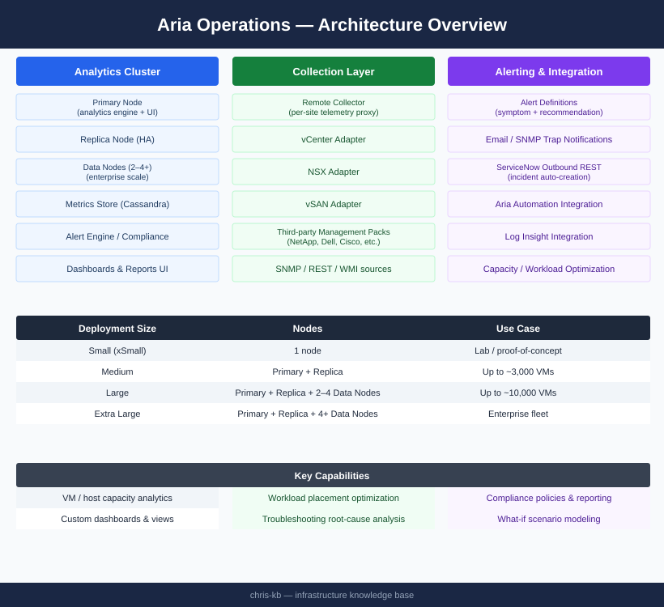

# Aria Operations — Architecture (Monitoring)

<div class="kb-summary">
Aria Operations deploys as an analytics cluster (Primary + Replica + optional Data Nodes) with Remote Collectors distributing telemetry collection across sites. Management Packs extend coverage to third-party platforms.
</div>

```
┌─────────────────────────────────── Aria Operations — Architecture ────────────────────────────────────┐
│                                                                                                       │
│   ┌───────────────────────────────────────────────────────────────────────────────────────────────┐   │
│   │             Aria Operations Cluster Architecture — Nodes, Data Flow, and HA Design            │   │
│   │        Cluster: Master (primary) + Replica (HA) + Collector(s) + optional Data node(s)        │   │
│   │         Data flow: adapters collect → collector node buffers → master analytics engine        │   │
│   │          Storage: embedded Cassandra (time-series) + vPostgres (relational metadata)          │   │
│   │         Network: nodes communicate on TCP 443/10443 · collectors use outbound TCP 443         │   │
│   └───────────────────────────────────────────────────────────────────────────────────────────────┘   │
│                                                                                                       │
│    Collector nodes are placed in each site or vPod to keep data collection local                      │
│                                                                                                       │
│                  ▼                                ▼                                ▼                  │
│                                                                                                       │
│   ┌─────────────────────────────┐  ┌─────────────────────────────┐  ┌─────────────────────────────┐   │
│   │         Master Node         │  │        Collector Node       │  │          Data Node          │   │
│   │       Analytics engine      │  │        Remote adapter       │  │       Cassandra shard       │   │
│   │        UI + REST API        │  │      Buffer 5-min data      │  │       Scales capacity       │   │
│   │         vPostgres DB        │  │       TCP 443 upstream      │  │        >5000 objects        │   │
│   │      Cassandra primary      │  │       No UI component       │  │     Added via UI wizard     │   │
│   │      HA: replica ready      │  │       Per-site deploy       │  │       Rebalances auto       │   │
│   └─────────────────────────────┘  └─────────────────────────────┘  └─────────────────────────────┘   │
│                                                                                                       │
│  Physical Infrastructure:                                                                             │
│  All nodes are VMs on vSphere · Master: 4 vCPU/16 GB min · Data node: 8 vCPU/32 GB                    │
│                                                                                                       │
│  Key terms:                                                                                           │
│                                                                                                       │
│  Cassandra         = Apache distributed time-series DB used by Aria Ops for metric storage            │
│  vPostgres         = PostgreSQL fork embedded in Aria Ops; stores inventory and configuration         │
│  Adapter instance  = Running adapter configuration connecting to a specific data source               │
│  Buffer            = Collector-side temporary storage holding metrics before master upload            │
│  TCP 443/10443     = Intra-cluster communication ports between nodes                                  │
│  Analytics engine  = Master-node service computing baselines, anomalies, and recommendations          │
│  Replica node      = Mirrors master state; takes over UI and analytics on master failure              │
│  HA failover       = Automatic promotion of replica to master when master heartbeat is lost           │
│  vPod              = VMware Pod; a discrete compute/network unit with its own collector               │
│  Object count      = Total monitored resources; drives node-sizing requirements                       │
│  Rebalance         = Redistribution of Cassandra data across data nodes after scale-out               │
│  TCP outbound      = Collector-to-master direction; only outbound TCP 443 required from collector     │
│                                                                                                       │
└───────────────────────────────────────────────────────────────────────────────────────────────────────┘
```


<div class="kb-grid kb-grid-3">
<a class="kb-card" href="how-it-works/"><strong>How It Works</strong><span>Analytics cluster topology, component roles, sizing, Remote Collectors, and network ports.</span></a>
<a class="kb-card" href="integrations/"><strong>Integrations</strong><span>Management packs, vCenter, NSX, storage adapters, and third-party integrations.</span></a>
<a class="kb-card" href="design-standards/"><strong>Design Standards</strong><span>Cluster sizing guidelines, naming conventions, and configuration baselines.</span></a>
</div>

---

## Deployment Sizing

| Deployment Size | Nodes | Use Case |
|---|---|---|
| Small (xSmall) | 1 node | Lab / proof-of-concept |
| Medium | Primary + Replica | Up to ~3,000 VMs |
| Large | Primary + Replica + 2–4 Data Nodes | Up to ~10,000 VMs |
| Extra Large | Primary + Replica + 4+ Data Nodes | Enterprise fleet |

---

## Analytics Cluster Topology


