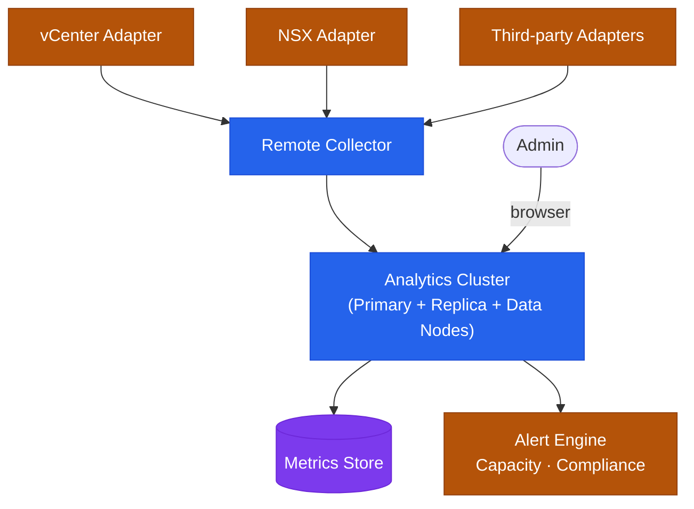

# Aria Operations — Architecture (Monitoring)

Aria Operations deploys as an analytics cluster (Primary + Replica + optional Data Nodes) with Remote Collectors distributing telemetry collection across sites. Management Packs extend coverage to third-party platforms.

<a class="kb-card" href="how-it-works/"><strong>How It Works</strong>Analytics cluster topology, component roles, sizing, Remote Collectors, and network ports.</a>
<a class="kb-card" href="integrations/"><strong>Integrations</strong>Management packs, vCenter, NSX, storage adapters, and third-party integrations.</a>
<a class="kb-card" href="design-standards/"><strong>Design Standards</strong>Cluster sizing guidelines, naming conventions, and configuration baselines.</a>

---

## Deployment Sizing

| Deployment Size | Nodes | Use Case |
|---|---|---|
| Small (xSmall) | 1 node | Lab / proof-of-concept |
| Medium | Primary + Replica | Up to ~3,000 VMs |
| Large | Primary + Replica + 2–4 Data Nodes | Up to ~10,000 VMs |
| Extra Large | Primary + Replica + 4+ Data Nodes | Enterprise fleet |

---

## Analytics Cluster Topology

