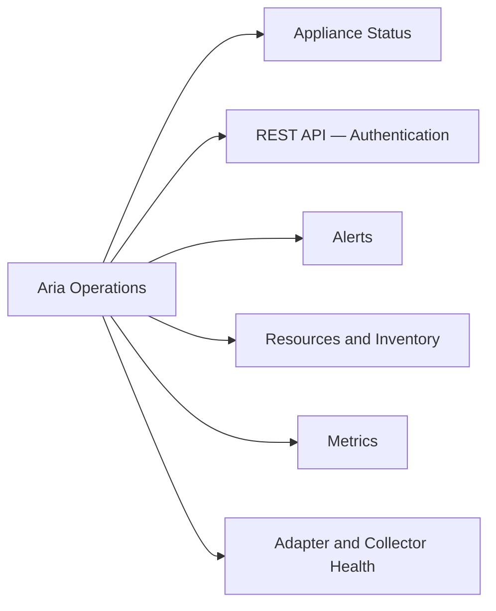

# Aria Operations CLI Reference

Aria Operations (formerly vRealize Operations) is managed via the REST API and the `vracli` tool on the vApp node. The REST API base URL is `https://<ariaops_fqdn>/suite-api/api`. SSH to the analytics node as root for appliance-level operations.



---

## Appliance Status

```bash
# SSH to Aria Operations node
ssh root@<ariaops_fqdn>

# Check cluster node status
vracli status

# Check service health
vracli services

# View logs
tail -f /data/vcops/log/analytics.log
tail -f /data/vcops/log/collector.log
```

---

## REST API — Authentication

```bash
# Authenticate (basic auth to get token)
curl -k -X POST https://<ariaops_fqdn>/suite-api/api/auth/token/acquire   -H "Content-Type: application/json"   -d '{"username":"admin","authSource":"LOCAL","password":"<pass>"}'

# Use the token in subsequent requests
# Header: Authorization: OpsToken <token>

# Release token
curl -k -X POST https://<ariaops_fqdn>/suite-api/api/auth/token/release   -H "Authorization: OpsToken <token>"
```

---

## Alerts

```bash
# List active alerts
curl -k -X GET "https://<ariaops_fqdn>/suite-api/api/alerts?activeOnly=true"   -H "Authorization: OpsToken <token>"

# List alerts by criticality (CRITICAL, WARNING, IMMEDIATE)
curl -k -X GET "https://<ariaops_fqdn>/suite-api/api/alerts?criticality=CRITICAL&activeOnly=true"   -H "Authorization: OpsToken <token>"

# Acknowledge an alert
curl -k -X PATCH "https://<ariaops_fqdn>/suite-api/api/alerts/<alert_id>/acknowledge"   -H "Authorization: OpsToken <token>"

# Cancel an alert
curl -k -X PATCH "https://<ariaops_fqdn>/suite-api/api/alerts/cancel"   -H "Authorization: OpsToken <token>"   -H "Content-Type: application/json"   -d '{"alertIds":["<alert_id>"]}'
```

---

## Resources & Inventory

```bash
# List all resources
curl -k -X GET "https://<ariaops_fqdn>/suite-api/api/resources?pageSize=1000"   -H "Authorization: OpsToken <token>"

# Search for a resource by name
curl -k -X GET "https://<ariaops_fqdn>/suite-api/api/resources?name=<vm_name>"   -H "Authorization: OpsToken <token>"

# Get resource health
curl -k -X GET "https://<ariaops_fqdn>/suite-api/api/resources/<resource_id>/health"   -H "Authorization: OpsToken <token>"
```

---

## Metrics

```bash
# Get metrics for a resource
curl -k -X GET "https://<ariaops_fqdn>/suite-api/api/resources/<resource_id>/statkeys"   -H "Authorization: OpsToken <token>"

# Query metric values
curl -k -X POST "https://<ariaops_fqdn>/suite-api/api/resources/stats/query"   -H "Authorization: OpsToken <token>"   -H "Content-Type: application/json"   -d '{"resourceId":["<resource_id>"],"statKey":["cpu|usage_average"]}'
```

---

## Adapter & Collector Health

```bash
# List adapter instances
curl -k -X GET "https://<ariaops_fqdn>/suite-api/api/adapters"   -H "Authorization: OpsToken <token>"

# Check collector status
curl -k -X GET "https://<ariaops_fqdn>/suite-api/api/collectors"   -H "Authorization: OpsToken <token>"
```
