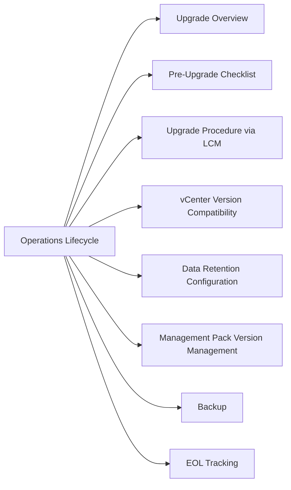

# Aria Operations Lifecycle



## Upgrade Overview

All Aria Operations upgrades in multi-node deployments must be orchestrated via **Aria Suite Lifecycle Manager (LCM)**. Manual in-place upgrades on multi-node clusters are not supported and can leave the cluster in an inconsistent state.

## Pre-Upgrade Checklist

1. Review the [VMware Product Interoperability Matrix](https://interopmatrix.vmware.com) to confirm the target Aria Operations version is compatible with the current vCenter, NSX, and management pack versions.
2. Verify all management pack versions have a compatible release for the target Aria Operations version.
3. Take a snapshot of the primary analytics node (and replica) before starting.
4. Confirm available disk space on all nodes: LCM requires headroom during upgrade staging.
5. Download the upgrade bundle to LCM from My VMware / Broadcom Support Portal.
6. Notify operations team — collection may pause briefly during upgrade window.

## Upgrade Procedure via LCM

```text
1. Log into Aria Suite Lifecycle Manager
2. Navigate to Environments > [Your Environment]
3. Select Aria Operations product tile
4. Click Upgrade — select the downloaded product bundle
5. LCM validates compatibility and pre-checks; resolve any failures before proceeding
6. Confirm upgrade — LCM performs rolling node upgrade (replica first, then primary)
7. Verify all nodes are Online in Admin > Cluster Management post-upgrade
8. Verify all adapters are Collecting in Admin > Solutions
```

## vCenter Version Compatibility

Always check the Interoperability Matrix before a vCenter upgrade, as newer vCenter versions may require a corresponding Aria Operations upgrade.

| Aria Operations Version | Minimum vCenter Supported |
|---|---|
| 8.16 | vCenter 7.0 U3+ |
| 8.14 | vCenter 7.0 U2+ |
| 8.12 | vCenter 7.0+ |

Check the current Broadcom Interoperability Matrix for the latest version pairings.

## Data Retention Configuration

Navigate to **Admin > Global Settings > Retention Policy** to configure retention periods. Changes to retention that reduce the period will trigger a data purge.

| Setting | Default | Notes |
|---|---|---|
| Metrics retention | 6 months | Increase requires additional data node storage |
| Policy data history | 6 months | Matched to metrics retention |
| Events/alerts history | 6 months | Configurable independently |

## Management Pack Version Management

Management packs have their own version lifecycle, independent of the Aria Operations platform version. Steps to update a management pack:

```text
1. Admin > Solutions > [Select Solution]
2. Click Upgrade — upload new management pack PAK file
3. Verify adapter instances reconnect successfully after upgrade
4. Review adapter logs for errors (Admin > Solutions > [Adapter] > Logs)
```

## Backup

Aria Operations does not have a native backup tool. Use the following:

| Method | What is Backed Up |
|---|---|
| VM snapshot (via vCenter) | Full appliance state — use before upgrades, not for operational backup |
| File-level backup agent | PostgreSQL data files + config (requires LCM configuration) |
| LCM backup | LCM configuration and product manifests |

## EOL Tracking

- Broadcom Product Lifecycle Matrix: [lifecycle.broadcom.com](https://lifecycle.broadcom.com)
- Aria Suite Lifecycle Manager — check installed product versions against the matrix quarterly
- Aim to be no more than one major version behind the current release
