# CloudIQ — How It Works (Monitoring)


<div class="kb-summary">
How It Works (Monitoring) reference covering Architecture, Component Roles, Secure Connect Gateway (SCG), Telemetry Collection, Data Residency and 1 more sections.
</div>

```text
┌─────────────────────────────────────── CloudIQ — How It Works ────────────────────────────────────────┐
│                                                                                                       │
│   ┌───────────────────────────────────────────────────────────────────────────────────────────────┐   │
│   │       Step 1: Array Registration — connect array to cloudiq.dell.com using Dell account       │   │
│   │         Step 2: Telemetry Push — array sends metrics/events every 5 minutes over HTTPS        │   │
│   │      Step 3: AI Processing — ML models score health, detect anomalies, forecast capacity      │   │
│   │     Step 4: Alert Generation — violations trigger alerts; notifications via email/webhook     │   │
│   │         Step 5: Recommendation — AI suggests corrective actions with estimated impact         │   │
│   │      Step 6: User Action — engineer reviews, acknowledges, and implements recommendation      │   │
│   └───────────────────────────────────────────────────────────────────────────────────────────────┘   │
│                                                                                                       │
│  Physical Infrastructure:                                                                             │
│  Arrays on-prem · Dell cloud processing · engineer accesses via browser at cloudiq.dell.com           │
│                                                                                                       │
│  Key terms:                                                                                           │
│                                                                                                       │
│  Array registration = Linking a Dell storage system to a CloudIQ organisation/account                 │
│  Telemetry interval = Frequency of metric push; typically 5 minutes for most array types              │
│  Health score = 0-100 composite score derived from multiple metric and event inputs                   │
│  Anomaly detection = ML model identifying behaviour deviating from learned baseline                   │
│  Capacity forecast = Regression model predicting when array will reach capacity threshold             │
│  Alert = Notification generated when health score drops below threshold or anomaly detected           │
│  Recommendation = AI-generated corrective action with priority and expected benefit                   │
│  Acknowledge = Marking alert as seen and accepted; stops re-notification                              │
│  Snooze = Temporarily silencing an alert for a defined period                                         │
│  Baseline = Normal operating pattern learned by ML over initial collection window                     │
│  Organisation = CloudIQ tenant grouping arrays and users for a customer account                       │
│  Dell account = MyService360 or Dell account credential used for CloudIQ login and registration       │
│                                                                                                       │
└───────────────────────────────────────────────────────────────────────────────────────────────────────┘
```
Dell CloudIQ is a cloud-native SaaS AIOps platform that collects telemetry from Dell storage, server, and networking systems. All communication is outbound HTTPS from an on-premises Secure Connect Gateway (SCG) virtual appliance — no inbound firewall rules are required.

---

## Architecture

```mermaid
graph LR
    Arrays["Dell Arrays<br/>PowerStore · PowerMax<br/>PowerScale · Unity XT<br/>Data Domain · PowerEdge"]
    SCG["Secure Connect Gateway<br/>on-prem OVA<br/>telemetry collector<br/>HTTPS outbound only"]
    CloudIQ["CloudIQ Cloud<br/>SaaS platform<br/>ML models · AI pipeline<br/>health scoring"]
    Dashboard["CloudIQ Dashboard<br/>health scores · alerts<br/>capacity trends<br/>anomaly detections"]
    Recommendations["Recommendations<br/>AI-generated actions<br/>root cause analysis<br/>priority + impact"]

    Arrays -->|"telemetry REST API TCP 443/8443"| SCG
    SCG -->|"encrypted upload TCP 443"| CloudIQ
    CloudIQ -->|"anomaly detection · forecasting"| Dashboard
    CloudIQ -->|"AI recommendations"| Recommendations
    Dashboard -->|"engineer reviews"| Recommendations

    style Arrays fill:#2563eb,stroke:#1d4ed8,color:#fff
    style SCG fill:#b45309,stroke:#92400e,color:#fff
    style CloudIQ fill:#7c3aed,stroke:#6d28d9,color:#fff
    style Dashboard fill:#15803d,stroke:#166534,color:#fff
    style Recommendations fill:#15803d,stroke:#166534,color:#fff
```



---

## Component Roles

| Component | Role |
|---|---|
| CloudIQ Cloud | SaaS platform hosted and managed by Dell |
| Secure Connect Gateway (SCG) | On-premises virtual appliance; collects telemetry from arrays and relays to CloudIQ over HTTPS |
| CloudIQ Dashboard | Web UI presenting health scores, alerts, capacity trends, and anomaly detections |
| CloudIQ REST API | Programmatic access to fleet data, alerts, and capacity metrics |
| Dell AIOps (integrated) | AI recommendations layer within CloudIQ for root cause analysis and predictive insights |

---

## Secure Connect Gateway (SCG)

The SCG is the sole on-premises component.

- Deployed as a Linux-based OVA (VMware or KVM)
- Communicates to Dell cloud endpoints on TCP 443 outbound only
- Supports proxy configuration for environments without direct internet egress
- Collects from arrays via management IP — requires reachability to all array management interfaces
- Supports multiple sites; a single SCG can collect from arrays across multiple subnets if routable

### SCG System Requirements

| Resource | Minimum | Recommended |
|---|---|---|
| vCPU | 4 | 8 |
| RAM | 8 GB | 16 GB |
| Disk | 100 GB | 200 GB |
| OS | RHEL/CentOS 7/8 or OVA | OVA preferred |

---

## Telemetry Collection

- Collection interval: typically every 5 minutes for performance metrics; health scores refresh every 15–30 minutes
- Protocol: HTTPS (REST API calls from SCG to array management endpoint)
- Supported platforms: PowerStore, PowerMax/VMAX, PowerScale/Isilon, Unity XT, Data Domain/PowerProtect, PowerVault, PowerEdge (via iDRAC)

---

## Data Residency

CloudIQ telemetry is processed and stored in Dell's cloud infrastructure. Confirm with Dell that data is stored in the appropriate region for compliance requirements (EU customers should verify GDPR residency options).

---

## Network Requirements

| Source | Destination | Port | Purpose |
|---|---|---|---|
| SCG | Dell cloud (cloudiq.dell.com) | TCP 443 | Telemetry upload |
| SCG | Array management IPs | TCP 443 / 8443 | Telemetry collection |
| Browser (admin) | SCG management UI | TCP 9443 | SCG administration |
| Browser (ops) | cloudiq.dell.com | TCP 443 | CloudIQ web dashboard |
