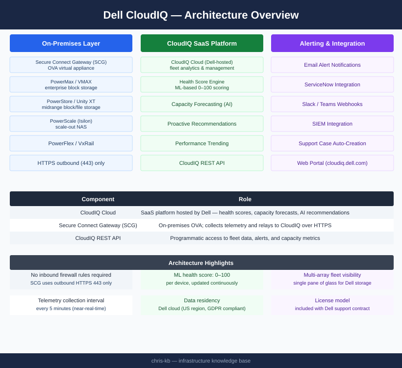
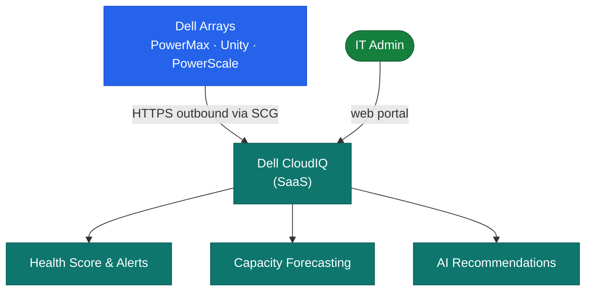

# CloudIQ — Architecture (Monitoring)

CloudIQ is a SaaS AIOps platform. The only on-premises component is the Secure Connect Gateway (SCG) virtual appliance, which collects telemetry from Dell arrays and forwards it outbound over HTTPS — no inbound firewall rules required.

<a class="kb-card" href="how-it-works/"><strong>How It Works</strong>SaaS architecture, SCG sizing, telemetry collection, data residency, and network requirements.</a>
<a class="kb-card" href="integrations/"><strong>Integrations</strong>Supported Dell platforms, ServiceNow, SIEM, and notification integrations.</a>
<a class="kb-card" href="design-standards/"><strong>Design Standards</strong>SCG deployment standards, naming conventions, and configuration baselines.</a>

---

## Component Roles

| Component | Role |
|---|---|
| CloudIQ Cloud | SaaS platform hosted by Dell — health scores, capacity forecasts, AI recommendations |
| Secure Connect Gateway (SCG) | On-premises OVA; collects telemetry and relays to CloudIQ over HTTPS |
| CloudIQ REST API | Programmatic access to fleet data, alerts, and capacity metrics |

---

## Architecture

