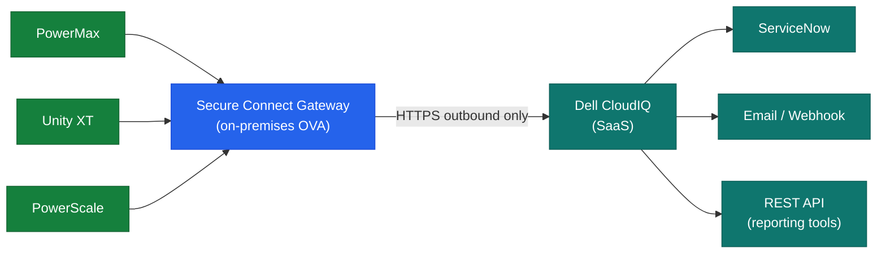

# CloudIQ — Integrations

<div class="kb-summary">
CloudIQ integrates natively with Dell storage arrays via the SCG, and outbound to ITSM and notification systems via the REST API and webhook connectors.
</div>

## Supported Dell Platforms

| Platform | Collection Method | Data Available |
|---|---|---|
| PowerMax / VMAX | HTTPS via Unisphere | Performance, capacity, SRDF state, health |
| PowerStore | HTTPS via REST API | Volume health, capacity, performance |
| PowerScale (Isilon) | SSH / OneFS REST API | Cluster capacity, node health, quotas |
| Unity XT | HTTPS via Unisphere | Pool capacity, SP health, replication status |
| PowerFlex (VxFlex OS) | HTTPS REST API | Cluster health, volume capacity |
| Data Domain | HTTPS REST API | Dedup savings, capacity, replication |

## ITSM Integrations

| Integration | Mechanism | Use Case |
|---|---|---|
| ServiceNow | REST outbound (CloudIQ connector) | Auto-create incidents on Critical alerts |
| Email | SMTP relay via CloudIQ cloud | Alert notifications to DL or individual |
| Webhook | HTTPS POST (custom) | PagerDuty, Slack, or custom endpoint |

### ServiceNow Setup

1. In CloudIQ portal: **Settings → Notifications → ServiceNow**
2. Enter ServiceNow instance URL, username, and password (or OAuth token)
3. Map CloudIQ severity levels to ServiceNow Priority values
4. Test with a manually triggered notification

## REST API

CloudIQ provides a REST API for programmatic access to fleet metrics:

```bash
# Get API token (OAuth client credentials)
curl -X POST https://cloudiq.dell.com/auth/token \
  -d "grant_type=client_credentials&client_id=<id>&client_secret=<secret>"

# List all systems and health scores
curl -H "Authorization: Bearer <token>" \
  https://cloudiq.dell.com/v1/storage-systems

# Get capacity for a specific system
curl -H "Authorization: Bearer <token>" \
  "https://cloudiq.dell.com/v1/storage-systems/{id}/capacity"
```

## Integration Architecture


