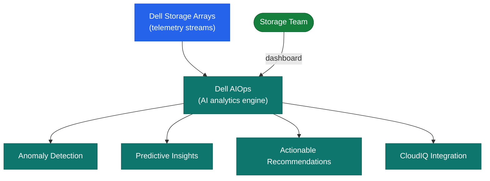

# Dell AIOps — How It Works

Dell AIOps (delivered via CloudIQ / APEX AIOps) is Dell's AI-driven IT operations platform providing anomaly detection, root cause analysis, and predictive recommendations across the Dell storage estate. The platform is fully SaaS-delivered — the only customer-managed component is the Secure Connect Gateway (SCG) virtual appliance.

---

## Architecture

---

## Component Roles

| Component | Role |
|---|---|
| CloudIQ / APEX Console | SaaS portal — surfacing recommendations, anomaly dashboard, health scores |
| Secure Connect Gateway (SCG) | On-premises telemetry collection and secure forwarding agent (customer-managed) |
| Dell AI Pipeline (cloud) | Anomaly detection, root cause analysis, and capacity forecasting (Dell-managed) |
| Storage Arrays | Telemetry data sources: PowerStore, PowerMax, PowerScale, Unity XT, Data Domain |

---

## AIOps Capabilities

### Anomaly Detection

Dell AIOps analyses rolling telemetry baselines for each array and surfaces anomalies when metrics deviate significantly from the learned pattern:

- **Performance anomalies**: unexpected latency or IOPS deviations
- **Capacity anomalies**: faster-than-expected capacity growth
- **Configuration drift**: changes from a known-good configuration state

### Root Cause Analysis (RCA)

When an anomaly or health score degradation is detected, AIOps cross-correlates telemetry across the stack to identify likely root causes and generates a ranked list of contributing factors.

### Capacity Forecasting

ML-based capacity models predict when a system will reach capacity thresholds:

- Days until raw capacity threshold (configured at 85%)
- Projected capacity at 30, 60, and 90 days
- Recommended actions (expand, thin provision, tier, etc.)

### Recommendations

| Severity | Examples |
|---|---|
| Critical | Imminent capacity exhaustion, hardware fault requiring immediate action |
| High | Performance degradation root cause identified, firmware vulnerability |
| Medium | Sub-optimal configuration, approaching threshold |
| Low | Best-practice suggestion, non-urgent tuning |

---

## Telemetry Sources

| Platform | Metrics Collected |
|---|---|
| PowerStore | IOPS, latency, throughput, capacity, hardware faults |
| PowerMax | SRDF replication lag, cache hit rates, capacity, performance |
| PowerScale (Isilon) | Protocol throughput, CPU, capacity, SmartPools usage |
| Unity XT | LUN performance, capacity, replication health |
| Data Domain | Dedup ratio, capacity, replication |

---

## Data Flow

1. SCG polls each array's management API at regular intervals (typically every 5 minutes)
2. SCG encrypts and forwards telemetry to Dell's cloud AI pipeline over HTTPS
3. Dell AI models process telemetry against learned baselines and generate anomaly/recommendation events
4. Recommendations and anomaly events appear in the CloudIQ APEX Console within 15–30 minutes of detection
5. Notification rules in CloudIQ deliver alerts to configured channels (PagerDuty, email, webhooks)
