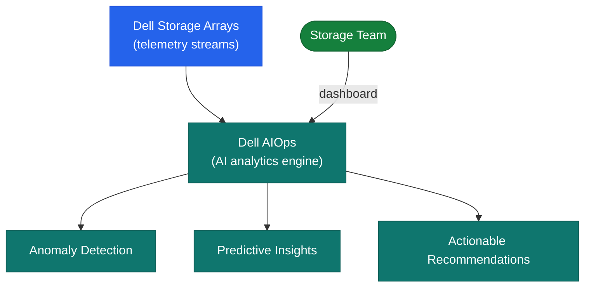

# Dell AIOps — Architecture

Dell AIOps is a fully SaaS-delivered AI operations platform. Telemetry flows from arrays through the on-premises Secure Connect Gateway to Dell's cloud AI pipeline, which produces anomaly detection, root cause analysis, and prioritised recommendations.

<a class="kb-card" href="how-it-works/"><strong>How It Works</strong>SaaS architecture, AI capabilities, telemetry sources, data flow, and component roles.</a>
<a class="kb-card" href="integrations/"><strong>Integrations</strong>CloudIQ integration, notification channels, and supported Dell platforms.</a>
<a class="kb-card" href="design-standards/"><strong>Design Standards</strong>Deployment standards, naming conventions, and configuration baselines.</a>

---

## Component Roles

| Component | Role |
|---|---|
| CloudIQ / APEX Console | SaaS portal — recommendations, anomaly dashboard, health scores |
| Secure Connect Gateway (SCG) | On-premises telemetry collection and forwarding (customer-managed) |
| Dell AI Pipeline | Anomaly detection, RCA, and capacity forecasting (Dell-managed cloud) |

---

## Architecture

