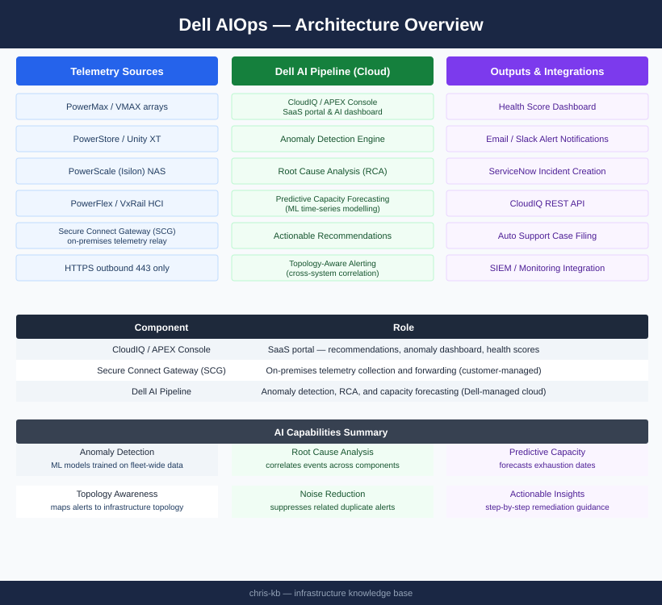

# Dell AIOps — Architecture

<div class="kb-summary">
Dell AIOps is a fully SaaS-delivered AI operations platform. Telemetry flows from arrays through the on-premises Secure Connect Gateway to Dell's cloud AI pipeline, which produces anomaly detection, root cause analysis, and prioritised recommendations.
</div>

```text
┌────────────────────────────────────── Dell AIOps — Architecture ──────────────────────────────────────┐
│                                                                                                       │
│   ┌───────────────────────────────────────────────────────────────────────────────────────────────┐   │
│   │             Architecture: microservices deployed as containers or VMs on-premises             │   │
│   │      Collector tier: agents/adapters on each array/server push metrics to ingest service      │   │
│   │         Processing tier: time-series DB + ML engine process streams in near-real-time         │   │
│   │        Presentation tier: web UI, REST API, alert engine, and outbound notification bus       │   │
│   └───────────────────────────────────────────────────────────────────────────────────────────────┘   │
│                                                                                                       │
│    Microservice architecture scales horizontally; each tier deployable independently                  │
│                                                                                                       │
│                                                  ▼                                                    │
│                                                                                                       │
│   ┌──────────────────────────────────────────────┐  ┌─────────────────────────────────────────────┐   │
│   │                Collector Tier                │  │               Processing Tier               │   │
│   │             Native API adapters              │  │             Time-series database            │   │
│   │              SNMP/REST polling               │  │               ML model runtime              │   │
│   │                CloudIQ bridge                │  │              Event correlation              │   │
│   │              Push via HTTPS/443              │  │               Alerting engine               │   │
│   │            Configurable interval             │  │                 Outbound bus                │   │
│   └──────────────────────────────────────────────┘  └─────────────────────────────────────────────┘   │
│                                                                                                       │
│  Physical Infrastructure:                                                                             │
│  AIOps VMs: 8 vCPU/32 GB typical · SSD-backed storage for time-series DB · TCP 443 mesh               │
│                                                                                                       │
│  Key terms:                                                                                           │
│                                                                                                       │
│  Microservices = Independently deployable services each handling a specific function                  │
│  Collector = Agent or adapter that polls or receives metrics from infrastructure                      │
│  Ingest service = API endpoint receiving telemetry from collectors                                    │
│  Time-series DB = Database optimised for sequential metric storage; InfluxDB or similar               │
│  ML model runtime = Execution environment for trained anomaly and prediction models                   │
│  Event correlation = Grouping related events from different sources into a single alert               │
│  Alerting engine = Rule evaluator triggering notifications when conditions are met                    │
│  Outbound bus = Message broker routing alerts to email, webhook, and API consumers                    │
│  CloudIQ bridge = Component forwarding CloudIQ telemetry into AIOps processing tier                   │
│  REST API = Programmatic access to AIOps data for custom dashboards and automation                    │
│  Horizontal scale = Adding collector or processing nodes to handle more data sources                  │
│  HTTPS/443 = All AIOps inter-component communication encrypted in transit                             │
│                                                                                                       │
└───────────────────────────────────────────────────────────────────────────────────────────────────────┘
```


<div class="kb-grid kb-grid-3">
<a class="kb-card" href="how-it-works/"><strong>How It Works</strong><span>SaaS architecture, AI capabilities, telemetry sources, data flow, and component roles.</span></a>
<a class="kb-card" href="integrations/"><strong>Integrations</strong><span>CloudIQ integration, notification channels, and supported Dell platforms.</span></a>
<a class="kb-card" href="design-standards/"><strong>Design Standards</strong><span>Deployment standards, naming conventions, and configuration baselines.</span></a>
</div>

---

## Component Roles

| Component | Role |
|---|---|
| CloudIQ / APEX Console | SaaS portal — recommendations, anomaly dashboard, health scores |
| Secure Connect Gateway (SCG) | On-premises telemetry collection and forwarding (customer-managed) |
| Dell AI Pipeline | Anomaly detection, RCA, and capacity forecasting (Dell-managed cloud) |

---

## Architecture


