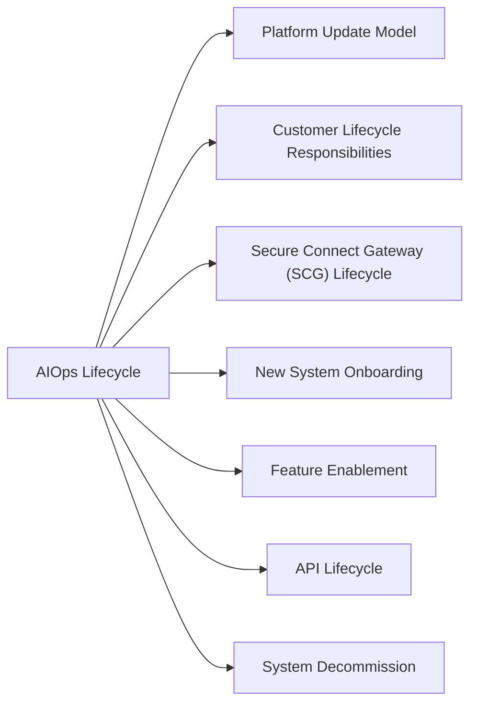

# Dell AIOps Lifecycle



## Platform Update Model

Dell AIOps is a SaaS platform — feature updates, AI model improvements, and bug fixes are deployed by Dell without customer action. Customers should monitor CloudIQ release notes for:

- New AI model capabilities
- New recommendation types
- API endpoint changes or deprecations
- New platform support (confirm newly deployed arrays are supported)

**Release notes location**: CloudIQ portal > Settings > Release Notes

## Customer Lifecycle Responsibilities

| Activity | Responsibility | Frequency |
|---|---|---|
| Platform updates / AI model rollouts | Dell (automatic) | Per Dell release schedule |
| SCG version management | Customer | As new versions are released |
| New system onboarding | Customer | When new arrays are deployed |
| API token lifecycle management | Customer | Annual rotation |
| Tag compliance review | Customer | Monthly |
| Feature enablement review | Customer | Quarterly |

## Secure Connect Gateway (SCG) Lifecycle

The SCG is the only customer-managed component in the Dell AIOps stack. Keeping SCG current ensures access to new platform support and AIOps features.

### Check Current SCG Version

```text
SCG admin UI > System Settings > About
Note the installed version and compare to the latest on Dell Support Portal:
support.dell.com > Products > CloudIQ > Secure Connect Gateway > Downloads
```

### SCG Upgrade Procedure

```text
1. Download upgrade package from Dell Support Portal
2. Log into SCG admin UI: https://<SCG-IP>:9443
3. Navigate to: System Settings > Software Updates
4. Upload the package and follow the upgrade wizard
5. SCG restarts (collection pause ~10–15 minutes)
6. Post-upgrade: verify all systems show Collecting status in CloudIQ
   (allow up to 30 minutes for telemetry to resume)
7. Check AIOps recommendations dashboard for new recommendations post-upgrade
```

## New System Onboarding

When a new Dell storage system is deployed and must be monitored by AIOps:

```text
1. Register the system in the SCG:
   SCG admin UI > Systems > Add System
   - Enter management IP and read-only service account credentials
   - Test connection

2. Confirm system appears in CloudIQ:
   CloudIQ portal > Assets — verify system is listed and has a health score
   (Allow 30–60 minutes for initial telemetry collection and health score calculation)

3. Apply mandatory tags:
   CloudIQ portal > Assets > [System] > Tags
   - site, environment, tier

4. Verify AIOps recommendations start appearing for the new system within 24 hours
   (initial baseline establishment takes time)
```

## Feature Enablement

Some AIOps features are not enabled by default and require manual activation:

```text
CloudIQ portal > Settings > Features
- Review available features per your subscription tier
- Enable/disable features relevant to your environment
- Document which features are enabled and the date of enablement
```

## API Lifecycle

The CloudIQ REST API used by AIOps scripts is versioned. Deprecated endpoints are published in CloudIQ release notes.

```text
Monitor for deprecation notices in:
- CloudIQ release notes
- Dell API documentation: developer.dell.com/cloudiq

When an endpoint is deprecated:
1. Identify all scripts/integrations using the deprecated endpoint
2. Update scripts to use the replacement endpoint
3. Test in non-prod before rolling out
4. Target completion before the deprecation date published by Dell
```

## System Decommission

When decommissioning a Dell system that is managed by AIOps:

```text
1. Ensure all open recommendations for the system are resolved or closed
2. Remove the system from the SCG: SCG admin UI > Systems > [System] > Delete
3. Remove the system from CloudIQ: CloudIQ portal > Assets > [System] > Remove
4. Update notification rules to remove the decommissioned system from alert scopes
```
