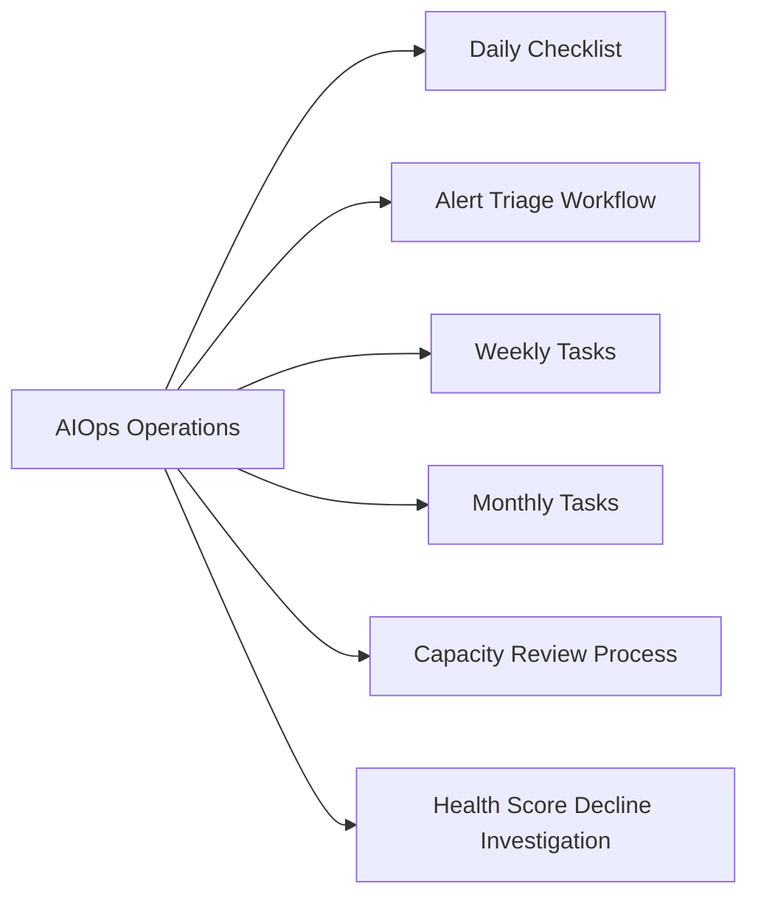

# Dell AIOps Operations



## Daily Checklist

| Check | Location | Pass Criteria |
|---|---|---|
| New Critical recommendations | CloudIQ > AIOps > Recommendations | No unacknowledged Critical recommendations |
| Active anomaly alerts | CloudIQ > AIOps > Anomalies | Review any new anomalies; no unacknowledged Critical anomalies |
| Infrastructure health scores | CloudIQ > Assets | No systems below 60 health score |
| SCG collection status | SCG admin UI > Systems | All systems show last-seen within 30 minutes |
| Notification delivery | CloudIQ > Settings > Notifications > Delivery Log | No failed notification deliveries |

## Alert Triage Workflow

### Critical or High Recommendation

```text
1. Open CloudIQ > AIOps > Recommendations
2. Click into the recommendation — review:
   - Affected system and component
   - Root cause analysis summary
   - Recommended action(s)
   - Time-to-impact estimate
3. Determine if this requires an emergency change or a standard change:
   - Days-to-impact < 7 days OR hardware fault: emergency change process
   - All other: standard change request
4. Raise ServiceNow record (auto-created if webhook is configured)
5. Acknowledge the recommendation in CloudIQ
6. Action during approved change window
7. Post-action: monitor health score for improvement over next 2–4 hours
```

### Anomaly Investigation

```text
1. CloudIQ > AIOps > Anomalies > [New Anomaly]
2. Review:
   - Affected metric (latency, IOPS, capacity growth rate)
   - Time of anomaly detection vs. start of deviation
   - Correlated events (firmware change, workload spike, replication event)
3. Cross-reference with Aria Operations for correlated VM workload changes
4. Determine root cause:
   - Workload-driven: notify application team; no storage action required
   - Storage-driven: investigate further; may require SCG-level diagnostics
5. Annotate the anomaly in CloudIQ with findings
6. If a storage-level issue is confirmed: raise ServiceNow incident
```

## Weekly Tasks

- Review the full recommendation queue — action or defer all High-priority items with documented rationale
- Confirm all storage systems are reporting (last-seen < 1 hour for all systems)
- Review capacity trend forecasts — flag systems with < 45 days remaining to capacity threshold
- Check anomaly frequency by system — identify persistently noisy systems for threshold tuning

## Monthly Tasks

- Generate AIOps Recommendations Summary report and share in the monthly infrastructure review
- Review anomaly trend analysis — identify recurring anomaly patterns
- Audit open/deferred recommendations — escalate any that have been deferred more than twice
- Review and update notification rules for any changes in team structure or on-call rotation
- Verify SIEM audit log export completed for the month

## Capacity Review Process

```text
1. CloudIQ > Capacity > [Select platform type: PowerStore / PowerScale / etc.]
2. Review 90-day capacity forecast for each system
3. Flag systems with:
   - Current usage > 70% (Warning) — track
   - Days to threshold < 45 (Warning) — add to capacity planning queue
   - Days to threshold < 15 (Critical) — raise immediate action item
4. Document in the capacity planning register with planned expansion date
```

## Health Score Decline Investigation

If a system's health score drops from the previous check:

```text
1. CloudIQ > Assets > [System] > Health Score History
   - Note when the decline started
   - Check for correlation with maintenance, firmware upgrades, or workload changes
2. Review associated AIOps recommendations for root cause
3. Check active hardware faults: CloudIQ > Assets > [System] > Faults
4. If hardware fault: open Dell support case with system serial number and fault details
5. Track health score recovery — confirm score improves after recommended action
```
