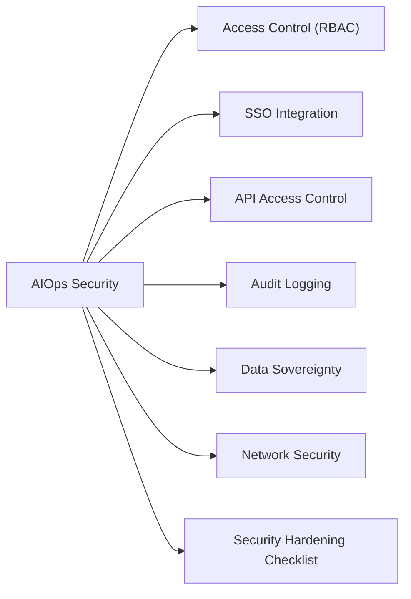

# Dell AIOps Security



## Access Control (RBAC)

Dell AIOps access control inherits from CloudIQ RBAC. Roles are assigned per user in the CloudIQ portal.

| Role | Capabilities |
|---|---|
| Admin | Full access: recommendations, configuration, notification rules, user management, API client management |
| Viewer | Read-only access to recommendations, anomalies, health data, and capacity trends |

User management: **CloudIQ portal > Settings > User Management**

Apply the principle of least privilege. Operations staff reviewing dashboards and recommendations should be Viewers. Admins should be limited to designated platform administrators.

## SSO Integration

Dell AIOps authentication is handled through CloudIQ SSO, which supports SAML 2.0 integration with enterprise IdPs.

```text
CloudIQ portal > Settings > Identity Providers > Add
- SAML 2.0 metadata from Okta / Azure AD / ADFS
- Attribute mapping: email → user account, group claim → Admin/Viewer role
- Enable JIT provisioning for automatic account creation from IdP groups
```

After SSO is configured, disable local CloudIQ account login for all non-break-glass users.

## API Access Control

All REST API access uses OAuth2 client credentials. Each consuming system should have its own API client with minimum required scopes.

```text
Create an API client:
CloudIQ portal > Settings > API Clients > Add Client
- Name: descriptive (e.g., automation-aiops, splunk-aiops)
- Scopes: read-only for monitoring and reporting
- Store client_id and client_secret in secrets manager immediately
  (secret only shown once)
```

### API Credential Rotation

```text
Rotation procedure (90-day schedule):
1. CloudIQ portal > Settings > API Clients > [Client] > Rotate Secret
2. Update new client_secret in secrets manager
3. Redeploy all scripts and integrations referencing the old secret
4. Verify scripts return HTTP 200 with new credentials
5. Log rotation date and next due date in the credential register
```

## Audit Logging

CloudIQ audit log captures all administrative actions for AIOps configuration and access.

```text
CloudIQ portal > Settings > Audit Log
- View: filter by user, date, or action type
- Export to CSV for SIEM ingestion
```

Key events to review in audit log:
- User login/logout (especially failed logins or logins from unexpected locations)
- API client creation, modification, and secret rotation
- Notification rule changes
- Recommendation acknowledgement and dismissal

**Retention**: Export audit logs monthly to SIEM for long-term retention beyond CloudIQ's on-platform retention window.

## Data Sovereignty

AIOps telemetry is processed entirely in Dell's cloud infrastructure.

| Consideration | Detail |
|---|---|
| Data type | Storage performance metrics, capacity data, hardware health — not customer data or PII |
| Processing location | Dell cloud (confirm EU region for GDPR compliance if required) |
| Retention in Dell cloud | Per Dell's data retention policy — review Dell's privacy documentation |
| Local SCG buffer | SCG stores a short-term telemetry buffer on disk — ensure SCG VM disk is on an encrypted datastore |

## Network Security

| Control | Implementation |
|---|---|
| SCG egress | TCP 443 outbound only to Dell cloud endpoints; no inbound rules required |
| SCG management UI access | Restrict to ops management subnet via firewall rule (TCP 9443) |
| Array credentials on SCG | Use dedicated read-only service accounts per array; store in SCG credential store |

## Security Hardening Checklist

- [ ] SSO enabled; local accounts disabled for non-break-glass users
- [ ] Admin role limited to designated platform administrators
- [ ] API clients scoped to minimum required permissions
- [ ] API secrets stored in secrets manager; not in scripts or repos
- [ ] API secret rotation on 90-day schedule; rotation dates tracked
- [ ] SCG management UI access restricted to ops subnet
- [ ] SCG VM disk on encrypted datastore
- [ ] NTP configured on SCG (prevents certificate validation failures)
- [ ] Audit log exported to SIEM monthly
- [ ] Annual review of user accounts — remove stale accounts
