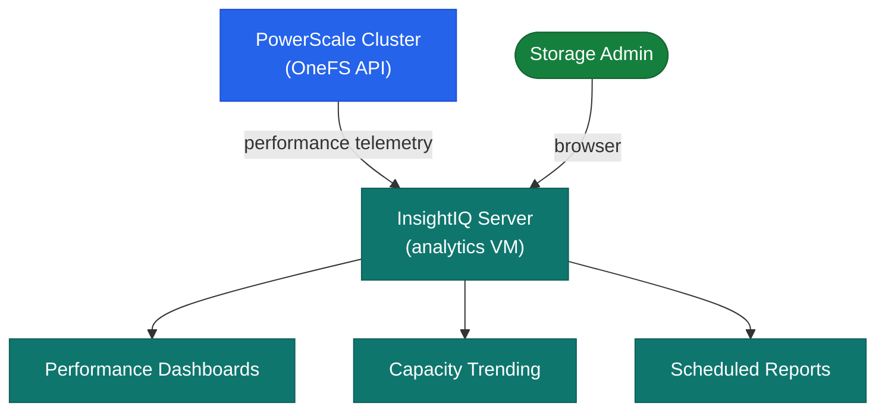

# InsightIQ — Architecture

InsightIQ is an on-premises virtual appliance that collects performance telemetry from PowerScale clusters via the OneFS REST API and stores it in a local PostgreSQL database for historical trend analysis and reporting.

<a class="kb-card" href="how-it-works/"><strong>How It Works</strong>Deployment architecture, data collection, retention sizing, network requirements, and HA.</a>
<a class="kb-card" href="integrations/"><strong>Integrations</strong>PowerScale OneFS integration, SIEM forwarding, and email alerting.</a>
<a class="kb-card" href="design-standards/"><strong>Design Standards</strong>Sizing guidelines, naming conventions, and configuration baselines.</a>

---

## Component Roles

| Component | Details |
|---|---|
| InsightIQ VM | OVA (VMware) or Linux installer; hosts collection engine and web dashboard |
| PostgreSQL | Local metrics database on the appliance |
| OneFS data connector | REST API pull from cluster management IP (port 8080) |

---

## Deployment Architecture

