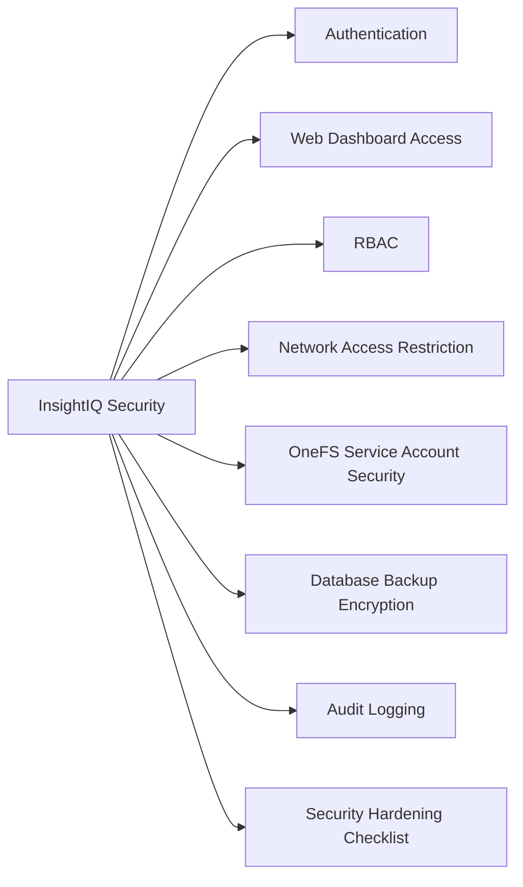

# InsightIQ Security



## Authentication

InsightIQ supports local accounts and LDAP/Active Directory integration. LDAP integration is strongly preferred for production environments to enable centralised account management and audit.

### Local Accounts

Local accounts should be limited to:
- The initial admin account used during deployment
- A break-glass account in case LDAP is unavailable

Do not use local accounts for day-to-day operations.

### LDAP / Active Directory Integration

```text
InsightIQ web UI > Administration > Authentication > LDAP
- LDAP server: ldaps://<DC-FQDN>:636 (use LDAPS — not plain LDAP)
- Bind DN: CN=svc-iiq-ldap,OU=ServiceAccounts,DC=company,DC=com
- Base DN: OU=StorageTeam,DC=company,DC=com
- Group attribute: memberOf
- Admin group → InsightIQ Administrator role
- Viewer group → InsightIQ ReadOnly role
```

LDAP bind account credentials are stored in the team secrets manager. Rotate annually.

## Web Dashboard Access

**HTTPS-only policy**: HTTP access must be disabled. Replace the self-signed certificate with one signed by the internal CA.

```bash
# On InsightIQ appliance — replace TLS certificate
# Place the certificate and key in /etc/iiq/ssl/
cp company-ca-signed.crt /etc/iiq/ssl/iiq.crt
cp iiq.key /etc/iiq/ssl/iiq.key

# Restart InsightIQ to apply
sudo systemctl restart iiq
```

Enforce HTTPS redirect: configure the InsightIQ web server to redirect HTTP (port 80) to HTTPS (port 443).

## RBAC

InsightIQ has two access levels:

| Role | Capabilities |
|---|---|
| Administrator | Full access: cluster management, configuration, user management, report creation, alert configuration |
| ReadOnly (Viewer) | View dashboards, run reports, view cluster performance data — no configuration changes |

Assign ReadOnly to all operations staff who need dashboard access but do not manage the appliance. Restrict Administrator to designated InsightIQ administrators.

## Network Access Restriction

InsightIQ management should only be accessible from the operations management subnet.

```bash
# Example: iptables rule to restrict web UI access
iptables -A INPUT -p tcp --dport 443 -s <mgmt-subnet>/24 -j ACCEPT
iptables -A INPUT -p tcp --dport 443 -j DROP

# Restrict SSH access to ops management subnet
iptables -A INPUT -p tcp --dport 22 -s <mgmt-subnet>/24 -j ACCEPT
iptables -A INPUT -p tcp --dport 22 -j DROP
```

Ensure these rules are persistent across reboots (via iptables-save or firewalld).

## OneFS Service Account Security

The `svc-insightiq` service account on OneFS must be read-only and scoped to the minimum required privileges.

```bash
# Verify the InsightIQ service account privileges on OneFS
isi auth roles list | grep IIQ
isi auth roles view IIQ_ReadOnly

# Confirm the account is not in any admin group
isi auth users view svc-insightiq
```

Rotate the service account password on the 12-month schedule. Update the credential in InsightIQ immediately after rotation.

## Database Backup Encryption

InsightIQ database backups contain performance data and should be encrypted at rest.

```bash
# Encrypted backup using GPG
pg_dump -U iiq iiq | gzip | gpg --cipher-algo AES256 \
  --compress-algo none --symmetric \
  --batch --passphrase-fd 0 > /backup/iiq_$(date +%Y%m%d).sql.gz.gpg <<< "$BACKUP_PASSPHRASE"
```

Store the backup passphrase in the secrets manager. Backup files should be stored on an encrypted backup target or an encrypted datastore.

## Audit Logging

InsightIQ logs admin actions (user logins, configuration changes, cluster add/remove) in the appliance logs. Forward to SIEM via syslog.

```bash
# /etc/rsyslog.d/insightiq.conf
*.* @@<SIEM-IP>:514    # TCP syslog to SIEM

sudo systemctl restart rsyslog
```

Key events to monitor in SIEM:
- User login failures
- Admin configuration changes
- Cluster connection changes

## Security Hardening Checklist

- [ ] LDAP/AD integration enabled; local accounts disabled for non-break-glass users
- [ ] HTTPS enforced; internal CA-signed certificate in place
- [ ] Network access restricted to ops management subnet
- [ ] `svc-insightiq` service account is read-only; password in secrets manager
- [ ] Database backups encrypted at rest and stored on external backup target
- [ ] Syslog forwarding to SIEM configured
- [ ] NTP configured (prevents certificate errors)
- [ ] Stale user accounts removed (monthly review)
- [ ] InsightIQ OS and packages patched on standard patch cycle
