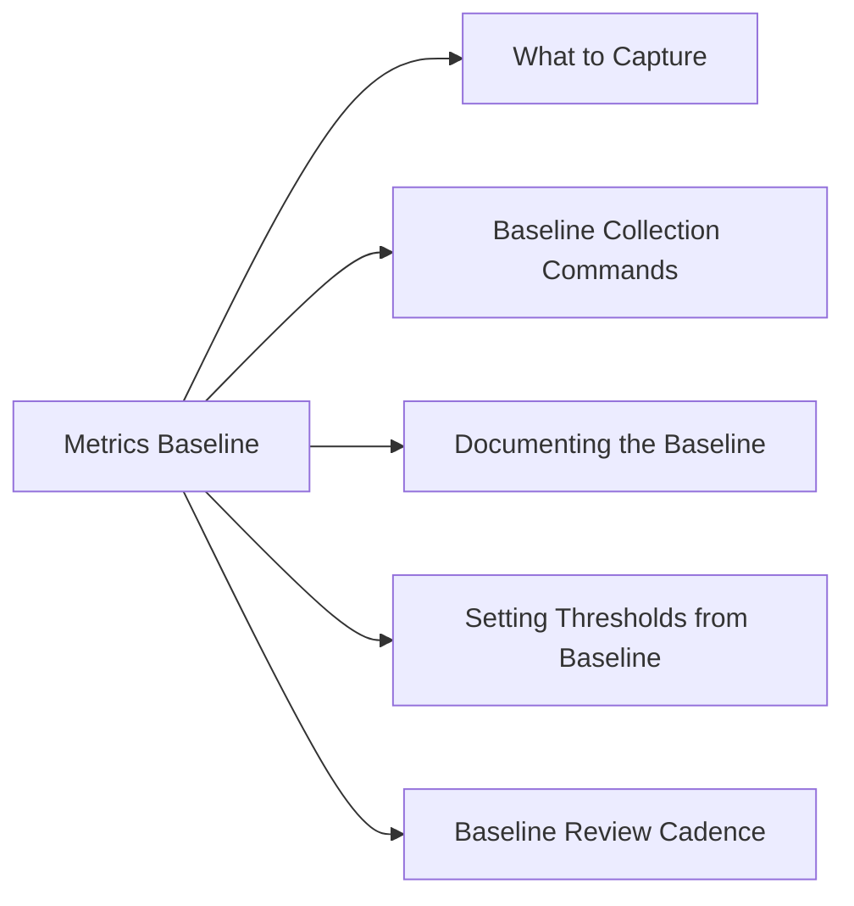

# Performance Metrics Baseline

A documented baseline allows you to distinguish normal variation from genuine anomalies and set meaningful alert thresholds.



## What to Capture

| Metric | Capture Period | Notes |
|---|---|---|
| CPU utilisation | 30-day rolling avg + peak | Separate weekday vs weekend |
| Memory utilisation | 30-day rolling avg | Include swap |
| Disk I/O latency | 30-day avg (read/write separately) | Per LUN / volume |
| Disk throughput (MB/s) | 30-day avg + peak | Per volume |
| Disk IOPS | 30-day avg + peak | Critical for storage sizing |
| Network utilisation | 30-day avg per interface | Flag sustained >60% |
| Application response time | 30-day avg per endpoint | P95 / P99 is more useful than avg |

## Baseline Collection Commands

**Linux — CPU and memory snapshot:**
```bash
# 60-second sample, 5 intervals
vmstat -S M 10 6

# Or sar if sysstat installed
sar -u 5 12      # CPU every 5 sec, 12 samples
sar -r 5 12      # Memory
sar -d 5 12      # Disk I/O
```

**Linux — disk latency:**
```bash
iostat -xz 5 6   # extended stats, 5 sec interval, 6 samples
# key fields: await (avg I/O wait ms), r_await, w_await, util%
```

**Windows — performance counters:**
```powershell
# CPU
Get-Counter '\Processor(_Total)\% Processor Time' -SampleInterval 5 -MaxSamples 12

# Memory available
Get-Counter '\Memory\Available MBytes' -SampleInterval 5 -MaxSamples 12

# Disk latency
Get-Counter '\PhysicalDisk(*)\Avg. Disk sec/Read','\PhysicalDisk(*)\Avg. Disk sec/Write' -SampleInterval 5 -MaxSamples 12
```

**NetApp ONTAP — workload stats:**
```bash
qos statistics workload latency show -iterations 5 -interval 5
statistics show -object system -counter total_ops,read_ops,write_ops,latency
```

**Pure FlashArray:**
```bash
purecli array get --mirrored
purecli volume list --performance    # per-volume latency, IOPS, BW
```

## Documenting the Baseline

Record for each system / service:

```
System:          app-db01
Date captured:   YYYY-MM-DD
Period:          Mon–Fri business hours, 4 weeks

CPU avg:         22%   | peak: 68% (month-end batch)
Memory avg:      71%   | peak: 84%
Disk read lat:   0.8ms | peak: 3ms
Disk write lat:  1.2ms | peak: 5ms
IOPS avg:        3,200 | peak: 12,000
Network (eth0):  120 Mbps avg | 450 Mbps peak
```

## Setting Thresholds from Baseline

Recommended starting point:
- **Warning**: avg + (2 × std deviation), or >75% of peak
- **Critical**: avg + (3 × std deviation), or >90% of peak

Avoid static thresholds that ignore daily/weekly patterns — use dynamic baselines in tools like vROps, Zabbix, or Datadog where available.

## Baseline Review Cadence

| Trigger | Action |
|---|---|
| Quarterly | Review and update baselines for all production systems |
| After major change (hardware refresh, app version) | Re-capture within 2 weeks |
| After sustained alert activity | Investigate: real anomaly or stale baseline |
