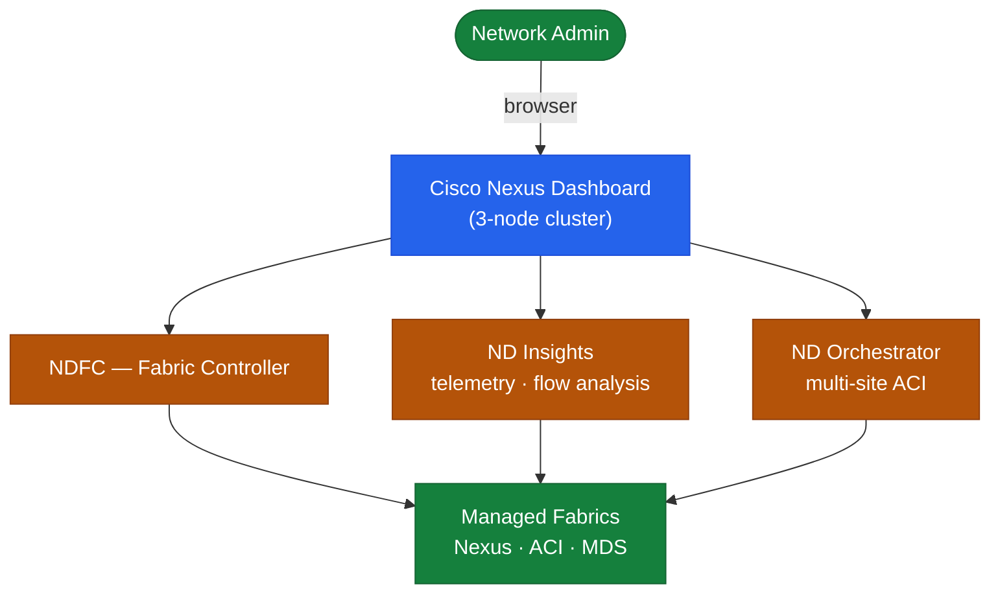

# Nexus Dashboard — How It Works (Monitoring)

Cisco Nexus Dashboard (ND) is a centralised operations platform for Cisco ACI and NX-OS data centre fabrics. It provides unified management, health monitoring, policy orchestration, and network insights through a microservices-based architecture. Services including Nexus Dashboard Fabric Controller (NDFC) and Nexus Dashboard Insights (NDI) run on top of the ND platform and are independently licensed and deployed.

---

## Cluster Architecture

A Nexus Dashboard cluster consists of 3 or 5 nodes. All nodes are peers in a Raft-based cluster consensus model. A virtual IP (VIP) provides a single management entry point.


```

---

## Node Communication

| Path | Protocol | Port | Purpose |
|---|---|---|---|
| ND cluster nodes (internal) | HTTPS | TCP 2379, 2380, 9200 | etcd / Elasticsearch cluster |
| Browser → ND VIP | HTTPS | TCP 443 | Web UI and REST API |
| ND → ACI APIC | HTTPS | TCP 443 | Policy management |
| ND → NX-OS switches | SSH | TCP 22 | Configuration and telemetry |
| ND → NX-OS switches | SNMP | UDP 161/162 | Fault and telemetry |
| ND → Syslog target | Syslog | UDP/TCP 514 | Event forwarding |

---

## Network Interfaces

Each ND node requires two network interfaces:

- **Management interface**: used for admin access and communication with managed devices
- **Data / cluster interface**: used for inter-node cluster communication (dedicated subnet recommended)
