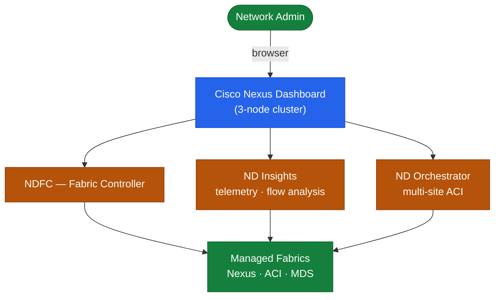

# Nexus Dashboard — Architecture

Nexus Dashboard is a 3- or 5-node Raft-consensus cluster hosting microservice bundles (NDFC, NDI, NDO) that provide unified management and observability across Cisco ACI and NX-OS fabrics.

<a class="kb-card" href="how-it-works/"><strong>How It Works</strong>Cluster architecture, deployment modes, services, ACI/NX-OS integration, and network ports.</a>
<a class="kb-card" href="integrations/"><strong>Integrations</strong>ACI APIC, NX-OS fabrics, multi-site orchestration, and third-party integrations.</a>
<a class="kb-card" href="design-standards/"><strong>Design Standards</strong>Cluster sizing, naming conventions, and configuration baselines.</a>

---

## Cluster Sizing

| Cluster Size | Use Case |
|---|---|
| 3 nodes | Standard production (NDFC or NDI, not both at scale) |
| 5 nodes | HA / multi-service deployment (NDFC + NDI at scale) |
| 1 node | Lab only — not supported for production |

---

## Cluster Architecture

