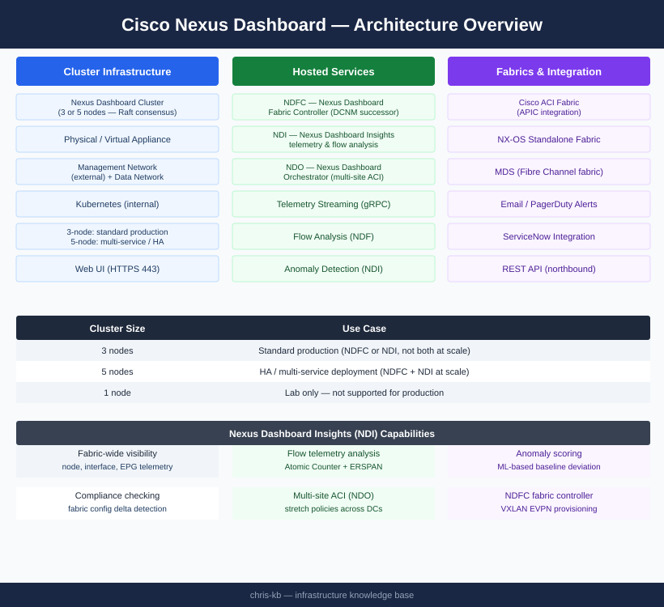

# Nexus Dashboard — Architecture (Monitoring)

<div class="kb-summary">
Nexus Dashboard is a 3- or 5-node Raft-consensus cluster hosting microservice bundles (NDFC, NDI, NDO) that provide unified management and observability across Cisco ACI and NX-OS fabrics.
</div>

```text
┌─────────────────────────────────── Nexus Dashboard — Architecture ────────────────────────────────────┐
│                                                                                                       │
│   ┌───────────────────────────────────────────────────────────────────────────────────────────────┐   │
│   │      Cluster: 3 master nodes (physical or VMware) for HA; optional worker nodes for scale     │   │
│   │     Management network: ND cluster internal · Data network: connects to ACI/NX-OS fabrics     │   │
│   │        Persistent storage: internal or external (pure, block); 500 GB+ per master node        │   │
│   └───────────────────────────────────────────────────────────────────────────────────────────────┘   │
│                                                                                                       │
│    3-node cluster provides quorum and HA; all master nodes active for app hosting                     │
│                                                                                                       │
│                                                  ▼                                                    │
│                                                                                                       │
│   ┌──────────────────────────────────────────────┐  ┌─────────────────────────────────────────────┐   │
│   │           Nexus Dashboard Cluster            │  │             Fabric Connectivity             │   │
│   │              3 master nodes min              │  │                APIC: TCP 443                │   │
│   │              Kubernetes base OS              │  │              NX-OS: SSH TCP 22              │   │
│   │                App containers                │  │             NDFC: gRPC/streaming            │   │
│   │            2 networks: mgmt/data             │  │             NDI: streaming telem            │   │
│   │               500 GB+ per node               │  │             HTTPS for web UI/API            │   │
│   └──────────────────────────────────────────────┘  └─────────────────────────────────────────────┘   │
│                                                                                                       │
│  Physical Infrastructure:                                                                             │
│  Physical: 3x Cisco UCS/x86 nodes · VM: 3x VMware VMs (16 vCPU/64 GB each) · SSD storage              │
│                                                                                                       │
│  Key terms:                                                                                           │
│                                                                                                       │
│  Master node = Primary Nexus Dashboard node hosting apps and control plane                            │
│  Worker node = Additional node adding capacity for app scale; optional                                │
│  Kubernetes = Container orchestration layer running ND apps as pods                                   │
│  Management network = ND cluster internal communication and admin access                              │
│  Data network = Connectivity from ND to managed fabrics (APIC, switches)                              │
│  gRPC = Protocol for streaming telemetry from NX-OS switches to NDI                                   │
│  Streaming telemetry = Real-time metric push from switches to NDI; MDT protocol                       │
│  App containers = NDI, NDFC, NDO each run as containerised apps on ND                                 │
│  Quorum = 3-node cluster requires 2 nodes for majority decision                                       │
│  Persistent storage = ND stores DB data on node local disk or external block                          │
│  MDT = Model-Driven Telemetry; real-time sensor push from NX-OS to NDI                                │
│  SSD = Flash storage required for streaming telemetry DB write performance                            │
│                                                                                                       │
└───────────────────────────────────────────────────────────────────────────────────────────────────────┘
```


<div class="kb-grid kb-grid-3">
<a class="kb-card" href="how-it-works/"><strong>How It Works</strong><span>Cluster architecture, deployment modes, services, ACI/NX-OS integration, and network ports.</span></a>
<a class="kb-card" href="integrations/"><strong>Integrations</strong><span>ACI APIC, NX-OS fabrics, multi-site orchestration, and third-party integrations.</span></a>
<a class="kb-card" href="design-standards/"><strong>Design Standards</strong><span>Cluster sizing, naming conventions, and configuration baselines.</span></a>
</div>

---

## Cluster Sizing

| Cluster Size | Use Case |
|---|---|
| 3 nodes | Standard production (NDFC or NDI, not both at scale) |
| 5 nodes | HA / multi-service deployment (NDFC + NDI at scale) |
| 1 node | Lab only — not supported for production |

---

## Cluster Architecture


