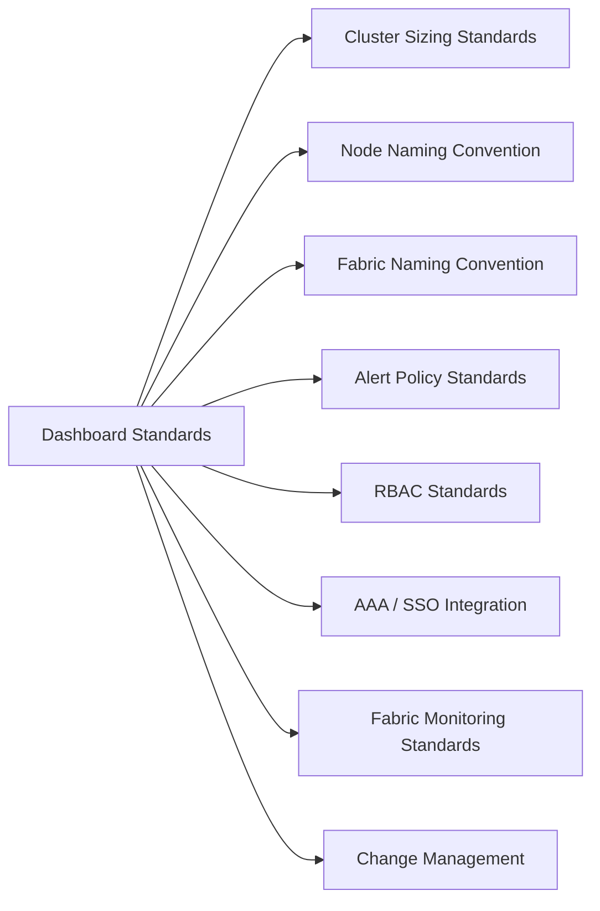

# Nexus Dashboard Standards



## Cluster Sizing Standards

| Environment | Nodes | Services |
|---|---|---|
| Production (single service) | 3 | NDFC or NDI (not both at scale) |
| Production (multi-service) | 5 | NDFC + NDI at production scale |
| Non-production / lab | 3 | Any combination |

Do not run single-node ND clusters in production — a 3-node cluster is the minimum for fault tolerance.

## Node Naming Convention

Nodes are named using the format: `nd-<site>-<number>`

| Example | Description |
|---|---|
| `nd-dc1-01` | First ND node at DC1 |
| `nd-dc1-02` | Second ND node at DC1 |
| `nd-dc2-01` | First ND node at DC2 (disaster recovery) |

Hostnames must be resolvable via DNS and stable — avoid IP-only configurations.

## Fabric Naming Convention

Fabrics onboarded to Nexus Dashboard use the format: `<site>-<fabric-type>-<number>`

| Example | Description |
|---|---|
| `dc1-aci-01` | First ACI fabric at DC1 |
| `dc1-nxos-01` | First NX-OS fabric at DC1 |
| `dc2-aci-01` | ACI fabric at DC2 |

Fabric names are used in dashboards, reports, and alert routing — keep names consistent with network topology documentation.

## Alert Policy Standards

Nexus Dashboard alert priorities align with the operational severity model:

| Priority | Label | Examples | Response |
|---|---|---|---|
| P1 | Critical | Node unreachable, fabric partition, APIC unreachable | Immediate — wake on-call; raise incident |
| P2 | Major | Interface error rate high, BGP session down, hardware fault | Acknowledge within 30 minutes; raise incident |
| P3 | Minor | Sub-optimal path, syslog threshold, interface flap | Review in next 4-hour window |
| P4 | Warning | Configuration compliance deviation, minor health score drop | Review in daily ops check |

Alert policies are configured in **NDI > Assurance > Policies > Alert Policies**.

## RBAC Standards

| Role | Scope | Use Case |
|---|---|---|
| Nexus Dashboard Admin | Full platform admin | Platform administrators only |
| Fabric Operator | Write access to assigned fabrics | NOC / engineers managing specific fabrics |
| ReadOnly | View-only across all fabrics and services | Operations staff, capacity planners |

Apply the principle of least privilege. Fabric Operator roles should be scoped to specific sites/fabrics where possible.

## AAA / SSO Integration

Nexus Dashboard supports LDAP, TACACS+, and RADIUS for authentication and authorisation.

```text
Admin > Authentication > Remote Login Domains > Add
- Type: LDAP (or TACACS+ / RADIUS)
- Server: ldaps://<AD-DC>:636
- Bind DN: CN=svc-nd-ldap,OU=ServiceAccounts,DC=company,DC=com
- Role mapping: LDAP group → ND role
```

SSO (SAML 2.0) is supported on newer ND versions. Enable SSO for simplified enterprise identity integration.

## Fabric Monitoring Standards

- All fabrics must have NDI health scoring enabled within 24 hours of onboarding
- NDI compliance checking must be run against a defined baseline configuration snapshot
- Flow telemetry (if licensed) is enabled on tier-1 production fabrics only
- Minimum NTP sync validation: all fabric nodes must sync to the same NTP source as ND nodes

## Change Management

All configuration changes to production fabrics via NDFC must be tracked as ServiceNow change records. Emergency changes may use the emergency change process, with documentation filed within 24 hours.

## Backup Standards

- ND cluster backup: weekly, automated via Admin > Backup and Restore
- Backup files stored on external NFS or SFTP target
- NDFC configuration backup: weekly
- Backup retention: 4 weeks minimum

```text
Admin > Backup and Restore > Backup
- Destination: SFTP or NFS
- Schedule: weekly (Sunday 02:00)
- Retention: 4 backups
```
