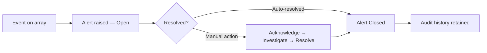

# Pure1 — Alerts

```
Alert Pipeline — Pure1
┌──────────────┐
│  Array event │  (hardware fault / capacity / replication lag)
└──────┬───────┘
       ▼
┌──────────────┐
│ Pure1 ML     │  (anomaly scoring, severity assignment)
└──────┬───────┘
       ▼
┌──────────────┐
│ Alert created│  state: Open
└──────┬───────┘
       │
       ├──────────────┬──────────────┐
       ▼              ▼              ▼
┌────────────┐  ┌──────────┐  ┌──────────────┐
│   Email    │  │  Portal  │  │  REST API /  │
│  (distro   │  │  (UI     │  │  Webhook     │
│   list)    │  │   view)  │  │  (ticketing) │
└────────────┘  └──────────┘  └──────────────┘
```

Pure1 aggregates alerts from all registered arrays in a single pane. Arrays generate alerts automatically for hardware faults, capacity thresholds, replication lag, and performance anomalies.

## Alert Lifecycle



## Viewing Alerts in Pure1

**Pure1 → Alerts** — filtered by:
- Array / site
- Severity: Info / Warning / Error / Critical
- State: Open / Closed
- Time range

## Alerts via CLI

```bash
ssh pureuser@<flasharray-ip>

# All open alerts
purealert list --flagged

# All alerts (including closed)
purealert list

# Filter by severity
purealert list | grep "error\|critical"

# Acknowledge an alert
purealert acknowledge --id <alert-id>
```

## Alerts via Pure1 API

```bash
TOKEN="<pure1-token>"

# All open alerts across all arrays
curl -s "https://api.pure1.purestorage.com/api/1.latest/alerts?filter=state='open'" \
  -H "Authorization: Bearer $TOKEN" | python3 -m json.tool

# Open alerts with severity error or critical
curl -s "https://api.pure1.purestorage.com/api/1.latest/alerts?filter=state='open'%20and%20(severity='error'%20or%20severity='critical')" \
  -H "Authorization: Bearer $TOKEN" | python3 -c "
import sys, json
data = json.load(sys.stdin)
for a in data.get('items', []):
    print(f\"{a['arrays'][0]['name']} | {a['severity'].upper()} | {a['summary']}\")
"
```

## Alert Severity Definitions

| Severity | Meaning | Response |
|---|---|---|
| **Info** | Informational — no immediate action needed | Review at next check |
| **Warning** | Degraded state or approaching threshold | Investigate within 24h |
| **Error** | Service or hardware impact; data protection at risk | Investigate immediately |
| **Critical** | Data loss risk or complete component failure | Escalate immediately |

## Common Alert Types

| Alert | Severity | What it means | Action |
|---|---|---|---|
| `hardware` — drive failed | Error | Physical drive failure | Open Pure support case — covered by Evergreen |
| `hardware` — controller offline | Critical | Controller failure | Open Priority support case immediately |
| `array` — space above 80% | Error | Array approaching capacity | Review snapshots; plan expansion |
| `replication` — lag | Warning | Replication behind RPO target | Check network; investigate source/target load |
| `volume` — almost full | Warning | Thin-provisioned volume near limit | Extend volume or reduce data |
| `phonehome` — disconnected | Warning | Array cannot reach Pure cloud | Check firewall; test outbound TCP 443 |
| `network` — interface down | Error | FC or iSCSI port down | Check cable, switch port, SFP |

## Alert Notification Configuration

### Email

```
Pure1 → Administration → Notification → Email
Add individual or distribution list email addresses
```

### SNMP Traps

```
Array CLI:
puresnmp list          # show current SNMP config
puresnmp set --manager <nms-ip> --community <community>
puresnmp enable

# Import Pure Storage MIB for alert descriptions:
# PURESTORAGE-FA-MIB.txt — available on Pure support portal
```

### Syslog

```bash
# FlashArray
puresyslog list
puresyslog add --address <syslog-ip> --port 514 --protocol udp

# Alerts appear as syslog messages with facility local7
# Format: <severity> <timestamp> <array> <alert-summary>
```

### Webhooks (FlashArray 6.3+)

```
Array UI → Settings → Notification → Webhooks → Add Webhook
URL: https://your-endpoint/pure-webhook
Events: hardware, capacity, replication, network
```

## Alert Integration with Prometheus

Use the `pure-fa-om` Prometheus exporter:

```yaml
# prometheus.yml
scrape_configs:
  - job_name: pure_flasharray
    static_configs:
      - targets: ['<flasharray-ip>']
    metrics_path: /metrics
    params:
      endpoint: ['<flasharray-ip>']
    relabel_configs:
      - target_label: __address__
        replacement: <pure-exporter-host>:9490

# Alert rule example
groups:
  - name: pure
    rules:
      - alert: PureArrayCapacityCritical
        expr: pure_array_space_used_bytes / pure_array_capacity_bytes > 0.85
        labels:
          severity: critical
        annotations:
          summary: "Pure array {{ $labels.array_name }} above 85% capacity"
```
