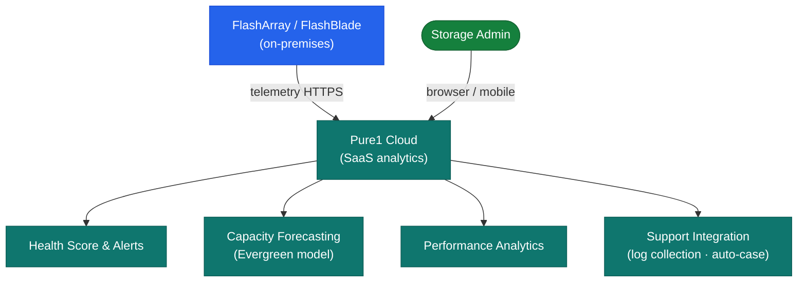

# Pure1 — How It Works

Pure1 is Pure Storage's cloud-based management and analytics platform for FlashArray and FlashBlade systems. It requires no on-premises management infrastructure — each array connects to Pure1 directly via outbound HTTPS. Pure1 provides AI-driven analytics (Pure1 Meta), capacity forecasting, health scoring, and a REST API for programmatic fleet management.

---

## Architecture


┌──────────────────────────────────────── Pure1 — How It Works ─────────────────────────────────────────┐
│                                                                                                       │
│   ┌───────────────────────────────────────────────────────────────────────────────────────────────┐   │
│   │    Step 1: Phonehome — Purity OS sends telemetry to pure1.purestorage.com every 30 seconds    │   │
│   │       Step 2: Ingest — Pure cloud stores metrics in time-series DB with full resolution       │   │
│   │      Step 3: AI Analysis — ML models score health, identify workloads, forecast capacity      │   │
│   │        Step 4: Alert — pre-failure condition or threshold breach triggers notification        │   │
│   │       Step 5: Auto case — Pure1 opens TAC case with diagnostics before customer is aware      │   │
│   │        Step 6: Resolution — Pure stages hardware, engineer resolves; customer notified        │   │
│   └───────────────────────────────────────────────────────────────────────────────────────────────┘   │
│                                                                                                       │
│  Physical Infrastructure:                                                                             │
│  Arrays push to Pure cloud every 30 sec · Pure TAC resolves proactively · no customer action          │
│                                                                                                       │
│  Key terms:                                                                                           │
│                                                                                                       │
│  Phonehome interval = 30 seconds; full metric telemetry at high resolution                            │
│  Pre-failure detection = Pure1 ML identifying component degradation before failure                    │
│  Auto case = Pure1 opening TAC support case automatically with diagnostic bundle                      │
│  Proactive swap = Pure staging replacement drive/module before customer impact                        │
│  Workload ID = Pure1 classifying IO pattern (random/sequential, read/write ratio)                     │
│  Capacity forecast = ML predicting array full date from consumption trend                             │
│  Health score = Composite array health from hardware, performance, and software inputs                │
│  Threshold breach = Alert when metric crosses defined limit (utilisation, latency)                    │
│  TAC = Pure Storage Technical Assistance Centre; resolves proactive cases                             │
│  Diagnostic bundle = Phonehome data attached to auto-opened TAC case                                  │
│  No customer action = Proactive support model aims for zero-touch resolution                          │
│  Evergreen = Subscription includes proactive support and hardware refresh rights                      │
│                                                                                                       │
└───────────────────────────────────────────────────────────────────────────────────────────────────────┘
```

---

## High Availability

Pure1 is managed entirely by Pure Storage as a SaaS platform. Availability SLA and disaster recovery are Pure Storage's responsibility. Customer action is not required for Pure1 infrastructure HA.
