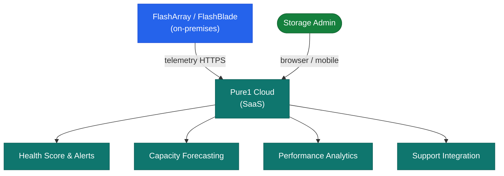

# Pure1 — Architecture

Pure1 is a SaaS monitoring and analytics platform. FlashArray and FlashBlade systems connect directly to Pure1 via outbound HTTPS — no on-premises collector required. Pure1 Meta provides AI-driven capacity forecasting and anomaly detection.

<a class="kb-card" href="how-it-works/"><strong>How It Works</strong>SaaS architecture, telemetry collection, Pure1 Meta AI, data retention, and network requirements.</a>
<a class="kb-card" href="integrations/"><strong>Integrations</strong>REST API, support integration, and third-party platform connections.</a>
<a class="kb-card" href="design-standards/"><strong>Design Standards</strong>Array onboarding standards, naming conventions, and configuration baselines.</a>

---

## Component Roles

| Component | Role |
|---|---|
| Pure1 Cloud | SaaS platform — health, capacity, performance, alerts, REST API |
| Array Purity OS | Generates and uploads telemetry to Pure1 via outbound HTTPS |
| Pure1 Meta | AI/ML engine — workload analytics, anomaly detection, capacity forecasting |

---

## Architecture

