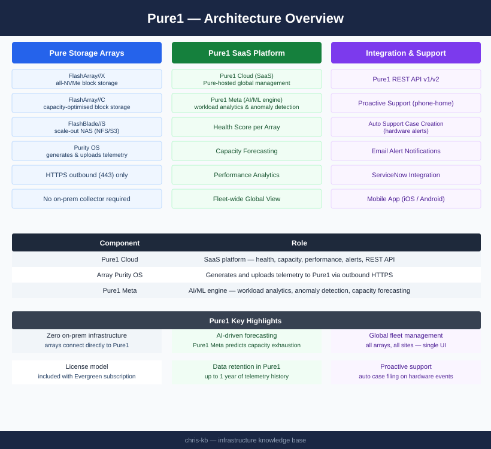

# Pure1 — Architecture

<div class="kb-summary">
Pure1 is a SaaS monitoring and analytics platform. FlashArray and FlashBlade systems connect directly to Pure1 via outbound HTTPS — no on-premises collector required. Pure1 Meta provides AI-driven capacity forecasting and anomaly detection.
</div>

```
┌──────────────────────────────────────── Pure1 — Architecture ─────────────────────────────────────────┐
│                                                                                                       │
│   ┌───────────────────────────────────────────────────────────────────────────────────────────────┐   │
│   │          Pure1 Cloud (pure1.purestorage.com) — SaaS backend operated by Pure Storage          │   │
│   │          AI/ML engine · Time-series DB · Alert engine · Workload analyser · REST API          │   │
│   └───────────────────────────────────────────────────────────────────────────────────────────────┘   │
│                                                                                                       │
│    Phonehome: arrays push telemetry outbound over HTTPS/443 to Pure cloud; zero inbound               │
│                                                                                                       │
│                                                  ▼                                                    │
│                                                                                                       │
│   ┌──────────────────────────────────────────────┐  ┌─────────────────────────────────────────────┐   │
│   │              On-Premises Arrays              │  │             Pure1 Cloud Services            │   │
│   │              FlashArray//X/C/E               │  │               AI/ML analytics               │   │
│   │               FlashBlade//S/E                │  │             Capacity forecasting            │   │
│   │              Phonehome TCP 443               │  │              Proactive support              │   │
│   │              No gateway needed               │  │                 Workload ID                 │   │
│   │              Purity OS built-in              │  │             REST API for tooling            │   │
│   └──────────────────────────────────────────────┘  └─────────────────────────────────────────────┘   │
│                                                                                                       │
│  Physical Infrastructure:                                                                             │
│  FlashArrays/FlashBlades on-prem · Purity OS handles phonehome · TCP 443 outbound only                │
│                                                                                                       │
│  Key terms:                                                                                           │
│                                                                                                       │
│  Phonehome = Purity OS built-in feature sending telemetry to Pure cloud over HTTPS                    │
│  SaaS = Software as a Service; Pure1 hosted and operated by Pure Storage                              │
│  Purity OS = Pure Storage operating system running on FlashArray and FlashBlade                       │
│  FlashArray//X = NVMe all-flash array for block workloads                                             │
│  FlashArray//C = QLC NVMe array for capacity-optimised workloads                                      │
│  FlashBlade//S = Unstructured data all-flash platform for file and object                             │
│  AI/ML analytics = Pure1 ML models for anomaly detection and failure prediction                       │
│  Workload ID = Pure1 classifying workload type from IO pattern (VDI, Oracle, AI/ML)                   │
│  Proactive support = Pure1 detecting pre-failure and staging replacement before alert                 │
│  REST API = Pure1 programmatic interface for metrics and array management                             │
│  No gateway = FlashArray/FlashBlade connect directly to Pure cloud; no proxy needed                   │
│  Zero inbound = Pure cloud never initiates connections to customer network                            │
│                                                                                                       │
└───────────────────────────────────────────────────────────────────────────────────────────────────────┘
```
```text
┌──────────────────────────────────────── Pure1 — Architecture ─────────────────────────────────────────┐
│                                                                                                       │
│   ┌───────────────────────────────────────────────────────────────────────────────────────────────┐   │
│   │          Pure1 Cloud (pure1.purestorage.com) — SaaS backend operated by Pure Storage          │   │
│   │          AI/ML engine · Time-series DB · Alert engine · Workload analyser · REST API          │   │
│   └───────────────────────────────────────────────────────────────────────────────────────────────┘   │
│                                                                                                       │
│    Phonehome: arrays push telemetry outbound over HTTPS/443 to Pure cloud; zero inbound               │
│                                                                                                       │
│                                                  ▼                                                    │
│                                                                                                       │
│   ┌──────────────────────────────────────────────┐  ┌─────────────────────────────────────────────┐   │
│   │              On-Premises Arrays              │  │             Pure1 Cloud Services            │   │
│   │              FlashArray//X/C/E               │  │               AI/ML analytics               │   │
│   │               FlashBlade//S/E                │  │             Capacity forecasting            │   │
│   │              Phonehome TCP 443               │  │              Proactive support              │   │
│   │              No gateway needed               │  │                 Workload ID                 │   │
│   │              Purity OS built-in              │  │             REST API for tooling            │   │
│   └──────────────────────────────────────────────┘  └─────────────────────────────────────────────┘   │
│                                                                                                       │
│  Physical Infrastructure:                                                                             │
│  FlashArrays/FlashBlades on-prem · Purity OS handles phonehome · TCP 443 outbound only                │
│                                                                                                       │
│  Key terms:                                                                                           │
│                                                                                                       │
│  Phonehome = Purity OS built-in feature sending telemetry to Pure cloud over HTTPS                    │
│  SaaS = Software as a Service; Pure1 hosted and operated by Pure Storage                              │
│  Purity OS = Pure Storage operating system running on FlashArray and FlashBlade                       │
│  FlashArray//X = NVMe all-flash array for block workloads                                             │
│  FlashArray//C = QLC NVMe array for capacity-optimised workloads                                      │
│  FlashBlade//S = Unstructured data all-flash platform for file and object                             │
│  AI/ML analytics = Pure1 ML models for anomaly detection and failure prediction                       │
│  Workload ID = Pure1 classifying workload type from IO pattern (VDI, Oracle, AI/ML)                   │
│  Proactive support = Pure1 detecting pre-failure and staging replacement before alert                 │
│  REST API = Pure1 programmatic interface for metrics and array management                             │
│  No gateway = FlashArray/FlashBlade connect directly to Pure cloud; no proxy needed                   │
│  Zero inbound = Pure cloud never initiates connections to customer network                            │
│                                                                                                       │
└───────────────────────────────────────────────────────────────────────────────────────────────────────┘
```


<div class="kb-grid kb-grid-3">
<a class="kb-card" href="how-it-works/"><strong>How It Works</strong><span>SaaS architecture, telemetry collection, Pure1 Meta AI, data retention, and network requirements.</span></a>
<a class="kb-card" href="integrations/"><strong>Integrations</strong><span>REST API, support integration, and third-party platform connections.</span></a>
<a class="kb-card" href="design-standards/"><strong>Design Standards</strong><span>Array onboarding standards, naming conventions, and configuration baselines.</span></a>
</div>

---

## Component Roles

| Component | Role |
|---|---|
| Pure1 Cloud | SaaS platform — health, capacity, performance, alerts, REST API |
| Array Purity OS | Generates and uploads telemetry to Pure1 via outbound HTTPS |
| Pure1 Meta | AI/ML engine — workload analytics, anomaly detection, capacity forecasting |

---

## Architecture


