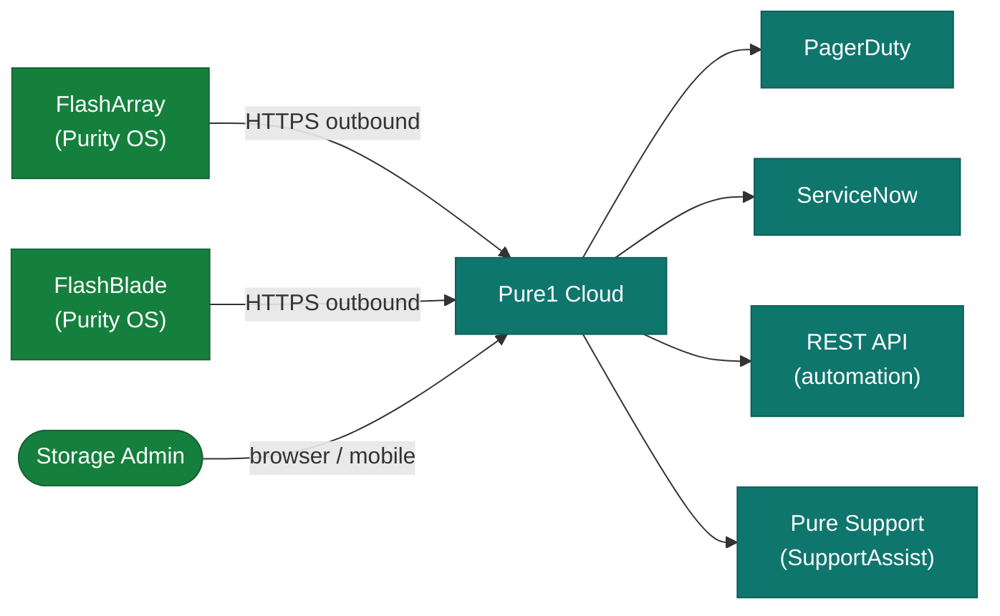

# Pure1 — Integrations

<div class="kb-summary">
Pure1 integrates natively with FlashArray and FlashBlade via Purity OS telemetry, and outbound to ITSM systems, notification channels, and the Pure1 REST API for automation.
</div>

## Native Array Integration

No on-premises collector is required. Each array connects directly to Pure1:

| Array | Integration Mechanism | Data Sent |
|---|---|---|
| FlashArray (Purity//FA) | Outbound HTTPS from array | Performance metrics, capacity, alerts, health |
| FlashBlade (Purity//FB) | Outbound HTTPS from array | Capacity, performance, filesystem health |

- Arrays use the built-in Pure SupportAssist channel — same HTTPS path as support data
- No firewall inbound rules required; only outbound 443 to `*.purestorage.com`
- Each array authenticates with a unique array identity token (auto-provisioned by Purity OS)

## ITSM and Notification Integrations

| Integration | Method | Configuration |
|---|---|---|
| Email | SMTP via Pure1 cloud | Pure1 → Account → Notification Rules |
| PagerDuty | REST outbound | Pure1 → Account → Integrations → PagerDuty |
| ServiceNow | Webhook (REST) | Pure1 → Account → Integrations → Webhook |
| Slack | Incoming webhook | Pure1 → Account → Integrations → Slack |

## Pure1 REST API

```bash
# Get API token (OAuth 2.0 with JWT)
curl -X POST https://api.pure1.purestorage.com/oauth2/1.0/token \
  -d "grant_type=urn:ietf:params:oauth:grant-type:jwt-bearer&assertion=<signed_jwt>"

# List all arrays
curl -H "Authorization: Bearer <token>" \
  "https://api.pure1.purestorage.com/api/1.latest/arrays"

# Get capacity metrics
curl -H "Authorization: Bearer <token>" \
  "https://api.pure1.purestorage.com/api/1.latest/metrics/history?names=array_total_capacity&ids=<array_id>"
```

Authentication uses RSA key pairs — generate a key pair in Pure1 → Profile → API Registration.

## SupportAssist Integration

- **Remote Support**: Allows Pure engineers to open a secure tunnel (requires per-session approval)
- **Support Tickets**: Auto-opened from Pure1 when an array alert triggers a support case
- **Evergreen Subscription**: Pure1 tracks subscription entitlements and flags non-compliance

## Integration Architecture


