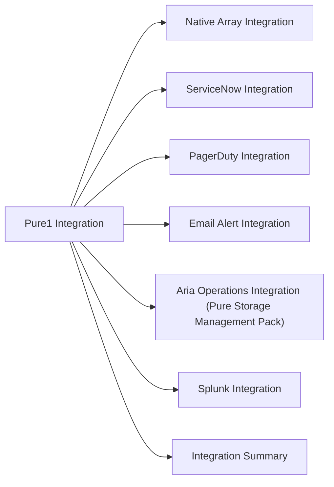

# Pure1 Integration



## Overview

Pure1 integrates natively with all Pure Storage FlashArray and FlashBlade systems via outbound telemetry. External integrations extend Pure1 data and alerts into ITSM, observability, on-call, and notification platforms.

## Native Array Integration

All Pure arrays connect to Pure1 automatically over outbound HTTPS. No on-premises collector is required.

```bash
# Verify array connectivity from Purity CLI
purearray list --connection
# Expected: pure1.purestorage.com connected

# Check array network configuration
purearray list --network

# Set proxy if needed
purearray set --proxy https://<proxy-host>:<port>
```

## ServiceNow Integration

Pure1 creates ServiceNow incidents on CRITICAL alerts via webhook notification rules.

```text
Pure1 > Administration > Notifications > Add Rule
- Trigger: Alert Severity = CRITICAL
- Action: Webhook
- URL: https://<instance>.service-now.com/api/now/table/incident
- Auth: Basic (svc-pure1-snow service account)
- Payload:
  {
    "short_description": "Pure1 CRITICAL: {{alert.summary}} — {{array.name}}",
    "severity": "1",
    "assignment_group": "storage-ops",
    "description": "Array: {{array.name}}\nSerial: {{array.serial}}\nAlert: {{alert.description}}\nPure1 ID: {{alert.id}}"
  }
```

Test the webhook before enabling: **Notifications > [Rule] > Test**.

## PagerDuty Integration

For CRITICAL alerts requiring immediate on-call response:

```text
Pure1 > Administration > Notifications > Add Rule
- Trigger: Alert Severity = CRITICAL
- Action: Webhook (PagerDuty Events API v2)
- URL: https://events.pagerduty.com/v2/enqueue
- Payload:
  {
    "routing_key": "<PagerDuty integration key>",
    "event_action": "trigger",
    "payload": {
      "summary": "Pure1 CRITICAL: {{alert.summary}}",
      "severity": "critical",
      "source": "{{array.name}}"
    }
  }
```

## Email Alert Integration

```text
Pure1 > Administration > Notifications > Add Rule
- Trigger: Alert Severity = WARNING
- Action: Email
- Recipients: storage-ops@company.com
- Include: array name, health score, alert description
```

Separate rules for WARNING (email) and CRITICAL (PagerDuty + ServiceNow) are the recommended pattern.

## Aria Operations Integration (Pure Storage Management Pack)

The Pure Storage Management Pack for Aria Operations pulls FlashArray metrics into vROps for correlated VMware + storage dashboards.

```text
Aria Operations > Admin > Solutions > Pure Storage Management Pack
- Pure1 API endpoint: https://api.pure1.purestorage.com
- API key / private key: (service account key from Pure1)
- Collection interval: 5 minutes
```

Key metrics available in Aria Operations from this integration:
- Array IOPS, throughput, latency
- Volume-level performance
- Array capacity used / available / data reduction ratio

## Splunk Integration

A Splunk Heavy Forwarder or a scheduled script pulls Pure1 API data for fleet health and capacity dashboards in Splunk.

```python
# Example: scheduled Pure1 API pull for Splunk index
# Runs every 15 minutes via Splunk scripted input or cron

import requests, json, time

# Auth using Pure1 RSA private key (see scripts/pure1/authentication.py)
headers = {"Authorization": f"Bearer {get_pure1_token()}"}
resp    = requests.get("https://api.pure1.purestorage.com/api/1.latest/arrays",
                       headers=headers)
for array in resp.json()["items"]:
    event = {
        "source": "pure1",
        "name": array["name"],
        "os": array.get("os"),
        "version": array.get("version"),
        "time": int(time.time())
    }
    print(json.dumps(event))  # Splunk scripted input reads stdout
```

## Integration Summary

| Integration | Method | Purpose |
|---|---|---|
| FlashArray / FlashBlade | Outbound HTTPS (native — Purity) | Fleet health, capacity, performance telemetry |
| Aria Operations | Pure Storage Management Pack | vROps dashboards with Pure array data |
| Splunk | Pure1 REST API poller | Capacity and alert events in Splunk |
| ServiceNow | Pure1 alert webhook | Auto-ticket creation on CRITICAL alerts |
| PagerDuty | Pure1 alert webhook | On-call notification for CRITICAL alerts |
| Slack / Teams | Pure1 alert webhook | Real-time alert notifications to ops channel |
| Email | Pure1 notification rules | WARNING alert distribution |
