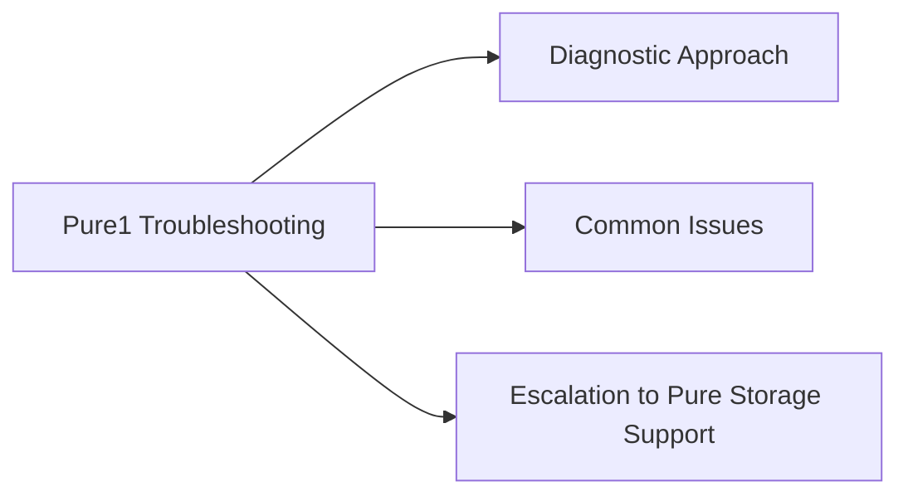

# Pure1 Troubleshooting



## Diagnostic Approach

1. Check the array's last-seen timestamp in Pure1 — this determines how stale the data is.
2. If last-seen is > 30 minutes ago, the problem is almost always connectivity from the array to Pure1.
3. Verify outbound HTTPS from the array before investigating further.

## Common Issues

### Array Not Reporting in Pure1

**Symptoms**: Array is missing from Pure1 Assets, or shows as "Disconnected".

```bash
# Step 1: Check array connectivity from Purity CLI
purearray list --connection
# If pure1.purestorage.com shows "disconnected":

# Step 2: Verify network configuration
purearray list --network
# Confirm management IP, gateway, DNS are correct

# Step 3: Test outbound HTTPS connectivity
# From the array support shell (requires Pure support):
curl -v https://pure1.purestorage.com

# Step 4: Check if a proxy is required and configured
purearray list | grep proxy
# If proxy is needed but not set:
purearray set --proxy https://<proxy-host>:<port>

# Step 5: Check firewall rules
# Array management IP must have outbound TCP 443 to pure1.purestorage.com
# Verify with network team if connectivity test fails
```

If array was recently onboarded, allow 30–60 minutes for first telemetry to appear.

### Stale Data / Old Last-Seen Timestamp

**Symptoms**: Metrics in Pure1 are hours or days out of date.

```bash
# Check Purity management service health
pureadmin list --api-token   # verify management services are running
puremessage list             # review recent system messages for errors

# If Purity management is running but connectivity is intermittent:
# - Check for network flaps on management interface
# - Review switch logs for the port connected to array management IP

# Restart Pure1 telemetry (if Purity running but connectivity was briefly lost):
# Connection recovers automatically — allow 15–30 minutes after connectivity restores
```

### API Rate Limiting (HTTP 429)

**Symptoms**: Automation scripts return `HTTP 429 Too Many Requests`.

```python
# Implement exponential backoff in all scripts
import time, requests

def api_get_with_retry(url, headers, max_retries=5):
    for attempt in range(max_retries):
        resp = requests.get(url, headers=headers)
        if resp.status_code == 429:
            wait = (2 ** attempt) + (random.random() * 0.5)
            print(f"Rate limited — retrying in {wait:.1f}s")
            time.sleep(wait)
            continue
        resp.raise_for_status()
        return resp.json()
    raise RuntimeError("Max retries exceeded due to rate limiting")
```

Additional steps:
- Reduce polling frequency in scripts (increase interval from 5 to 15 minutes)
- Consolidate multiple scripts into a single scheduled run that caches results
- Ensure scripts are not running concurrently (use locking or staggered cron schedules)

### Missing Arrays in Pure1 Dashboard

**Symptoms**: Arrays are collecting but not visible in a dashboard or report.

```text
1. Check if a tag filter is active in the dashboard view:
   Pure1 > Fleet > clear any active tag/site filters
2. Verify the array has the required tags (Site, Environment, Owner)
3. Confirm your Pure1 user account has access to the site/tag scope
   (Admin may have scoped your account to specific tags)
```

### Alert Notifications Not Delivered

**Symptoms**: A CRITICAL alert fired in Pure1 but no PagerDuty/email notification was received.

```text
1. Pure1 > Administration > Notifications > [Rule]
   - Verify the rule is enabled
   - Confirm the webhook URL / email address is current
   - Check rule scope: does it cover the affected array's tags?

2. Test the notification rule manually:
   Actions > Test Notification

3. For PagerDuty: verify the integration routing key has not been rotated/changed

4. For email: check spam/junk folders; verify the relay server is operational

5. Check Pure1 notification delivery log:
   Administration > Notifications > Delivery Log
```

### Authentication Failure (Pure1 API — HTTP 401)

**Symptoms**: Scripts return HTTP 401 Unauthorized.

```text
1. Confirm the API token has not been rotated without updating the secrets manager
2. Verify the service account is not disabled:
   Pure1 > Administration > API Registration > [Account] > Status
3. Confirm the private key file is correct and not corrupted
4. Re-generate a new API token if needed:
   Administration > API Registration > [Account] > Rotate Key
5. Update the secrets manager with the new key
```

## Escalation to Pure Storage Support

- Portal: support.purestorage.com
- Include: array serial number (from `purearray list`), the last-seen timestamp from Pure1, and a description of the symptom
- For array connectivity issues: Pure support can initiate a diagnostic from the array side
