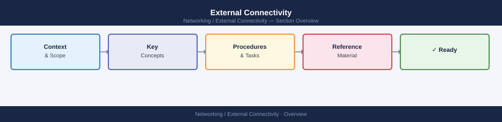

---
tags:
  - networking
---
# External Connectivity


<div class="kb-summary">
Covers infrastructure paths for internet egress, WAN/MPLS, cloud direct connections, and partner API connectivity.
</div>



---

## On-Premises to Cloud — Network Topology

How traffic flows from an ESXi host through your core network out to AWS or Azure over a VPN tunnel.


---

## Connectivity Paths

| Path Type | Description | Typical Components |
|---|---|---|
| **Internet egress (NAT/proxy)** | Outbound traffic from servers or VMs to the public internet, routed via NAT gateway or explicit proxy | NAT gateway, forward proxy (Squid/Zscaler), firewall outbound policy |
| **WAN / MPLS** | Private layer-3 connectivity between data centres or branch offices without traversing the public internet | MPLS PE router, CE router, BGP or OSPF peering, QoS policy |
| **Cloud Direct Connect / ExpressRoute** | Dedicated private circuit from on-premises to AWS (Direct Connect) or Azure (ExpressRoute) — bypasses the public internet | Direct Connect hosted connection or dedicated connection, Virtual Private Gateway or Transit Gateway; Azure: ExpressRoute circuit, virtual network gateway |
| **Partner API connections** | Outbound HTTPS calls from internal systems to third-party APIs (payment processors, SaaS platforms, suppliers) | Application server, proxy or NAT, firewall allow rule for destination CIDR/FQDN, partner-provided credentials |

---

## Health Check Commands

### Outbound internet reachability

```bash
# HTTP/HTTPS reachability and response code
curl -o /dev/null -s -w "%{http_code}  %{time_total}s\n" https://api.example.com/health

# TLS certificate expiry check (days remaining)
echo | openssl s_client -connect api.example.com:443 -servername api.example.com 2>/dev/null \
  | openssl x509 -noout -dates

# MTU path discovery — detect PMTUD black holes (Linux)
ping -M do -s 1400 -c 4 8.8.8.8

# Windows equivalent
ping -f -l 1400 8.8.8.8
```

### Route and latency

```bash
# Traceroute to confirm path and hop count (Linux)
traceroute -n api.example.com

# Windows equivalent
tracert -d api.example.com

# Test TCP reachability on a specific port (Windows)
Test-NetConnection -ComputerName api.example.com -Port 443

# Test TCP port reachability (Linux)
nc -zv api.example.com 443
```

### DNS resolution

```bash
# Confirm DNS resolves to expected addresses
dig +short api.example.com

# Test with a specific resolver (check split-DNS behaviour)
dig @10.0.0.53 api.example.com

# Windows
Resolve-DnsName api.example.com
```

### Cloud Direct Connect / ExpressRoute

```bash
# AWS: verify BGP session state on a virtual interface
aws directconnect describe-virtual-interfaces --query 'virtualInterfaces[*].[virtualInterfaceId,bgpPeers[*].bgpStatus]'

# Azure: verify ExpressRoute circuit peering state
az network express-route show --name <circuit-name> --resource-group <rg> --query 'serviceProviderProvisioningState'
```

---

## Firewall Rule Verification

| Platform | Command / Method | What to Confirm |
|---|---|---|
| **Cisco ASA** | `show access-list <acl-name>` | Rule exists, hit count is non-zero (confirms traffic is matching). |
| **Cisco ASA** | `packet-tracer input <interface> tcp <src-ip> 1024 <dst-ip> 443 detail` | Simulates a packet — confirm result is `ALLOW`. |
| **Palo Alto (PAN-OS)** | `show running security-policy \| match <destination>` | Confirm the expected rule name appears. |
| **Palo Alto** | Traffic log query: source, destination, port, action=allow | Verify recent hits. Absence of hits when traffic is expected points to a routing or DNS issue. |
| **Windows Firewall** | `Get-NetFirewallRule -DisplayName "*<name>*" \| Get-NetFirewallPortFilter` | Confirm rule is enabled and port/protocol match expected values. |
| **iptables (Linux)** | `iptables -L OUTPUT -v -n \| grep <destination>` | Confirm the rule is present and packet/byte counts are incrementing. |

---

## Troubleshooting

| Symptom | Check | Action |
|---|---|---|
| DNS resolution fails for external hostname | `dig` returns SERVFAIL or NXDOMAIN | Confirm the resolver can reach upstream DNS. For split-DNS environments, check whether the FQDN should be resolved internally or externally. |
| TCP connection times out (no RST) | `traceroute` loses packets at a firewall hop | A firewall is silently dropping the traffic. Identify the hop and verify the outbound rule allows the destination port. |
| TCP connection refused (RST received) | `nc -zv` reports `Connection refused` | The destination host is reachable but the service is not listening on that port, or a host-based firewall is sending RST. |
| TLS handshake fails | `openssl s_client` shows `handshake failure` | Check TLS version compatibility. Some older servers reject TLS 1.3. Try forcing TLS 1.2: `openssl s_client -tls1_2 -connect host:443`. |
| Proxy authentication error | Application logs show `407 Proxy Authentication Required` | Confirm proxy credentials are current. Check whether the application is configured to use the proxy (`http_proxy`/`HTTPS_PROXY` env vars or system proxy settings). |
| Intermittent packet loss on WAN/MPLS | `ping` shows variable loss, `traceroute` shows jitter at WAN hops | Engage the WAN carrier. Collect `mtr` output over 60 seconds to share with the provider: `mtr -r -c 60 <remote-ip>`. |
| Direct Connect / ExpressRoute BGP down | AWS/Azure portal shows circuit state as `Not provisioned` or BGP peer as `Down` | Confirm physical layer is up with the carrier. Verify BGP peer config (ASN, auth key) on the CE router matches the cloud-side configuration. |
| Partner API returns 403 Forbidden | Authentication succeeds but requests are rejected | Confirm the source egress IP is on the partner's allowlist. Check whether the API key has expired or the required scope is missing. |
