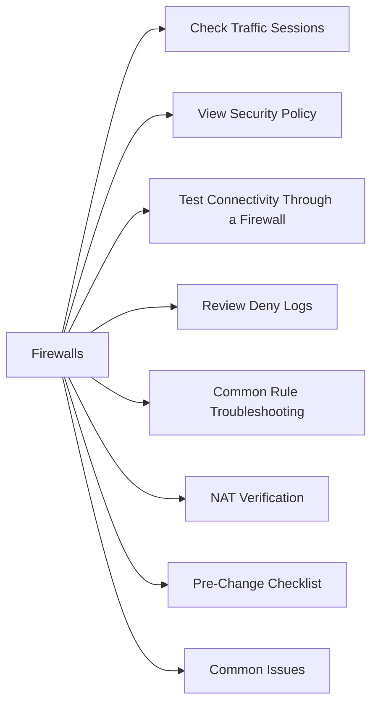

# Firewalls



## Overview

Firewalls control traffic between zones using rules, policies, NAT, and inspection profiles. In enterprise infrastructure, firewalls govern traffic between:
- Production and management networks
- On-premises and cloud
- Internet egress
- Storage replication paths across sites

## Check Traffic Sessions

```bash
# Active sessions (Palo Alto / PAN-OS)
show session all
show session id <id>

# Traffic logs
show log traffic
```

## View Security Policy

```bash
show running security-policy    # PAN-OS
show security policies          # Juniper SRX
show access-list                # Cisco ASA
```

## Test Connectivity Through a Firewall

```bash
# From a host behind the firewall
ping <destination>
traceroute <destination>
curl -v telnet://<dest>:<port>    # test specific TCP port

# From Linux — test TCP port
nc -zv <host> <port>
```

## Review Deny Logs

```bash
# PAN-OS
show log traffic action=deny | last 100

# Linux iptables
iptables -L -v -n | grep DROP
journalctl | grep "DPT=<port>"
```

## Common Rule Troubleshooting

```bash
# Identify which policy matched a session (PAN-OS)
show session all filter destination <ip> destination-port <port>
```

## NAT Verification

```bash
show running nat-policy           # PAN-OS
show ip nat translations          # Cisco IOS
```

## Pre-Change Checklist

- [ ] Confirm source, destination, port, and protocol needed
- [ ] Identify which policy/zone applies
- [ ] Capture current rule hit counts
- [ ] Test connectivity before change (baseline)
- [ ] Test connectivity after change

## Common Issues

| Issue | Check | Action |
|---|---|---|
| Traffic blocked | Deny logs | Identify rule; add permit if authorized |
| Rule exists but traffic still blocked | Rule order | Check rule priority — most specific first |
| NAT failing | NAT policy | Verify NAT translation and route |
| VPN tunnel down | IKE/IPSEC logs | Check PSK, crypto policy, peer IP |
