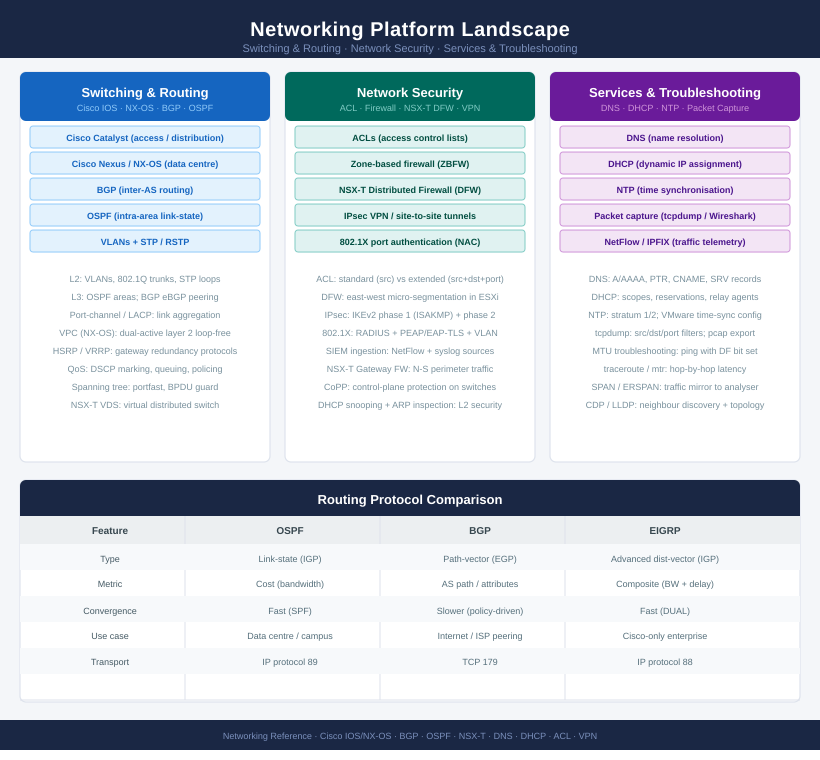
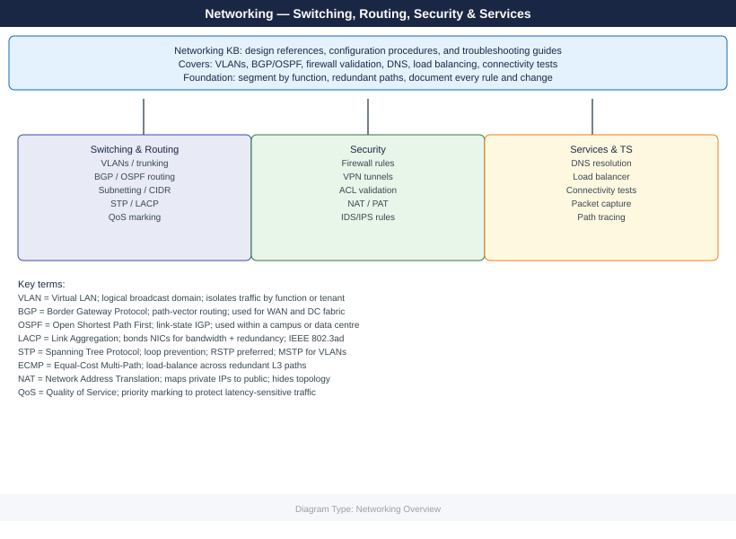

---
tags:
  - networking
description: "Networking knowledge base covering switching, routing, security, and network services. Includes design references, configuration procedures, connectivity..."
---
# Networking

Networking knowledge base covering switching, routing, security, and network services. Includes design references, configuration procedures, connectivity troubleshooting, and validation guides for enterprise network environments.

<a class="kb-card" href="switching-routing/">
  <strong>Switching & Routing</strong>
  VLANs, trunk ports, BGP, OSPF, route tables, subnetting, and TCP/IP.
</a>

<a class="kb-card" href="security/">
  <strong>Security</strong>
  Firewalls, VPN, rule validation, and network access control.
</a>

<a class="kb-card" href="services/">
  <strong>Load Balancer & Services</strong>
  Load balancer VIP management, pool health monitoring, and IPAM. DNS and DHCP covered under Protocols.
</a>

<a class="kb-card" href="troubleshooting/">
  <strong>Troubleshooting</strong>
  Connectivity testing, packet loss, path tracing, and reachability validation.
</a>

<a class="kb-card" href="external-connectivity/">
  <strong>External Connectivity</strong>
  Internet egress, WAN/MPLS, cloud direct connections, and partner API connectivity paths.
</a>

<a class="kb-card" href="network-design/">
  <strong>Network Design</strong>
  Enterprise network design — topology, redundancy, trust zones, and observability references.
</a>

<a class="kb-card" href="protocols/">
  <strong>Protocols</strong>
  Protocol reference — FC, iSCSI, NFS, SMB, DNS, DHCP, NTP, LDAP, SNMP, TLS, Syslog, and SMTP.
</a>

