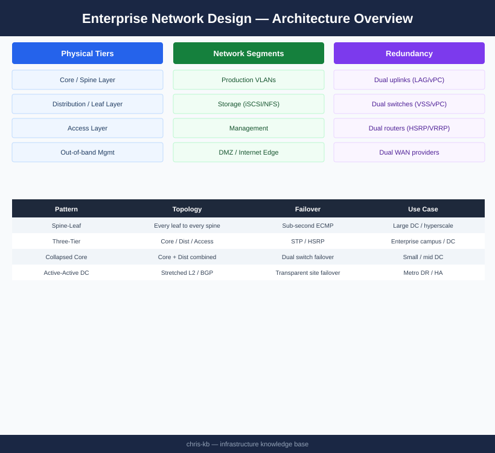
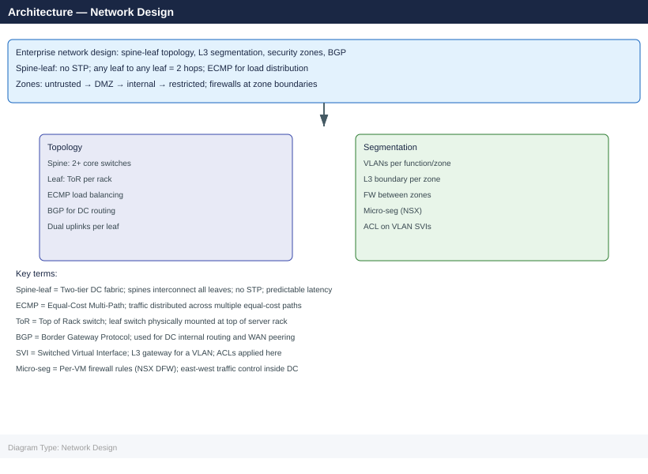

---
tags:
  - networking
description: ""
---
# Network Design

<div class="kb-summary">

</div>

## Overview

Enterprise network design establishes the framework for how compute, storage, users, and external services communicate reliably, securely, and at scale. A well-architected network is deterministic in its behavior, resilient to single and double failures, segmented by trust zone, and observable at every layer.

This guide covers the hierarchical design model, VLAN segmentation strategy, routing architecture, redundancy patterns, firewall zoning, load balancer placement, cloud connectivity, and storage network considerations applicable to VMware-based data centre environments with Cisco switching infrastructure.

---

## Enterprise Network Tier Model

The three-tier (core / distribution / access) model remains the reference architecture for large data centres. Smaller environments may collapse distribution into the core (two-tier / spine-leaf), but the design principles are identical.

```d2
direction: right

Internet: "Internet / WAN / MPLS" {shape: rectangle}
FW_Pair: "Firewall Pair\n(Palo Alto PA-5450 HA Active-Passive" {shape: rectangle}
Core_A: "Core Switch A\n(Cisco Nexus 9504" {shape: rectangle}
Core_B: "Core Switch B\n(Cisco Nexus 9504" {shape: rectangle}
Dist_A: "Distribution Switch A\n(Cisco Nexus 9300" {shape: rectangle}
Dist_B: "Distribution Switch B\n(Cisco Nexus 9300" {shape: rectangle}
Access_A: "Access / ToR A\n(Nexus 93180YC-FX" {shape: rectangle}
Access_B: "Access / ToR B\n(Nexus 93180YC-FX" {shape: rectangle}
Hosts: "ESXi Hosts / Bare Metal Servers\n(dual-homed, LACP" {shape: rectangle}

Internet -> FW_Pair
FW_Pair -> Core_A
Core_A -> Core_B
Core_A -> Dist_A
Dist_A -> Dist_B
Core_B -> Dist_A
Dist_A -> Access_A
Access_A -> Access_B
Dist_B -> Access_A
Access_A -> Hosts
Access_B -> Hosts
```


**Zone definitions:**

| Zone | Description | Default Inbound Policy |
|------|-------------|----------------------|
| Untrust (Internet) | Public internet, untrusted external | Block all; explicit allow only |
| DMZ | Reverse proxies, public-facing APIs | Allow from Untrust on published ports only |
| Production | Application and database servers | Allow from DMZ on specific ports; deny internet direct |
| Management | ESXi management, vCenter, jump hosts | Allow only from authorised admin subnets / VPN |
| Storage | Storage arrays, NAS heads | Allow only from Production and Backup; deny all others |
| Backup | Backup repositories, media servers | Allow from Production (agent traffic); deny internet |

---

## Load Balancer Placement

```d2
direction: right

Client: "Client (Internet" {shape: rectangle}
ELB: "External Load Balancer\n(F5 BIG-IP / NSX-T ALB)\nDMZ zone" {shape: rectangle}
WAF: "Web Application Firewall\n(inline with ELB or cloud-native" {shape: rectangle}
AppTier: "Application Tier\n(Production zone" {shape: rectangle}
ILB: "Internal Load Balancer\n(NSX-T ALB Service Engine)\nProduction zone" {shape: rectangle}
DBTier: "Database Tier\n(Production zone" {shape: rectangle}

Client -> ELB
ELB -> WAF
WAF -> AppTier
AppTier -> ILB
ILB -> DBTier
```

- Place external LBs in the DMZ with VIPs on the DMZ subnet; real servers in the production zone
- Place internal LBs within the production zone for service-to-service load distribution
- Use NSX Advanced Load Balancer (Avi) for VMware-native environments — it integrates with vCenter and NSX for automatic pool member discovery
- Enable connection persistence (source IP or cookie-based) for stateful applications
- Configure health monitors that verify application-layer health, not just TCP handshake

---

## Cloud Connectivity

### AWS Direct Connect

| Option | Bandwidth | Use Case | Notes |
|--------|-----------|----------|-------|
| Dedicated Connection | 1, 10, 100 Gbps | Production workloads, large data transfer | Ordered directly with AWS; months lead time |
| Hosted Connection | 50 Mbps – 10 Gbps | Smaller workloads, quicker provisioning | Ordered via Direct Connect Partner |
| Transit Gateway | Aggregates multiple VPCs | Hub-and-spoke multi-VPC | Use with Direct Connect Gateway for multi-region |

### Azure ExpressRoute

| SKU | Bandwidth | Peering Options |
|-----|-----------|----------------|
| Standard | 50 Mbps – 10 Gbps | Azure public + private peering |
| Premium | 50 Mbps – 10 Gbps | Global reach; all regions via one circuit |
| ExpressRoute Direct | 10 or 100 Gbps | Port-level allocation; no partner needed |

**Routing from on-premises to cloud:**
- Advertise on-premises prefixes to cloud via BGP over Direct Connect / ExpressRoute
- Do not advertise a default route from on-premises unless intentionally forcing cloud egress through on-premises (hair-pin routing); this has latency and bandwidth implications
- Use Route Server (Azure) or Transit Gateway (AWS) to simplify route management when connecting multiple on-premises sites

---

## MTU and Jumbo Frame Considerations

Jumbo frames (MTU 9000) are mandatory for storage and vMotion networks. Mismatched MTU is a leading cause of intermittent performance degradation and difficult-to-diagnose connectivity issues.

| Network | Recommended MTU | Justification |
|---------|----------------|---------------|
| Production VMs | 1500 | Internet compatibility; avoid fragmentation at WAN edge |
| vMotion | 9000 | Large memory transfer; reduces CPU overhead and improves throughput |
| vSAN / iSCSI | 9000 | Reduces per-I/O overhead; improves storage throughput |
| NFS | 9000 | Same as iSCSI; jumbo reduces NFS overhead at high I/O |
| FT Logging | 9000 | Continuous memory mirroring; bandwidth-sensitive |
| Replication (SRDF, RecoverPoint) | 9000 | Inter-site bulk data transfer |
| Management | 1500 | Compatibility; management traffic is low-bandwidth |

**MTU validation procedure:**
1. Enable jumbo frames on all switch interfaces in the storage VLAN (`mtu 9216` on Nexus NX-OS — note: switch MTU must be set to 9216 to pass 9000-byte frames with headers)
2. Configure MTU 9000 on all VMkernel ports (vMotion, vSAN, iSCSI) in vCenter
3. Validate with `ping` with DF-bit set: `vmkping -I vmk2 -d -s 8972 <target_IP>` (8972 = 9000 − 28 bytes IP+ICMP header)
4. A successful ping at 8972 bytes confirms end-to-end 9000 MTU; any failure indicates a switch or NIC misconfiguration

---

## Network Design Validation Checklist

### Physical Layer
- [ ] All host NICs dual-homed to independent ToR switches
- [ ] LACP port-channels confirmed active on both host and switch (show port-channel summary)
- [ ] vPC/MLAG peer-link operational; peer-keepalive reachable
- [ ] Uplink capacity verified: ToR-to-distribution and distribution-to-core bandwidth meets calculated demand

### VLAN and Trunking
- [ ] All VLANs defined in IPAM with owner and purpose
- [ ] VLAN pruning applied — trunk ports carry only required VLANs
- [ ] VLAN 1 not used for any production traffic
- [ ] Private VLANs configured in DMZ to prevent lateral movement

### Routing
- [ ] OSPF neighbour relationships verified on all transit links
- [ ] BFD enabled on all OSPF and BGP sessions on production links
- [ ] BGP sessions to WAN/cloud providers established and route counts validated
- [ ] Route summarisation applied at OSPF area boundaries
- [ ] No default route leaking from WAN into OSPF without explicit policy intent

### Security / Firewall
- [ ] Zone model implemented; inter-zone deny-by-default verified
- [ ] Firewall rule audit completed; no "any/any" permit rules in production zones
- [ ] Management zone accessible only via jump host or VPN
- [ ] VLAN 900 (OOB/BMC) has no routing to production or internet

### Storage Network
- [ ] Jumbo frames (MTU 9000) enabled on all storage VLANs end-to-end
- [ ] MTU validated with vmkping DF-bit test from each ESXi host
- [ ] Storage VLANs carry no non-storage traffic
- [ ] Dedicated uplinks assigned to vSAN / iSCSI VMkernel ports (not shared with VM traffic)

### Cloud Connectivity
- [ ] Direct Connect / ExpressRoute circuits active and BGP sessions established
- [ ] Advertised prefixes verified — no unintended routes propagated to cloud
- [ ] Failover path (internet VPN) tested for continuity if private circuit fails

### Documentation
- [ ] Network diagram current and stored in version control
- [ ] IPAM records complete for all subnets and VLANs
- [ ] Change process defined for VLAN additions / firewall rule changes
- [ ] Monitoring configured for interface errors, BGP session state, and bandwidth utilisation
