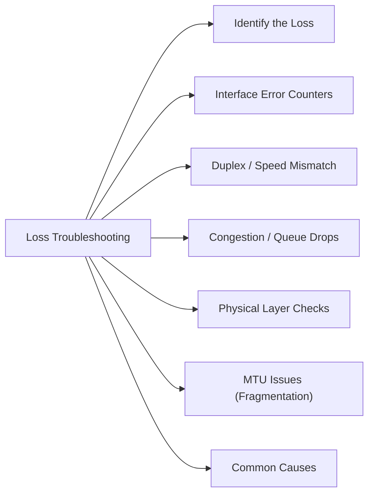

# Packet Loss Troubleshooting

Packet loss causes degraded application performance, storage I/O timeouts, replication lag, and vMotion failures.



## Identify the Loss

```bash
# Extended ping to observe loss pattern
ping -c 100 <destination>

# Continuous path trace with loss stats per hop
mtr <destination>
mtr --report --report-cycles 100 <destination>
```

`mtr` shows loss per hop — if loss appears at hop N but not N+1, it's ICMP de-prioritization by the router, not true loss. True loss appears at hop N and all subsequent hops.

## Interface Error Counters

```bash
# Linux
ethtool -S <interface> | grep -i error
ip -s link show <interface>

# Show interface errors
netstat -i

# Network interface stats
cat /proc/net/dev
```

## Duplex / Speed Mismatch

Half-duplex on a switch port causes severe packet loss under load:

```bash
ethtool <interface>
# Look for: Speed: 1000Mb/s, Duplex: Full
```

On the switch:
```bash
show interface <int>
# Look for: duplex full, 1000 Mbps
```

## Congestion / Queue Drops

```bash
# Linux — show interface TX/RX drops
ip -s link show <interface>
```

On the switch, check output drops:
```bash
show interface <int> counters    # Cisco
show interface <int>             # look for output drops
```

## Physical Layer Checks

```bash
# Check SFP/cable on the switch port
show interface <int> transceiver    # Cisco
# Check Rx power — should be within spec
```

## MTU Issues (Fragmentation)

Packet loss with large frames may be MTU-related:

```bash
ping -M do -s 8972 <destination>    # iSCSI/NFS MTU test (9000 bytes)
ping -M do -s 1472 <destination>    # standard MTU test
```

Any failure with do-not-fragment set indicates an MTU mismatch somewhere in the path.

## Common Causes

| Cause | Check | Action |
|---|---|---|
| Duplex mismatch | `ethtool` / switch port | Force full duplex on both ends |
| Congestion / drops | Interface counters | Increase bandwidth or QoS |
| Bad cable / SFP | Rx power, error counters | Replace SFP or cable |
| MTU mismatch | DF-bit ping | Align MTU across path |
| Physical interface errors | `ip -s link show` | Replace NIC or port |
