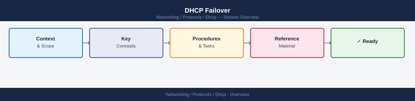

---
tags:
  - networking
---
# DHCP Failover


<div class="kb-summary">
DHCP Failover reference covering Overview, Configuring Failover, Checking Failover State, Failover States Reference, Split Scope (Pre-2012 Fallback) and 2 more sections.
</div>



```d2
direction: right

center: "DHCP" {shape: hexagon}
configuring_failover: "Configuring Failover" {shape: rectangle}
checking_failover_state: "Checking Failover State" {shape: rectangle}
failover_states_reference: "Failover States Reference" {shape: rectangle}
split_scope_pre2012_fallback: "Split Scope (Pre-2012 Fallback)" {shape: rectangle}
removing_and_modifying_failover: "Removing and Modifying Failover" {shape: rectangle}
known_issues: "Known Issues" {shape: rectangle}

center -> configuring_failover
center -> checking_failover_state
center -> failover_states_reference
center -> split_scope_pre2012_fallback
center -> removing_and_modifying_failover
center -> known_issues
```

## Overview

DHCP failover on Windows Server allows two DHCP servers to share responsibility for a scope, providing redundancy. The two modes are **Hot Standby** (one active, one passive) and **Load Balance** (both serve leases simultaneously, split by percentage).

## Configuring Failover

```powershell
# Create a failover relationship (load balance, 50/50)
Add-DhcpServerv4Failover `
  -Name "DHCP-Failover-LAN" `
  -PartnerServer "dhcp02.example.local" `
  -ScopeId 192.168.10.0 `
  -LoadBalancePercent 50 `
  -SharedSecret "S3cur3Sh@red" `
  -AutoStateTransition $true `
  -MaxClientLeadTime 01:00:00

# Create hot standby failover
Add-DhcpServerv4Failover `
  -Name "DHCP-Failover-HS" `
  -PartnerServer "dhcp02.example.local" `
  -ScopeId 192.168.20.0 `
  -Mode HotStandby `
  -ServerRole Active `
  -ReservePercent 5 `
  -SharedSecret "S3cur3Sh@red"
```

## Checking Failover State

```powershell
# View all failover relationships on this server
Get-DhcpServerv4Failover

# Check state for a specific relationship
Get-DhcpServerv4Failover -Name "DHCP-Failover-LAN"

# Sync the failover database with partner
Invoke-DhcpServerv4FailoverReplication -Name "DHCP-Failover-LAN"

# Force sync all scopes
Invoke-DhcpServerv4FailoverReplication -Force
```

## Failover States Reference

| State | Meaning |
|-------|---------|
| Normal | Both servers communicating, operating as configured |
| CommunicationInterrupted | Partner unreachable; MCLT timer running |
| PartnerDown | Admin declared partner down; full pool now served |
| PotentialConflict | Both servers tried to become primary independently |
| Recover | Server recovering after being down |
| RecoverDone | Recovery complete, returning to Normal |

## Split Scope (Pre-2012 Fallback)

On Server 2008 R2 without native failover, split the pool manually:

```powershell
# Primary: serve 192.168.10.1-192.168.10.150
# Secondary: serve 192.168.10.151-192.168.10.250
# Each excludes the other's range

Add-DhcpServerv4ExclusionRange `
  -ScopeId 192.168.10.0 `
  -StartRange 192.168.10.151 `
  -EndRange 192.168.10.250
```

## Removing and Modifying Failover

```powershell
# Remove a failover relationship
Remove-DhcpServerv4Failover -Name "DHCP-Failover-LAN"

# Update load balance percentage
Set-DhcpServerv4Failover -Name "DHCP-Failover-LAN" -LoadBalancePercent 60

# Declare partner down (enables serving full scope)
Set-DhcpServerv4FailoverScope `
  -Name "DHCP-Failover-LAN" `
  -ScopeId 192.168.10.0 `
  -State PartnerDown
```

## Known Issues

- **PotentialConflict state**: Both servers were unreachable from each other and each started serving the full pool. Resolve by stopping DHCP on one server, reconciling leases, then re-enabling failover.
- **Replication failures**: Check firewall allows TCP 647 between DHCP servers.
- After restoring a partner from backup, always run `Invoke-DhcpServerv4FailoverReplication -Force` before bringing it online.
