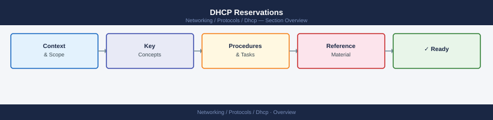

---
tags:
  - networking
---
# DHCP Reservations


<div class="kb-summary">
DHCP Reservations reference covering Overview, Creating a Reservation, Bulk Reservations from CSV, Reservation Conflicts, Reservation Management Reference and 2 more sections.
</div>



## Overview

A DHCP reservation pins a specific IP address to a client's MAC address. The IP must fall within the scope range but is excluded from the dynamic pool. Reservations inherit scope options unless overridden at the reservation level.

## Creating a Reservation

```powershell
# Create a single reservation
Add-DhcpServerv4Reservation `
  -ScopeId 192.168.10.0 `
  -IPAddress 192.168.10.200 `
  -ClientId "00-1A-2B-3C-4D-5E" `
  -Name "printer-floor2" `
  -Description "HP LaserJet MFP floor 2"

# Verify it was created
Get-DhcpServerv4Reservation -ScopeId 192.168.10.0
```

## Bulk Reservations from CSV

```powershell
# CSV columns: IPAddress,ClientId,Name,Description
# Example row: 192.168.10.201,00-AA-BB-CC-DD-01,srv-mon,Monitoring server

$reservations = Import-Csv -Path C:\dhcp-reservations.csv
foreach ($r in $reservations) {
  Add-DhcpServerv4Reservation `
    -ScopeId 192.168.10.0 `
    -IPAddress $r.IPAddress `
    -ClientId $r.ClientId `
    -Name $r.Name `
    -Description $r.Description
}
```

## Reservation Conflicts

If a reservation IP is already leased to a different client, the new client will not receive it until the existing lease expires or is removed.

```powershell
# Check if the target IP is currently leased
Get-DhcpServerv4Lease -ScopeId 192.168.10.0 -IPAddress 192.168.10.200

# Remove the conflicting lease before creating the reservation
Remove-DhcpServerv4Lease -ScopeId 192.168.10.0 -IPAddress 192.168.10.200

# Convert an existing active lease to a reservation
$lease = Get-DhcpServerv4Lease -ScopeId 192.168.10.0 -IPAddress 192.168.10.55
Add-DhcpServerv4Reservation `
  -ScopeId 192.168.10.0 `
  -IPAddress $lease.IPAddress `
  -ClientId $lease.ClientId `
  -Name $lease.HostName
```

## Reservation Management Reference

| Action | Command |
|--------|---------|
| List all reservations in scope | `Get-DhcpServerv4Reservation -ScopeId` |
| Remove a reservation | `Remove-DhcpServerv4Reservation -ScopeId -IPAddress` |
| Update reservation name | `Set-DhcpServerv4Reservation -IPAddress -Name` |
| Export reservations | `Export-DhcpServer -File -ScopeId` |
| Set reservation-level option | `Set-DhcpServerv4OptionValue -ScopeId -ReservedIP -OptionId` |

## Reservation Option Overrides

```powershell
# Set a reservation-level DNS server (overrides scope)
Set-DhcpServerv4OptionValue `
  -ScopeId 192.168.10.0 `
  -ReservedIP 192.168.10.200 `
  -OptionId 6 `
  -Value 10.0.0.60

# View reservation-level options
Get-DhcpServerv4OptionValue -ScopeId 192.168.10.0 -ReservedIP 192.168.10.200
```

## Known Issues

- MAC address format must use dashes (`00-AA-BB-CC-DD-EE`), not colons. The cmdlet rejects colon-separated MACs.
- If the reserved IP is outside the scope range, the cmdlet succeeds but the client never receives the address. Always verify the IP falls within the scope's start/end range.
- Wireless clients using MAC address randomization will not reliably receive reservations. Disable randomization on managed endpoints or use 802.1X identity-based assignment instead.
