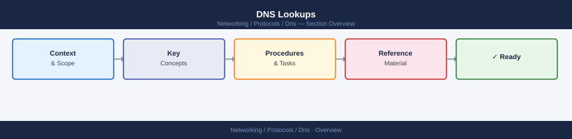

---
tags:
  - networking
---
# DNS Lookups


<div class="kb-summary">
DNS Lookups reference covering Overview, nslookup, dig, Resolve-DnsName (PowerShell), TTL Debugging and 1 more sections.
</div>



        FORWARD vs REVERSE LOOKUPS


## Overview

DNS lookups translate hostnames to IPs (forward) and IPs to hostnames (reverse). Tools vary by OS: `nslookup` is universal, `dig` is preferred on Linux/macOS for detailed output, and `Resolve-DnsName` is the PowerShell equivalent on Windows. TTL inspection is essential when debugging stale cache issues.

## nslookup

```bash
# Forward lookup using default resolver
nslookup www.example.com

# Forward lookup against a specific server
nslookup www.example.com 10.0.0.53

# Reverse lookup (PTR)
nslookup 192.168.10.55

# Query a specific record type
nslookup -type=MX example.com 10.0.0.53
nslookup -type=SRV _ldap._tcp.example.local 10.0.0.53

# Interactive mode — query multiple records
nslookup
> server 10.0.0.53
> set type=A
> host.example.local
> exit
```

## dig

```bash
# Basic forward lookup
dig www.example.com

# Lookup against specific server
dig @10.0.0.53 www.example.local

# Reverse lookup
dig -x 192.168.10.55

# Query specific type with short output
dig @10.0.0.53 MX example.com +short

# Check TTL remaining in a response
dig @10.0.0.53 www.example.local | grep -A1 "ANSWER SECTION"

# Trace full resolution path
dig +trace www.example.com
```

## Resolve-DnsName (PowerShell)

```powershell
# Basic forward lookup
Resolve-DnsName www.example.local

# Query a specific DNS server
Resolve-DnsName www.example.local -Server 10.0.0.53

# Reverse lookup
Resolve-DnsName 192.168.10.55

# Query specific record type
Resolve-DnsName corp.local -Type MX -Server 10.0.0.53
Resolve-DnsName _ldap._tcp.example.local -Type SRV

# Bypass cache (go direct to server)
Resolve-DnsName www.example.local -Server 10.0.0.53 -DnsOnly
```

## TTL Debugging

| Symptom | Check |
|---------|-------|
| Old IP returned after DNS update | TTL not yet expired — wait or flush cache |
| TTL shows 0 or very low | Record set for rapid expiry (e.g. during migration) |
| Different TTL from different servers | Secondary not yet replicated from primary |
| Negative cache (NXDOMAIN) | Negative TTL (SOA minimum) is caching the miss |

```bash
# Flush DNS cache on Windows client
ipconfig /flushdns

# Flush DNS cache on Linux (systemd-resolved)
resolvectl flush-caches

# Check cached TTL with dig (TTL column in answer section)
dig @8.8.8.8 www.example.com

# Clear DNS server cache on Windows DNS
Clear-DnsServerCache -Force
```

## Known Issues

- `nslookup` and `Resolve-DnsName` may return different results because `Resolve-DnsName` uses the Windows DNS client cache while `nslookup` queries the resolver directly. Always specify `-Server` to rule out cache differences.
- A forward lookup succeeds but reverse lookup fails: the PTR record is missing or the reverse zone does not exist. Check `10.168.192.in-addr.arpa` exists on the DNS server.
- `dig +trace` follows from root hints; results may differ from what an internal forwarder returns. Use `dig @<internal-server>` for split-brain validation.
