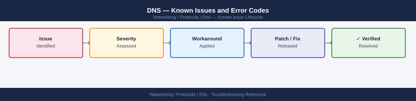

---
tags:
  - troubleshooting
  - dns
  - networking
  - known-issues
---
# DNS — Known Issues and Error Codes

Catalog of known DNS bugs, error codes, and workarounds covering resolution failures, DNSSEC, split-horizon, and AD-integrated DNS.

*Applies to: Windows DNS / BIND 9.x / PowerDNS*

## Before you begin

- `nslookup <name> <dns-server>` and `dig @<dns-server> <name>` for resolution testing.
- DNS failures cause cascading failures (AD, NFS, Kerberos) — check DNS first on any auth or mount issue.
- Split-horizon DNS (different internal vs external resolution) is a common source of confusion.

## Resolution Failures

| Error / Symptom | Affected Versions | Cause | Workaround / Fix | Fixed In |
|---|---|---|---|---|
| `NXDOMAIN` for internal host | All | Record not created; or client using wrong DNS server | Create A/AAAA record; verify client DNS server points to internal DNS | N/A |
| `SERVFAIL` for external queries | Windows DNS | Forwarder unreachable or DNSSEC validation failing | Check forwarder connectivity; disable DNSSEC validation on internal resolver if not needed | N/A |
| Intermittent resolution failures | All | DNS server overloaded or unreachable | Add redundant DNS servers; check DNS server CPU/memory | N/A |

## AD-Integrated DNS

| Error / Symptom | Affected Versions | Cause | Workaround / Fix | Fixed In |
|---|---|---|---|---|
| `_msdcs` SRV records missing after DC promotion | Windows DNS | DC failed to register Netlogon SRV records | Restart Netlogon on DC: `net stop netlogon; net start netlogon` | N/A |
| DNS zone not replicating between DCs | Windows DNS | AD replication broken; DNS zone uses AD replication | Fix AD replication first: `repadmin /showrepl` | N/A |

## TTL and Caching

| Error / Symptom | Affected Versions | Cause | Workaround / Fix | Fixed In |
|---|---|---|---|---|
| IP change not propagating despite correct record | All | Old TTL cached by clients/resolvers | Wait for TTL to expire; flush client cache: `ipconfig /flushdns` (Windows) / `systemctl restart systemd-resolved` (Linux) | N/A |
| SmartConnect zone cached wrong IP after PowerScale failover | All | TTL too long on SmartConnect DNS record | Set SmartConnect TTL to ≤10 seconds for failover scenarios | N/A |

## See also

