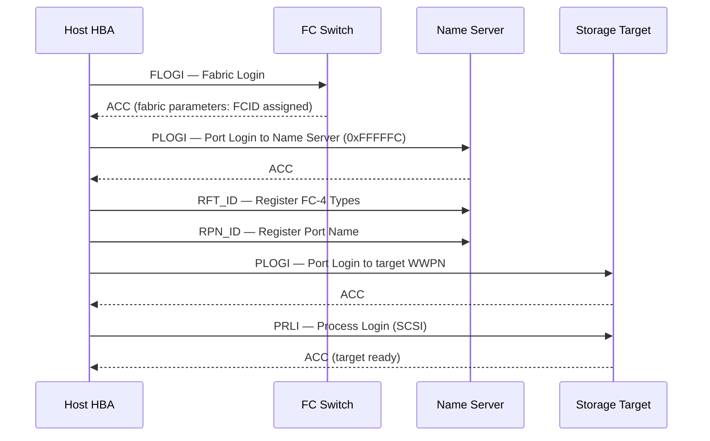

---
tags:
  - networking
---
# Fibre Channel — Fabric Login

```sql
Login failures prevent hosts from seeing storage.

## Login Sequence

```


```bash
## Show fabric logins on this switch
nsshow

## Show logins across all switches
nsallshow

## Show FLOGI database (ports logged into this switch's F_ports)
switchshow | grep Online

## Per-port FLOGI details
portlogshow <slot/port>
```

```text title="Expected output"
Fabric Port Name:   switch01
Fabric Port State:  Online
Fabric Port ID:     010000
Fabric Port Address: 50:00:14:40:02:71:a1:23

Fabric Port Name:   switch02
Fabric Port State:  Online
Fabric Port ID:     010100
Fabric Port Address: 50:00:14:40:02:71:a1:24

Fabric Port Name:   switch03
Fabric Port State:  Online
Fabric Port ID:     010200
Fabric Port Address: 50:00:14:40:02:71:a1:25

 0  0   Online      F-Port  50:00:14:40:02:71:a1:23  Initiator
 1  0   Online      F-Port  50:00:14:40:02:71:a1:24  Target
 2  0   Online      F-Port  50:00:14:40:02:71:a1:25  Initiator
 3  0   Online      F-Port  50:00:14:40:02:71:a1:26  Target
 4  0   Online      F-Port  50:00:14:40:02:71:a1:27  Initiator

Port  0/0:
  FLOGI Accepted:  Yes
  Port WWN:        50:00:14:40:02:71:a1:23
  Node WWN:        20:00:14:40:02:71:a1:23
  Class of Service: 3
  FC4 Types:       SCSI FCP
```

!!! warning "Common errors"
    | Error | Fix |
    |---|---|
    | `portlogshow: Invalid slot/port format` | Use correct syntax like `portlogshow 0/0` with slot and port numbers separated by a forward slash. |
    | `nsshow: Command not found` | Verify you are logged into a Brocade/Fibre Channel switch; this command does not exist on standard Linux hosts. |
    | `portlogshow: Port offline or not present` | Confirm the port is in Online state using `switchshow` before querying FLOGI details. |
```bash
## FLOGI database — who is logged in to the fabric
show flogi database vsan 10

## Name server — all registered ports
show fcns database vsan 10

## PLOGI state between two ports
show topology

## Detailed port login info
show interface fc1/1
```

```text title="Expected output"
FLOGI Database for VSAN 10:
FCID           PORT NAME               NODE NAME               CLASS
0x010001       50:00:09:73:a2:00:01:02 50:00:09:73:a2:00:00:01 3
0x010002       50:00:09:73:a2:00:02:03 50:00:09:73:a2:00:00:02 3
0x010003       50:00:09:73:a2:00:03:04 50:00:09:73:a2:00:00:03 3

FCNS Database for VSAN 10:
FCID           TYPE PWWN                 NWWN                 SYMBOLIC NAME
0x010001       NPort 50:00:09:73:a2:00:01:02 50:00:09:73:a2:00:00:01 esx-host-01
0x010002       NPort 50:00:09:73:a2:00:02:03 50:00:09:73:a2:00:00:02 esx-host-02
0x010003       NPort 50:00:09:73:a2:00:03:04 50:00:09:73:a2:00:00:03 storage-array-lun1

Topology for VSAN 10:
Port1: fc1/1 — 50:00:09:73:a2:00:01:02 (PLOGI: UP)
Port2: fc1/2 — 50:00:09:73:a2:00:02:03 (PLOGI: UP)
Port3: fc1/3 — 50:00:09:73:a2:00:03:04 (PLOGI: UP)

fc1/1 is up
  Bound Interface: Ethernet1/1
  Speed: 16 Gbps
  Port WWN (PWWN): 50:00:09:73:a2:00:01:02
  Node WWN (NWWN): 50:00:09:73:a2:00:00:01
  FLOGI State: OPEN
  PLOGI State: OPEN
  Frames Transmitted: 1,247,392
  Frames Received: 1,251,847
```

!!! warning "Common errors"
    | Error | Fix |
    |---|---|
    | `% Invalid command` | Verify the switch model supports these commands (some older switches use different syntax like `show flogi` without `database`). |
    | `VSAN 10 is suspended` | Enable the VSAN with `vsan 10` followed by `no suspend` in config mode. |
    | `Port fc1/1 is down` | Check physical cable connections and run `no shutdown` on the port interface. |
```bash
## Brocade — port error counters (CRC, loss-of-sync)
porterrshow

## Brocade — port statistics
portstatshow <port>

## Cisco MDS — interface counters
show interface fc1/1 counters

## Verify FCID assigned to a WWPN
nsshow | grep <wwpn-last-4-chars>
```


```text title="Expected output"
porterrshow
Port 0: CRC Errors: 1247, Loss of Sync: 3, Frames Discarded: 89
Port 1: CRC Errors: 0, Loss of Sync: 0, Frames Discarded: 0
Port 2: CRC Errors: 156, Loss of Sync: 12, Frames Discarded: 34
Port 3: CRC Errors: 2, Loss of Sync: 0, Frames Discarded: 1

portstatshow 0
Port 0 Statistics:
  Frames Transmitted: 45678234
  Frames Received: 45612987
  Bytes Transmitted: 2847392847
  Bytes Received: 2845928374
  Link Failures: 2

show interface fc1/1 counters
fc1/1
  Frames In: 23456789
  Frames Out: 23401234
  Bytes In: 1456234567
  Bytes Out: 1454892345
  CRC Errors: 0
  Enc-Out Errors: 0
  Too-Long Frames: 0

nsshow | grep 5678
    WWPN: 50:00:14:40:5a:bc:56:78  FCID: 010a01  Port: 0  Node Name: esx-host-04
```

!!! warning "Common errors"
    | Error | Fix |
    |---|---|
    | `porterrshow: command not found` | Verify you are logged into a Brocade switch (not a Cisco MDS) and have admin privileges. |
    | `show interface fc1/1 counters: % Invalid command` | Confirm the interface name is correct (e.g., `fc1/1` not `Fc1/1`) and the port exists on your MDS switch. |
    | `nsshow: command not found` | Run this command only on Brocade switches; use `show fcns database` on Cisco MDS instead. |