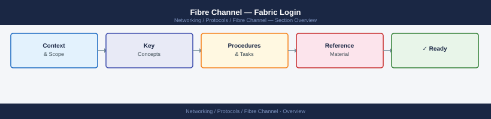
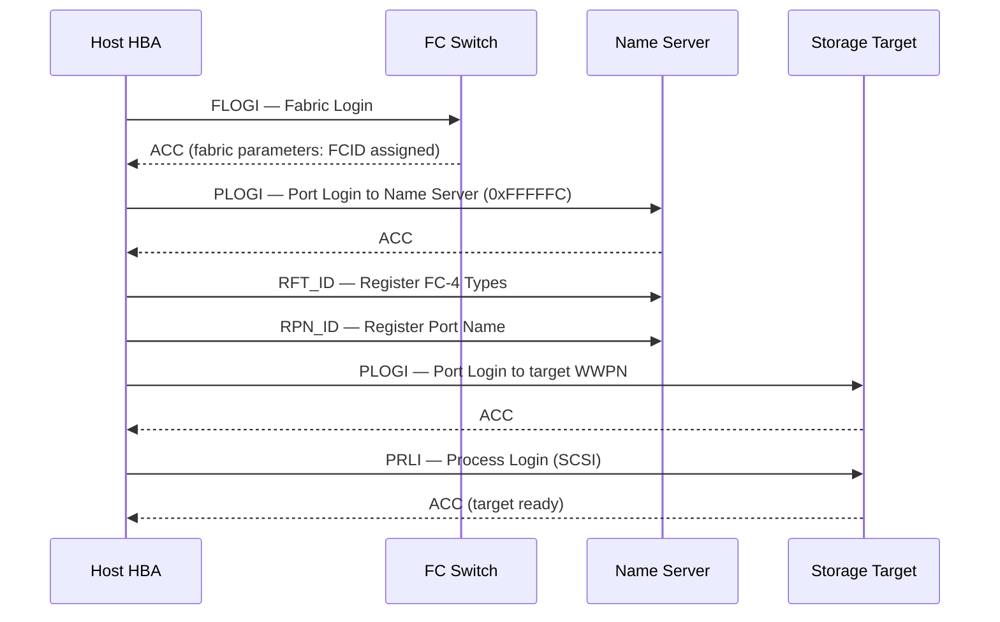

---
tags:
  - networking
---
# Fibre Channel — Fabric Login



```sql
Login failures prevent hosts from seeing storage.

```d2
direction: right

center: "Fibre Channel" {shape: hexagon}
login_sequence: "Login Sequence" {shape: rectangle}
show_fabric_logins_on_this_switch: "Show fabric logins on this switch" {shape: rectangle}
show_logins_across_all_switches: "Show logins across all switches" {shape: rectangle}
show_flogi_database_ports_logged_int: "Show FLOGI database (ports logged into this switch's F_ports" {shape: rectangle}
perport_flogi_details: "Per-port FLOGI details" {shape: rectangle}
flogi_database_who_is_logged_in_to_t: "FLOGI database — who is logged in to the fabric" {shape: rectangle}

center -> login_sequence
center -> show_fabric_logins_on_this_switch
center -> show_logins_across_all_switches
center -> show_flogi_database_ports_logged_int
center -> perport_flogi_details
center -> flogi_database_who_is_logged_in_to_t
```

## Login Sequence

```


```bash
## Show fabric logins on this switch
nsshow

## Show logins across all switches
nsallshow

## Show FLOGI database (ports logged into this switch's F_ports)
switchshow | grep Online

## Per-port FLOGI details
portlogshow <slot/port>
```
```bash
## FLOGI database — who is logged in to the fabric
show flogi database vsan 10

## Name server — all registered ports
show fcns database vsan 10

## PLOGI state between two ports
show topology

## Detailed port login info
show interface fc1/1
```
```bash
## Brocade — port error counters (CRC, loss-of-sync)
porterrshow

## Brocade — port statistics
portstatshow <port>

## Cisco MDS — interface counters
show interface fc1/1 counters

## Verify FCID assigned to a WWPN
nsshow | grep <wwpn-last-4-chars>
```
