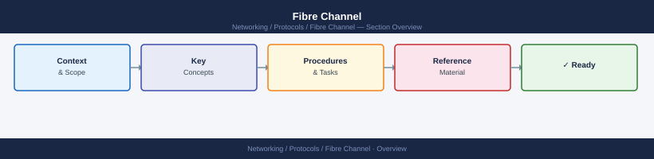

---
tags:
  - networking
---
# Fibre Channel

<div class="kb-summary">
Fibre Channel reference — WWPN/WWNN addressing, zoning, fabric login (FLOGI), multipathing, and SAN fabric health.
</div>



```xml


<div class="kb-grid kb-grid-1">

<a class="kb-card" href="fabric-login/">
  <strong>Fabric Login</strong>
  <span>Fabric Login notes, checks, commands, and references.</span>
</a>

<a class="kb-card" href="paths/">
  <strong>Paths</strong>
  <span>Paths notes, checks, commands, and references.</span>
</a>

<a class="kb-card" href="troubleshooting/">
  <strong>Troubleshooting</strong>
  <span>Common issues, diagnostic steps, and resolution guides.</span>
</a>

<a class="kb-card" href="wwns/"><strong>WWNs</strong><span>World Wide Names — WWPN/WWNN addressing, assignment, and management.</span></a>
<a class="kb-card" href="zoning/"><strong>Zoning</strong><span>FC fabric zoning — hard/soft zoning, zone sets, and best practices.</span></a>

</div>

```d2
direction: right

center: "Fibre Channel" {shape: hexagon}
key_concepts: "Key Concepts" {shape: rectangle}
fc_port_speeds: "FC Port Speeds" {shape: rectangle}
health_checks_cisco_mds: "Health Checks — Cisco MDS" {shape: rectangle}
port_status: "Port status" {shape: rectangle}
flogi_database_confirmed_loggedin_de: "FLOGI database — confirmed logged-in devices" {shape: rectangle}
fc_name_server_hosttostorage_mapping: "FC Name Server — host-to-storage mapping" {shape: rectangle}

center -> key_concepts
center -> fc_port_speeds
center -> health_checks_cisco_mds
center -> port_status
center -> flogi_database_confirmed_loggedin_de
center -> fc_name_server_hosttostorage_mapping
```

## Key Concepts

| Concept | Description |
|---|---|
| WWN (World Wide Name) | 64-bit unique identifier for HBAs and storage ports |
| WWPN (Port Name) | WWN of a specific FC port |
| WWNN (Node Name) | WWN of the HBA adapter |
| FLOGI | Fabric Login — HBA registers with the switch |
| FCNS (Name Server) | Switch database mapping WWPN to FC address |
| Zone | Defines which initiators can see which targets |
| VSAN | Virtual SAN — logical fabric isolation on Cisco MDS |
| ISL | Inter-Switch Link — trunk between fabric switches |

## FC Port Speeds

| Speed | Standard |
|---|---|
| 8G | FC8 |
| 16G | FC16 |
| 32G | FC32 |
| 64G | FC64 |

## Health Checks — Cisco MDS

```

```bash
## Port status
show interface fc brief

## FLOGI database — confirmed logged-in devices
show flogi database

## FC Name Server — host-to-storage mapping
show fcns database

## Active zones
show zoneset active

## Interface error counters
show interface fc1/1 counters errors

## Port utilisation
show interface fc1/1 counters brief
```
```bash
## Switch and port status
switchshow

## Port error counters
porterrshow

## FLOGI entries
nsshow

## Active zoning
cfgshow | head -30
cfgactvshow

## Per-port stats
portshow <port-number>
```
```bash
conf t
zone name <zone-name> vsan <vsan-id>
  member pwwn <host-wwpn>
  member pwwn <storage-wwpn>
zoneset activate name <zoneset-name> vsan <vsan-id>
```
```bash
zoneadd "<zone-name>", "<wwpn>"
cfgsave
cfgenable "<zoneset-name>"
```
