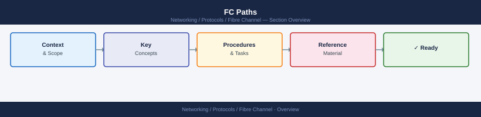
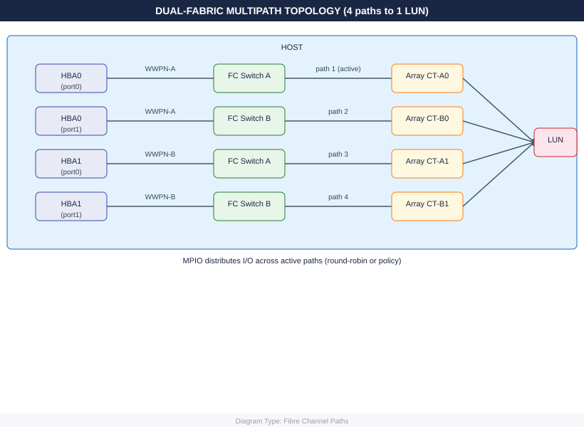

---
tags:
  - networking
---
# FC Paths


<div class="kb-summary">
A path is a complete end-to-end connection from an HBA port through the fabric to a storage target port.
</div>




Multipath I/O (MPIO) uses multiple paths simultaneously for redundancy and load distribution.

```d2
direction: right

center: "Fibre Channel" {shape: hexagon}
path_architecture: "Path Architecture" {shape: rectangle}
path_states: "Path States" {shape: rectangle}
checking_paths: "Checking Paths" {shape: rectangle}
path_policies: "Path Policies" {shape: rectangle}
common_path_issues: "Common Path Issues" {shape: rectangle}
rescanning_for_new_paths: "Re-scanning for New Paths" {shape: rectangle}

center -> path_architecture
center -> path_states
center -> checking_paths
center -> path_policies
center -> common_path_issues
center -> rescanning_for_new_paths
```

## Path Architecture

```text
Host HBA0 (WWPN-A) → Fabric A → Array Port CT-A0 → LUN
Host HBA1 (WWPN-B) → Fabric B → Array Port CT-B0 → LUN
```

Minimum for production: 2 paths per LUN across independent fabrics.

## Path States

| State | Meaning |
|---|---|
| **Active (I/O)** | Path is in use and carrying I/O |
| **Active (no I/O)** | Path is healthy but standby |
| **Dead / Failed** | Path is down — I/O not possible |
| **Standby** | Path available but not preferred |
| **Transitioning** | Path state changing — transient |

## Checking Paths

### Linux — DM-Multipath

```bash
# Show all paths and their state
multipath -ll

# Show path count per device
multipath -ll | grep -E "^[a-z]|policy|status"

# Path details
dmsetup ls --tree

# Reload multipath config
multipath -r

# Blacklist check
cat /etc/multipath.conf | grep -A5 blacklist
```

### ESXi

```bash
# List all paths for all datastores
esxcli storage core path list

# Paths for a specific device
esxcli storage core path list -d naa.<id>

# Active path count
esxcli storage core path list | grep -c "Active (I/O)"

# Path claim rules
esxcli storage core claimrule list
```

### Windows — MPIO

```powershell
# Show MPIO paths
Get-MSDSMSupportedHW
Get-MPIOAvailableHW

# MPIO disk paths
Get-Disk | Get-MpioDisk | Select-Object -ExpandProperty MpioDeviceAttributes
```

## Path Policies

| Policy | Behaviour | Best for |
|---|---|---|
| **Round Robin** | Distributes I/O across all active paths | Active-active arrays (Pure, VPLEX) |
| **Fixed / Most Recently Used** | Sticks to preferred path; failover on failure | Active-passive arrays |
| **Least Queue Depth** | Sends I/O to path with fewest outstanding requests | High-latency mixed workloads |

## Common Path Issues

| Symptom | Cause | Check |
|---|---|---|
| Single path only | Dual-fabric not configured / zone missing on Fabric B | Verify zoning on both fabrics |
| All paths dead | HBA failure, fabric outage, or storage port down | Check HBA link, `portshow`, storage port state |
| Path flapping | SFP degraded or loose cable | `porterrshow` — look for high CRC or signal loss |
| Paths shown but I/O failing | LUN not mapped in storage host group | Verify LUN masking on array |
| Uneven I/O across paths | Round-robin not configured, using fixed policy | Set multipath policy to round-robin |

## Re-scanning for New Paths

```bash
# Linux — rescan HBAs
echo "- - -" > /sys/class/scsi_host/host0/scan
echo "- - -" > /sys/class/scsi_host/host1/scan
multipath -r

# ESXi — rescan all HBAs
esxcli storage core adapter rescan --all

# Windows
Update-StorageProviderCache -DiscoveryLevel Full
```
