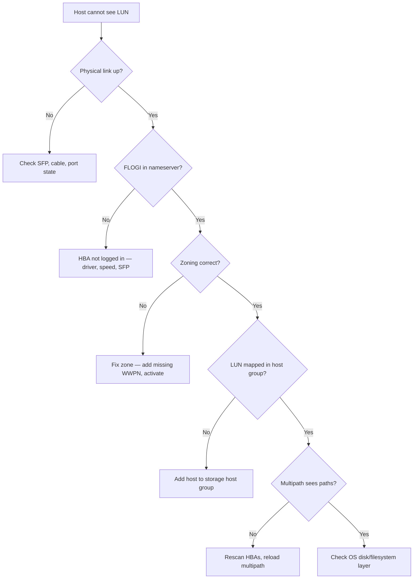

# FC Troubleshooting


<div class="kb-summary">
FC Troubleshooting reference covering Diagnostic Flow, Quick Diagnostics, Common Issues Reference, Error Counter Interpretation (Brocade), Log Locations.
</div>

        TRIAGE: HOST CANNOT SEE LUN
```text
┌───────────────────────────────────────────────────────────────────────────────────────────────────────┐
│  1. No LUN visible on host                                                                            │
│          │                                                                                            │
│          ▼                                                                                            │
│  Check WWPN in zone? ── No ──► Add WWPN to zone, activate                                             │
│          │ Yes                                                                                        │
│          ▼                                                                                            │
│  Zone set active? ──── No ──► cfgenable / zoneset activate                                            │
│          │ Yes                                                                                        │
│          ▼                                                                                            │
│  Target port online? ─ No ──► Check SFP, cable, port state                                            │
│          │ Yes                                                                                        │
│          ▼                                                                                            │
│  LUN mapped to host group? No ► Add host to storage group                                             │
│          │ Yes                                                                                        │
│          ▼                                                                                            │
│  Multipath sees paths? ─ No ──► Rescan HBAs, reload mpio                                              │
│          │ Yes                                                                                        │
│          ▼                                                                                            │
│  Check OS / filesystem layer                                                                          │
└───────────────────────────────────────────────────────────────────────────────────────────────────────┘
```

## Diagnostic Flow



## Quick Diagnostics

```bash
# Brocade — overall fabric health
fabricshow
switchshow
porterrshow

# Brocade — nameserver (who is logged in)
nsshow
nsallshow

# Brocade — zone config
cfgshow
zoneshow

# Cisco MDS — fabric login table
show flogi database vsan 10
show fcns database vsan 10
show zoneset active vsan 10

# Linux — multipath state
multipath -ll
cat /proc/scsi/scsi

# ESXi — path state
esxcli storage core path list
esxcli storage core adapter list
```

## Common Issues Reference

| Symptom | Likely cause | First check |
|---|---|---|
| Host sees no LUNs | FLOGI failed or zone missing | `nsshow` — is WWPN registered? |
| LUNs disappeared suddenly | Link down or SFP fault | `portshow` / switch LED / `porterrshow` |
| Intermittent path drops | Marginal SFP or cable | `porterrshow` — CRC errors, loss-of-sync |
| Slow I/O on FC | Port congestion (BB_Credit exhaustion) | `portbuffershow` on Brocade |
| Only one of two paths active | Zone missing on second fabric | Check both fabric A and B zoning independently |
| New server cannot see storage | Zone not created / activated | Create zone, add to cfgsave, activate |
| Zone exists but still no access | WWPN typo in zone | `zoneshow` — compare WWPNs character by character |
| HBA not seen after reboot | Driver not loading or HBA disabled | `dmesg | grep -i qla` or `lpfc` |

## Error Counter Interpretation (Brocade)

```bash
porterrshow
```

| Counter | Acceptable | Investigate if |
|---|---|---|
| CRC | 0 | > 0 in last hour |
| Loss of Signal | 0 | Any increment |
| Loss of Sync | 0 | > 5 in last hour |
| Encoding Errors | 0 | Any increment |
| Too Many RDYs | 0 | Any — BB_Credit issue |

## Log Locations

| Platform | Log |
|---|---|
| Brocade | `raslog` (CLI) / Brocade SANnav |
| Cisco MDS | `show logging` / DCNM |
| Linux HBA (QLogic) | `/var/log/messages` — `qla2xxx` |
| Linux HBA (Emulex) | `/var/log/messages` — `lpfc` |
| ESXi | `esxcli storage core path list` / `vmkwarning.log` |
