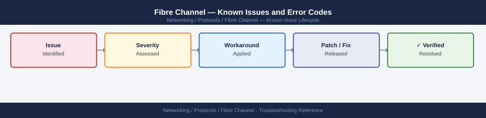

---
tags:
  - troubleshooting
  - fibre-channel
  - san
  - networking
  - known-issues
---
# Fibre Channel — Known Issues and Error Codes

<div class="kb-summary">
Catalog of known Fibre Channel issues covering HBA, fabric login, zoning, and link instability.

*Applies to: Fibre Channel fabric (Brocade / Cisco MDS), 16G / 32G FC*
</div>



```d2
direction: down

symptom: Identify Symptom {shape: diamond}
hba_and_link: "HBA and Link" {shape: rectangle}
zoning: "Zoning" {shape: rectangle}
performance: "Performance" {shape: rectangle}
resolution: Resolve or Escalate {shape: oval}

symptom -> hba_and_link: investigate
symptom -> zoning: investigate
symptom -> performance: investigate
hba_and_link -> resolution
zoning -> resolution
performance -> resolution
```

## Before you begin

- HBA state: `cat /sys/class/fc_host/host*/port_state` (Linux); check HBA management software (QConvergeConsole, OneCommand Manager).
- FC errors surface as SCSI errors in OS (`dmesg | grep scsi`), storage array port stats, or switch port counters.

## HBA and Link

| Error / Symptom | Cause | Workaround / Fix |
|---|---|---|
| HBA port `Link Down` | Fiber broken, SFP failure, or switch port disabled | Check fiber; replace SFP; verify switch port enabled |
| `LOGO` events in switch log — HBA logging out | HBA driver crash or host reboot | Check HBA driver version; update to current stable version |
| High CRC error count on switch port | Dirty fiber connectors or faulty SFP | Clean connectors; replace SFP |
| F_Port stuck in `Initializing` | Zoning not configured for HBA WWN | Add HBA WWN to zone and activate zoneset |

## Zoning

| Error / Symptom | Cause | Workaround / Fix |
|---|---|---|
| Host sees all storage devices (no zoning) | No zoneset active | Create zones; activate zoneset |
| Zone merge failed during ISL bring-up | Zone database conflict between switches | Resolve conflict: isolate switches; reconcile zone DBs; remerge |
| New LUN not visible after zoning | Host HBA not logged into fabric after zone add | Rescan HBA: `echo "- - -" > /sys/class/scsi_host/hostX/scan` |

## Performance

| Error / Symptom | Cause | Workaround / Fix |
|---|---|---|
| Intermittent I/O latency spikes | ISL congestion or buffer credit depletion | Monitor BB credits on switch; add ISL bandwidth; enable BB credit recovery |
| SCSI timeouts from application | Queue depth too high or path failover taking too long | Reduce HBA queue depth; verify multipath failover time <30s |

## See also

