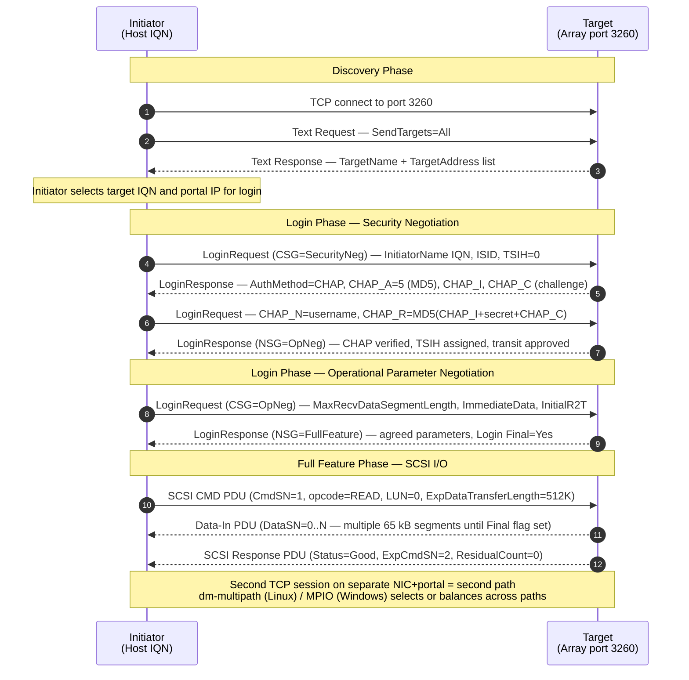

# iSCSI

<div class="kb-summary">
iSCSI (Internet Small Computer Systems Interface) encapsulates SCSI commands over TCP/IP, delivering block storage across standard Ethernet on port 3260. Coverage includes initiator IQN naming, target discovery, CHAP authentication, multipathing (dm-multipath/MPIO), and network tuning for storage VLANs.
</div>

        iSCSI END-TO-END ARCHITECTURE

## iSCSI Session Establishment

The sequence below traces a complete iSCSI session from TCP connection through discovery, CHAP authentication, operational parameter negotiation, and SCSI command flow.



<div class="kb-grid kb-grid-5">

<a class="kb-card" href="initiators/">
  <strong>Initiators</strong>
  <span>iSCSI initiator software configuration, IQN naming, initiator IQN assignment, and host-side setup.</span>
</a>

<a class="kb-card" href="targets/">
  <strong>Targets</strong>
  <span>Target IQN naming, LUN assignment, target portal configuration, and storage array setup.</span>
</a>

<a class="kb-card" href="sessions/">
  <strong>Sessions</strong>
  <span>Session establishment via SendTargets, login/logout, session persistence, and connection parameters.</span>
</a>

<a class="kb-card" href="multipathing/">
  <strong>Multipathing</strong>
  <span>dm-multipath on Linux, MPIO on Windows, path policies (round-robin, failover), and path verification.</span>
</a>

<a class="kb-card" href="troubleshooting/">
  <strong>Troubleshooting</strong>
  <span>Session drops, login failures, CHAP errors, multipath path failures, and performance issues.</span>
</a>

</div>

## Quick Reference

| Property | Value |
|---|---|
| Transport | TCP |
| Port | 3260 |
| IQN format | `iqn.YYYY-MM.com.example:target-name` |
| Authentication | CHAP (one-way or mutual) |
| Multipathing (Linux) | dm-multipath |
| Multipathing (Windows) | MPIO |
| Recommended MTU | 9000 (jumbo frames) |
| Dedicated VLAN | Strongly recommended |

**IQN naming format:**

| Component | Description | Example |
|---|---|---|
| `iqn` | Prefix | `iqn` |
| `YYYY-MM` | Year and month the domain was owned | `2024-01` |
| `com.example` | Reversed domain name | `com.example` |
| `:identifier` | Unique target/initiator identifier | `:storage01-lun0` |

Full example: `iqn.2024-01.com.example:storage01-lun0`

**CHAP modes:**

| Mode | Description |
|---|---|
| One-way CHAP | Target authenticates the initiator |
| Mutual CHAP | Both initiator and target authenticate each other |

## Common Commands / Config

```bash
# Linux: Discover targets on a portal (SendTargets)
iscsiadm -m discovery -t sendtargets -p <target-ip>:3260

# Linux: Log in to all discovered targets
iscsiadm -m node --loginall all

# Linux: Log in to a specific target
iscsiadm -m node -T <target-iqn> -p <target-ip>:3260 --login

# Linux: List active sessions
iscsiadm -m session

# Linux: Show session details (performance counters)
iscsiadm -m session -P 3

# Linux: Log out from all targets
iscsiadm -m node --logoutall all

# Linux: Show multipath status
multipath -ll

# Linux: Check path state for a multipath device
multipathd show paths

# Windows: Discover and connect iSCSI target (PowerShell)
New-IscsiTargetPortal -TargetPortalAddress <target-ip>
Connect-IscsiTarget -NodeAddress <target-iqn> -IsPersistent $true

# Windows: Show iSCSI sessions
Get-IscsiSession

# Check MTU on storage interface (Linux)
ip link show eth1 | grep mtu
# Set jumbo frames
ip link set eth1 mtu 9000
```


```text title="Expected output"
Discovering targets on 192.168.1.100:3260
192.168.1.100:3260,-1 iqn.2020-01.com.storage:target.disk1
192.168.1.100:3260,-1 iqn.2020-01.com.storage:target.disk2

Logging in to all discovered targets
Logging in to [iface default, target iqn.2020-01.com.storage:target.disk1, portal 192.168.1.100,3260] (multiple)
Login to [iface default, target iqn.2020-01.com.storage:target.disk1, portal 192.168.1.100,3260]: successful
Login to [iface default, target iqn.2020-01.com.storage:target.disk2, portal 192.168.1.100,3260]: successful

Active iSCSI sessions:
tcp: [1] 192.168.1.100:3260,1 iqn.2020-01.com.storage:target.disk1 (non-flash)
tcp: [2] 192.168.1.100:3260,1 iqn.2020-01.com.storage:target.disk2 (non-flash)

Session details:
iSCSI Transport: tcp
Initiator Name: iqn.1993-08.org.debian:01.a4c2f1b8e9d2
Initiator Alias: debian-host-01
Target Name: iqn.2020-01.com.storage:target.disk1
Current Portal: 192.168.1.100:3260,1
Persistent Portal: 192.168.1.100:3260,1

mpatha (36001405a1b2c3d4e5f6g7h8i9j0k1l2m) dm-0 NETAPP,LUN C-Mode
size=500G features='3 queue_if_no_path pg_init_retries 50' hwhandler='1 alua' wp=rw
`-+- policy='service-time 0' prio=50 status=active
  |- 1:0:0:0 sdb 8:16 active ready running
  `- 2:0:0:0 sdc 8:32 active ready running

path checker directio TUR [0] usable
path checker directio TUR [1] usable

ConnectIscsiTarget : iSCSI target portal added successfully.
Get-IscsiSession

AuthenticationType      : CHAP
InitiatorNodeAddress    : iqn.1991-05.com.microsoft:debian-host-01
InitiatorPortNumber     : 49152
TargetNodeAddress       : iqn.2020-01.com.storage:target.disk1
TargetPortalAddress     : 192.168.1.100
TargetPortalPortNumber  : 3260
IsConnected             : True
IsMultipathEnabled      : True

2: eth1: <BROADCAST,MULTICAST,UP,LOWER_UP> mtu 1500
    link/ether 08:00:27:a4:c2:f1 brd ff:ff:ff:ff:ff:ff
```
**iscsid.conf CHAP example:**
```bash
# /etc/iscsi/iscsid.conf
node.session.auth.authmethod = CHAP
node.session.auth.username = initiator-user
node.session.auth.password = initiator-secret
node.session.auth.username_in = target-user
node.session.auth.password_in = target-secret
```


```text title="Expected output"
(no output — command completes silently)
```

!!! warning "Common errors"
    **`iscsid: cannot open /etc/iscsi/iscsid.conf: Permission denied`** — Run the commands with `sudo` or edit the file as root.
    **`iscsid: parse error in /etc/iscsi/iscsid.conf at line X`** — Verify syntax matches the format exactly (no extra spaces around `=`, proper key names) and reload with `sudo systemctl restart iscsid`.
## Troubleshooting

| Symptom | Check | Action |
|---|---|---|
| Login fails: `initiator error` | CHAP credentials; IQN ACL on target | Verify CHAP username/password match target config; confirm initiator IQN is in target ACL |
| Session drops under load | MTU mismatch; NIC driver offload issues | Enable jumbo frames consistently end-to-end; disable iSCSI offload if causing drops; check NIC firmware |
| LUN not visible after login | Multipath not recognising device; udev not triggered | Run `multipath -v3`; `partprobe`; check `dmesg` for SCSI scan; verify LUN masking on array |
| Multipath shows failed paths | NIC failure; cable; switch port | Check `ip link`; verify switch port; run `multipathd show paths`; replace failed NIC/cable |
| High latency on iSCSI storage | Shared NIC with other traffic; no QoS | Dedicate NICs to iSCSI; place on separate VLAN; enable flow control (PFC) on switch |
| `iscsiadm: No records found` | Targets not discovered yet | Run discovery first: `iscsiadm -m discovery -t sendtargets -p <ip>` |
