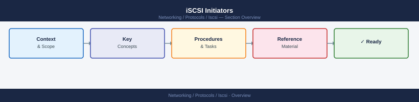
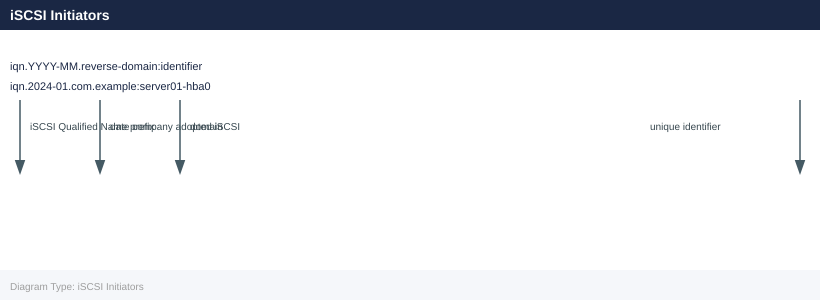

---
tags:
  - networking
---
# iSCSI Initiators


<div class="kb-summary">
An iSCSI initiator is the client-side component — typically software on a server OS or a hardware iSCSI HBA — that sends SCSI commands over an IP network to iSCSI targets.
</div>



```d2
direction: right

center: "iSCSI" {shape: hexagon}
iqn_format: "IQN Format" {shape: rectangle}
linux_software_initiator_openiscsi: "Linux Software Initiator (open-iscsi)" {shape: rectangle}
windows_iscsi_initiator: "Windows iSCSI Initiator" {shape: rectangle}
vmware_esxi_software_iscsi: "VMware ESXi Software iSCSI" {shape: rectangle}
initiator_standards: "Initiator Standards" {shape: rectangle}
common_issues: "Common Issues" {shape: rectangle}

center -> iqn_format
center -> linux_software_initiator_openiscsi
center -> windows_iscsi_initiator
center -> vmware_esxi_software_iscsi
center -> initiator_standards
center -> common_issues
```

## IQN Format



## Linux Software Initiator (open-iscsi)

```bash
# Install
dnf install iscsi-initiator-utils      # RHEL/Rocky
apt install open-iscsi                 # Ubuntu

# Find your initiator IQN
cat /etc/iscsi/initiatorname.iscsi

# Set a custom IQN (edit file, then restart)
echo "InitiatorName=iqn.2024-01.com.example:server01" > /etc/iscsi/initiatorname.iscsi
systemctl restart iscsid

# Configure CHAP (optional, in /etc/iscsi/iscsid.conf)
node.session.auth.authmethod = CHAP
node.session.auth.username = <initiator-username>
node.session.auth.password = <initiator-password>

# Start and enable daemon
systemctl enable --now iscsid
```

## Windows iSCSI Initiator

```powershell
# Enable initiator service
Start-Service MSiSCSI
Set-Service MSiSCSI -StartupType Automatic

# View initiator IQN
(Get-WmiObject -Namespace root\wmi -Class MSiSCSIInitiator_MethodClass).iSCSINodeName

# Discover targets
iscsicli ListTargets
iscsicli AddTargetPortal <target-ip>
iscsicli QAddTargetPortal <target-ip>

# Connect to a target
iscsicli PersistentLoginTarget <IQN> <...>
```

## VMware ESXi Software iSCSI

```bash
# Enable software iSCSI adapter
esxcli iscsi software set --enabled=true

# Get initiator IQN
esxcli iscsi adapter list

# Add target portal (send target discovery)
esxcli iscsi adapter discovery sendtarget add \
  --adapter vmhba65 --address <target-ip>

# Rescan
esxcli storage core adapter rescan --adapter vmhba65
```

## Initiator Standards

- One initiator IQN per HBA port — do not share IQNs across hosts
- Register initiator IQNs in CMDB at provisioning time
- Use CHAP in environments where iSCSI traverses shared networks
- Bind software initiators to dedicated storage NICs — never use management interfaces

## Common Issues

| Symptom | Cause | Check |
|---|---|---|
| Initiator not seen by array | Discovery not run or wrong target IP | Run `iscsiadm -m discovery` |
| CHAP authentication failure | Mismatched credentials | Compare username/password on initiator and target |
| Session drops | MTU mismatch or jumbo frames not end-to-end | Verify MTU on NIC, switch, and storage port |
| IQN rejected by array | IQN not added to host group | Add IQN to storage host group / initiator group |
