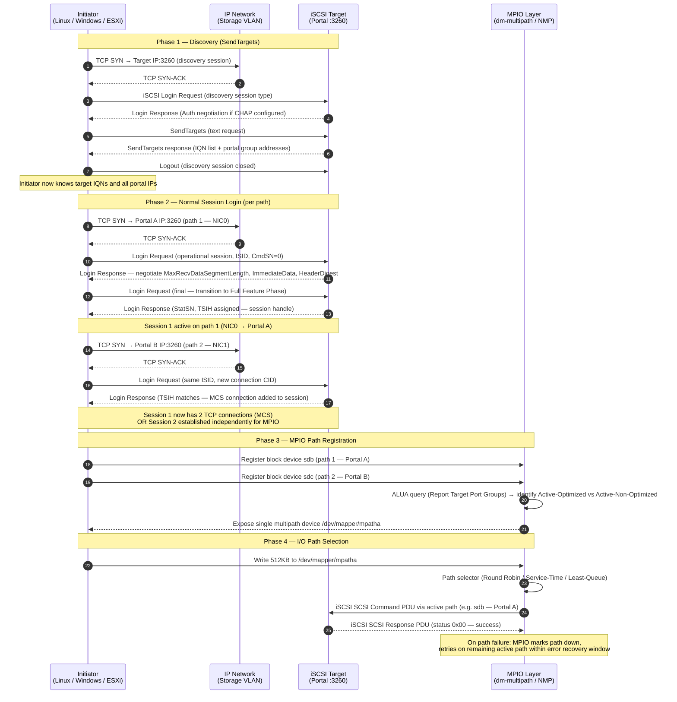

---
tags:
  - networking
---
# iSCSI — Sessions

```text
Each session can carry multiple connections (TCP streams) for performance.

## Session Lifecycle

```

```d2
direction: right

A: "Discovery" {shape: rectangle}
B: "Login" {shape: rectangle}
C: "Session Active" {shape: rectangle}
D: "D" {shape: rectangle}
E: "Session Closed" {shape: rectangle}
F: "Session Recovery" {shape: rectangle}

A -> B
B -> C
D -> C
D -> E
C -> F
F -> C
```

## Session Establishment and Multipath Data Flow

The sequence below covers the full path from initial iSCSI discovery through SendTargets negotiation, session login, and MPIO/DM-Multipath path selection for active I/O.



| Phase | Protocol | Key Negotiation | Outcome |
|---|---|---|---|
| Discovery | iSCSI text (SendTargets) | None (or CHAP) | IQN list + portal group IPs returned |
| Session login | iSCSI Login PDU sequence | MaxRecvDataSegmentLength, ImmediateData, digest | TSIH (session handle) assigned |
| MCS / MPIO | TCP + iSCSI | Additional CID on same TSIH (MCS) or separate sessions | Multiple TCP paths to same target |
| ALUA | SCSI RTPG (Report Target Port Groups) | Active-Optimized vs Standby port group | MPIO prefers optimized path |
| Path failover | dm-multipath / NMP | Failover timeout, path checker (tur / readsector0) | I/O retried on next available path |
```bash
## List all active sessions (brief)
iscsiadm -m session

## Detailed session info (connections, state, target IQN)
iscsiadm -m session -P 3

## Show session parameters (timeouts, queue depth)
iscsiadm -m session -P 3 | grep -E "Target|State|Recovery|Queue"

## Session stats (bytes tx/rx, retries)
iscsiadm -m session -s
```

```text title="Expected output"
tcp: [1] 192.168.1.50:3260,1 iqn.2020-04.com.example:storage.target1 (non-flash)
tcp: [2] 192.168.1.51:3260,1 iqn.2020-04.com.example:storage.target2 (non-flash)

Current Portal: 192.168.1.50:3260
PersistentPortal: 192.168.1.50:3260
	Iface Name: default
	Initiator Name: iqn.1993-08.org.debian:01.a1b2c3d4e5f6
	Initiator Alias: debian-host-01
	Target Name: iqn.2020-04.com.example:storage.target1
	Target Alias: LUN-PROD-01
	Session State: logged_in
	Physical Link State: up
	Conn State: logged_in
	Kfree_obj_state: free
	Hostno: 2
	SID: 1
	iSCSI Connection State: logged_in
	iSCSI Session State: logged_in
	Recovery Timeout: 120
	Queue Depth: 32
	...

Target: iqn.2020-04.com.example:storage.target1
	State: logged_in
	Recovery Timeout: 120
	Queue Depth: 32
Target: iqn.2020-04.com.example:storage.target2
	State: logged_in
	Recovery Timeout: 120
	Queue Depth: 64

iSCSI Statistics for session [sid: 1, target: iqn.2020-04.com.example:storage.target1, portal: 192.168.1.50,3260]
	Rx/Tx PDU Count: 4521/3847
	Rx/Tx iSCSI bytes: 1847362048/524288000
	iSCSI Login/Logout PDUs: 1/0
	iSCSI Errors: 0
	Transport Errors: 0
	iSCSI Timeouts: 0
	SCSI Commands: 2156
	SCSI Task Management PDUs: 0
	SCSI Device Resets: 0
	SCSI Session Resets: 0
```

!!! warning "Common errors"
    | Error | Fix |
    |---|---|
    | `iscsiadm: No active sessions.` | Verify iSCSI initiator service is running with `systemctl status iscsid` and sessions are logged in with `iscsiadm -m discovery -t st -p <target_ip>` followed by login. |
    | `iscsiadm: Cannot find record for sid 1` | Ensure the session exists before querying; use `iscsiadm -m session` first to list valid session IDs. |
    | `iscsiadm: command requires root privileges` | Run the command with `sudo` or as the root user. |
```bash
## Login to all discovered targets (persistent)
iscsiadm -m node --login

## Login to a specific target
iscsiadm -m node -T <IQN> -p <ip>:3260 --login

## Make login persistent across reboots
iscsiadm -m node -T <IQN> -p <ip>:3260 -o update -n node.startup -v automatic

## Logout from a target
iscsiadm -m node -T <IQN> -p <ip>:3260 --logout

## Logout all sessions
iscsiadm -m node --logoutall=all
```

```text title="Expected output"
Logging in to all discovered targets...
Logging in to [iface default, target iqn.2019-05.com.example:storage.disk1, portal 192.168.1.50,3260] successful.
Logging in to [iface default, target iqn.2019-05.com.example:storage.disk2, portal 192.168.1.51,3260] successful.

Logging in to specific target iqn.2019-05.com.example:storage.disk1...
Logging in to [iface default, target iqn.2019-05.com.example:storage.disk1, portal 192.168.1.50,3260] successful.

Updating node startup mode to automatic...
(no output — command completes silently)

Logging out from target iqn.2019-05.com.example:storage.disk1...
Logging out of [iface default, target iqn.2019-05.com.example:storage.disk1, portal 192.168.1.50,3260] successful.

Logging out all sessions...
Logging out of session [sid: 1, target: iqn.2019-05.com.example:storage.disk1, portal: 192.168.1.50,3260]
Logging out of session [sid: 2, target: iqn.2019-05.com.example:storage.disk2, portal: 192.168.1.51,3260]
```

!!! warning "Common errors"
    | Error | Fix |
    |---|---|
    | `iscsiadm: No records found` | Run `iscsiadm -m discovery -t st -p <target_ip>:3260` to discover targets before attempting login. |
    | `iscsiadm: cannot login to target` | Verify the target IP is reachable with `ping`, the iSCSI daemon is running with `systemctl status iscsid`, and credentials are correct if CHAP is enabled. |
    | `iscsiadm: No active session found` | Confirm the target is currently logged in using `iscsiadm -m session` before attempting logout. |
```bash
## /etc/iscsi/iscsid.conf
node.session.nr_sessions = 2

## Or per-node override
iscsiadm -m node -T <IQN> -p <ip> -o update -n node.session.nr_sessions -v 2
```

```text title="Expected output"
(no output — command completes silently)
```

!!! warning "Common errors"
    | Error | Fix |
    |---|---|
    | `iscsiadm: No records found` | Ensure the target IQN and portal IP are already discovered; run `iscsiadm -m discovery -t st -p <ip>` first to populate the node database. |
    | `iscsiadm: cannot open /etc/iscsi/iscsid.conf: Permission denied` | Run the command with `sudo` or as root, since iSCSI configuration requires elevated privileges. |
```bash
## Check session state during recovery
iscsiadm -m session -P 3 | grep -i state

## Force session re-establishment
iscsiadm -m node -T <IQN> -p <ip>:3260 --logout
iscsiadm -m node -T <IQN> -p <ip>:3260 --login
```


```text title="Expected output"
state: LOGGED_IN
state: LOGGED_IN
state: LOGGED_IN
Logging out of session [sid: 2, target: iqn.1991-05.com.example:storage.disk1, portal: 192.168.1.50,3260]
Logout of [sid: 2, target: iqn.1991-05.com.example:storage.disk1, portal: 192.168.1.50,3260] successful.
Logging in to [iface: default, target: iqn.1991-05.com.example:storage.disk1, portal: 192.168.1.50,3260, name: iqn.1991-05.com.example:storage.disk1, portal: 192.168.1.50,3260]
Login to [iface: default, target: iqn.1991-05.com.example:storage.disk1, portal: 192.168.1.50,3260] successful.
```

!!! warning "Common errors"
    | Error | Fix |
    |---|---|
    | `iscsiadm: No records found` | Verify the target IQN and portal IP are correct and exist in the node database with `iscsiadm -m node -o show`. |
    | `iscsiadm: cannot connect to iSCSI daemon` | Ensure the iscsid service is running with `systemctl start iscsid` and `systemctl start iscsi`. |
    | `Login to [iface: default, target: iqn.1991-05.com.example:storage.disk1, portal: 192.168.1.50,3260] failed` | Check network connectivity to the target portal and verify the target is accepting connections with `iscsiadm -m discovery -t st -p <ip>:3260`. |