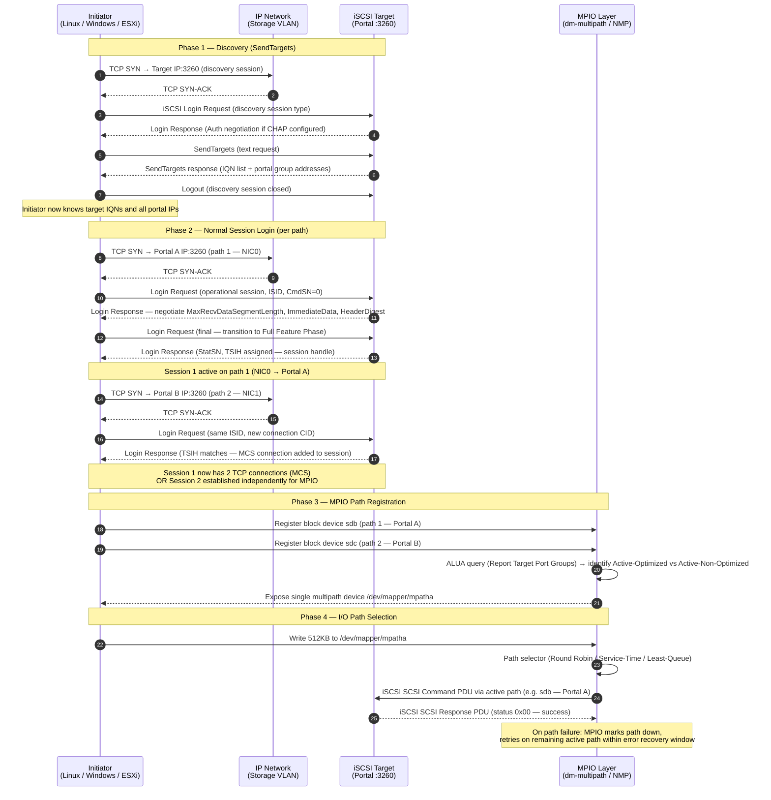

---
tags:
  - networking
---
# iSCSI — Sessions

```text
Each session can carry multiple connections (TCP streams) for performance.

## Session Lifecycle

```

```d2
direction: right

A: "Discovery" {shape: rectangle}
B: "Login" {shape: rectangle}
C: "Session Active" {shape: rectangle}
D: "D" {shape: rectangle}
E: "Session Closed" {shape: rectangle}
F: "Session Recovery" {shape: rectangle}

A -> B
B -> C
D -> C
D -> E
C -> F
F -> C
```

## Session Establishment and Multipath Data Flow

The sequence below covers the full path from initial iSCSI discovery through SendTargets negotiation, session login, and MPIO/DM-Multipath path selection for active I/O.



| Phase | Protocol | Key Negotiation | Outcome |
|---|---|---|---|
| Discovery | iSCSI text (SendTargets) | None (or CHAP) | IQN list + portal group IPs returned |
| Session login | iSCSI Login PDU sequence | MaxRecvDataSegmentLength, ImmediateData, digest | TSIH (session handle) assigned |
| MCS / MPIO | TCP + iSCSI | Additional CID on same TSIH (MCS) or separate sessions | Multiple TCP paths to same target |
| ALUA | SCSI RTPG (Report Target Port Groups) | Active-Optimized vs Standby port group | MPIO prefers optimized path |
| Path failover | dm-multipath / NMP | Failover timeout, path checker (tur / readsector0) | I/O retried on next available path |
```bash
## List all active sessions (brief)
iscsiadm -m session

## Detailed session info (connections, state, target IQN)
iscsiadm -m session -P 3

## Show session parameters (timeouts, queue depth)
iscsiadm -m session -P 3 | grep -E "Target|State|Recovery|Queue"

## Session stats (bytes tx/rx, retries)
iscsiadm -m session -s
```
```bash
## Login to all discovered targets (persistent)
iscsiadm -m node --login

## Login to a specific target
iscsiadm -m node -T <IQN> -p <ip>:3260 --login

## Make login persistent across reboots
iscsiadm -m node -T <IQN> -p <ip>:3260 -o update -n node.startup -v automatic

## Logout from a target
iscsiadm -m node -T <IQN> -p <ip>:3260 --logout

## Logout all sessions
iscsiadm -m node --logoutall=all
```
```bash
## /etc/iscsi/iscsid.conf
node.session.nr_sessions = 2

## Or per-node override
iscsiadm -m node -T <IQN> -p <ip> -o update -n node.session.nr_sessions -v 2
```
```bash
## Check session state during recovery
iscsiadm -m session -P 3 | grep -i state

## Force session re-establishment
iscsiadm -m node -T <IQN> -p <ip>:3260 --logout
iscsiadm -m node -T <IQN> -p <ip>:3260 --login
```
