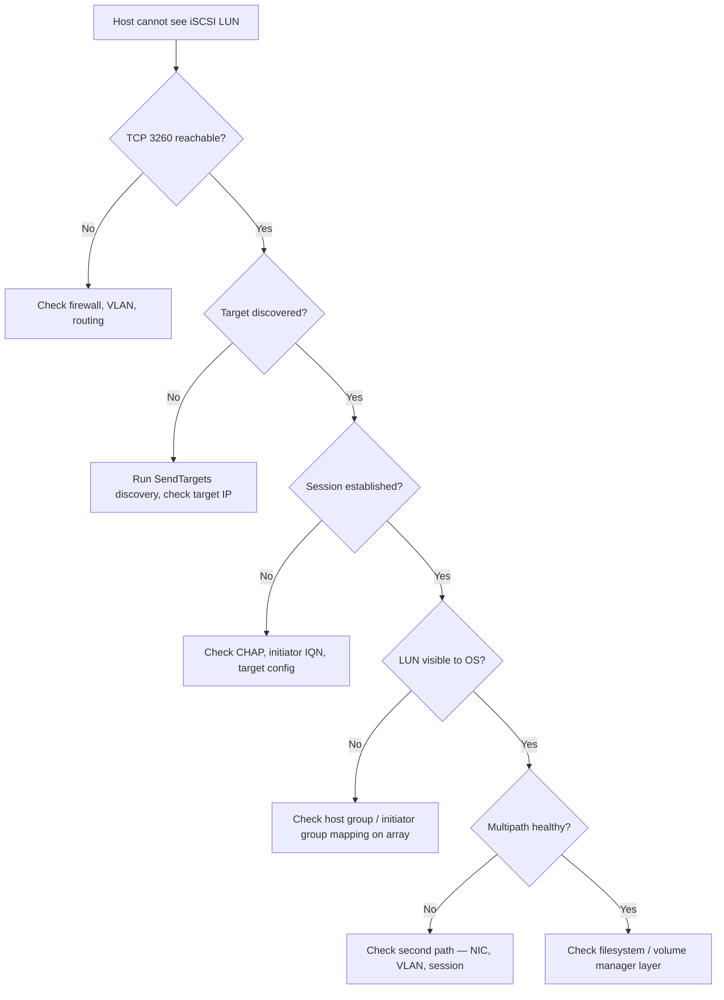

---
tags:
  - networking
  - troubleshooting
search:
  boost: 1.5
---
# iSCSI Troubleshooting


<div class="kb-summary">
iSCSI Troubleshooting reference covering Diagnostic Flow, Quick Diagnostics, Common Issues Reference, MTU Troubleshooting, Log Locations and 1 more sections.
</div>

        TRIAGE: HOST CANNOT SEE iSCSI LUN
```text
┌───────────────────────────────────────────────────────────────────────────────────────────────────────┐
│  1. Ping target IP ───── fail ──► check VLAN, routing, NIC                                            │
│          │ ok                                                                                         │
│          ▼                                                                                            │
│  2. nc -zv <ip> 3260 ─── fail ──► check firewall, target svc                                          │
│          │ ok                                                                                         │
│          ▼                                                                                            │
│  3. Run SendTargets ──── no targets ► check target IP / IQN                                           │
│          │ targets found                                                                              │
│          ▼                                                                                            │
│  4. Login (session) ──── fail ──► check CHAP credentials                                              │
│          │ ok                                                                                         │
│          ▼                                                                                            │
│  5. LUN visible? ──────── no ───► add IQN to host group                                               │
│          │ yes                                                                                        │
│          ▼                                                                                            │
│  6. Multipath healthy? ─── no ──► check second path / NIC                                             │
│          │ yes                                                                                        │
│          ▼                                                                                            │
│  7. Check filesystem / volume manager layer                                                           │
└───────────────────────────────────────────────────────────────────────────────────────────────────────┘
```

## Before you begin

- **Access:** Network admin credentials; console or SSH to devices
- **Gather first:** recent error message text, event timestamps, and affected object names
- **Scope:** confirm whether the issue affects a single object, host, cluster, or site
- **Escalation:** open a vendor support ticket before running any destructive step
- **Logging:** document each command and output — required if escalation is needed

---

## Diagnostic Flow



## Quick Diagnostics

```bash
# Test TCP connectivity to target portal
nc -zv <target-ip> 3260

# Run discovery
iscsiadm -m discovery -t sendtargets -p <target-ip>:3260

# List active sessions
iscsiadm -m session

# Detailed session + path info
iscsiadm -m session -P 3

# Session statistics (errors, retries)
iscsiadm -m session -s

# Multipath device state
multipath -ll

# Rescan for new devices
iscsiadm -m node --rescan
echo "- - -" > /sys/class/scsi_host/host*/scan
multipath -r
```

## Common Issues Reference

| Symptom | Probable cause | Resolution |
|---|---|---|
| `iscsiadm: No portals found` | Target IP wrong or portal down | Verify target IP; test with `nc -zv <ip> 3260` |
| `Login I/O error, rx -1, errno 111` | Connection refused — service not running or wrong port | Check target service; confirm port 3260 |
| CHAP auth failure | Username/password mismatch | Compare credentials on initiator (`iscsid.conf`) and array |
| Session established, no disks | IQN not in host group | Add initiator IQN to array host/initiator group |
| Disk appears but no multipath | One path only, multipath not configured | Verify second NIC has session; check multipathd |
| Intermittent I/O errors / session drops | MTU mismatch (jumbo frames) | Verify MTU 9000 end-to-end or reduce to 1500 consistently |
| Session drop during array maintenance | `replacement_timeout` exceeded | Extend timeout in `iscsid.conf` or coordinate maintenance window |
| Performance poor on iSCSI | Sharing NIC with management | Dedicate NICs to iSCSI; enable flow control |

## MTU Troubleshooting

```bash
# Test jumbo frame path (9000 byte MTU)
ping -M do -s 8972 <target-ip>   # 8972 + 28 byte header = 9000

# Check NIC MTU
ip link show <ethX>
ethtool <ethX> | grep -i mtu

# Set MTU
ip link set <ethX> mtu 9000
```

## Log Locations

| Platform | Where to look |
|---|---|
| Linux | `journalctl -k | grep -i iscsi` / `/var/log/messages` |
| Windows | Event Viewer → System → iScsiPrt source |
| ESXi | `vmkwarning.log` / `vmkernel.log` in `/var/log/` |

## Kernel Messages (Linux)

```bash
# iSCSI kernel events
dmesg | grep -i iscsi

# Session recovery events
journalctl -k | grep -i "session recovery"

# SCSI device attach
dmesg | grep -i "Attached scsi"
```

---

## Verify resolution

- Confirm the original symptom no longer occurs
- Check logs for any residual errors related to the issue
- Monitor for 10–15 minutes to confirm the fix is stable

## See also

- [Initiators](initiators/)
- [Multipathing](multipathing/)
- [Sessions](sessions/)
- [Targets](targets/)
- [iSCSI — Overview](../)
