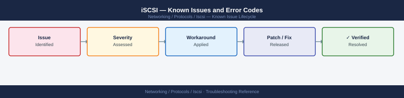

---
tags:
  - troubleshooting
  - iscsi
  - networking
  - known-issues
description: "Catalog of known iSCSI issues covering initiator discovery, session stability, multipath, and CHAP authentication."
---
# iSCSI — Known Issues and Error Codes

<div class="kb-summary">
Catalog of known iSCSI issues covering initiator discovery, session stability, multipath, and CHAP authentication.

*Applies to: Linux open-iscsi, Windows iSCSI initiator, VMware iSCSI*
</div>



```d2
direction: down

symptom: Identify Symptom {shape: diamond}
discovery_and_login: "Discovery and Login" {shape: rectangle}
multipath: "Multipath" {shape: rectangle}
performance: "Performance" {shape: rectangle}
resolution: Resolve or Escalate {shape: oval}

symptom -> discovery_and_login: investigate
symptom -> multipath: investigate
symptom -> performance: investigate
discovery_and_login -> resolution
multipath -> resolution
performance -> resolution
```

## Before you begin

- Linux iSCSI: `iscsiadm -m session` for active sessions; `/var/log/syslog` or `dmesg` for errors.
- Windows: iSCSI Initiator Properties → Sessions tab.
- Multipath must be configured before multiple paths are visible — a single-path iSCSI setup is not redundant.

## Discovery and Login

| Error / Symptom | Cause | Workaround / Fix |
|---|---|---|
| `iscsiadm -m discovery` returns nothing | Target portal unreachable; TCP 3260 blocked | Verify TCP 3260 from initiator to target IP; check iSCSI portal on array |
| `Login failed: authentication failure` | CHAP credentials mismatch | Verify CHAP username/password on initiator matches array CHAP configuration |
| Session logs out intermittently | Network instability or iSCSI keepalive timeout | Increase `node.session.timeo.replacement_timeout`; check network for packet loss |

## Multipath

| Error / Symptom | Cause | Workaround / Fix |
|---|---|---|
| Only one path visible despite two target IPs | Initiator only discovering one portal | Configure discovery for both target IPs; verify `node.startup = automatic` for both |
| Device mapper multipath showing `failed faulty running` | Path failure; multipath detected I/O error | Check physical connectivity; run `multipath -ll` to verify path state; `multipath -r` to reload |
| iSCSI device shown twice with no multipath | Multipath daemon not running or not configured | Start multipath: `systemctl start multipathd`; configure `multipath.conf` |

## Performance

| Error / Symptom | Cause | Workaround / Fix |
|---|---|---|
| High latency on iSCSI LUN | Network congestion; Jumbo Frames not configured | Enable Jumbo Frames (MTU 9000) end-to-end; verify with `ping -s 8972 -M do <target>` |

## See also

