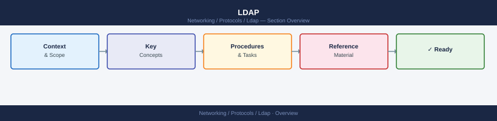

# LDAP


<div class="kb-summary">
Lightweight Directory Access Protocol — directory service query and authentication for infrastructure and applications.
</div>



<div class="kb-grid kb-grid-1">

<a class="kb-card" href="binds/">
  <strong>Binds</strong>
  <span>Binds notes, checks, commands, and references.</span>
</a>

<a class="kb-card" href="ports/">
  <strong>Ports</strong>
  <span>Ports notes, checks, commands, and references.</span>
</a>

<a class="kb-card" href="tls/">
  <strong>Tls</strong>
  <span>Tls notes, checks, commands, and references.</span>
</a>

<a class="kb-card" href="troubleshooting/"><strong>Troubleshooting</strong><span>Common issues, diagnostic steps, and resolution guides.</span></a>
<a class="kb-card" href="queries/"><strong>Queries</strong><span>LDAP search filters, attribute queries, and ldapsearch examples.</span></a>

</div>

```d2
direction: right

center: "LDAP" {shape: hexagon}
key_concepts: "Key Concepts" {shape: rectangle}
common_ldapsearch_queries: "Common ldapsearch Queries" {shape: rectangle}
ldaps_verification: "LDAPS Verification" {shape: rectangle}
application_ldap_integration_linux_p: "Application LDAP Integration (Linux PAM/SSSD)" {shape: rectangle}
troubleshooting: "Troubleshooting" {shape: rectangle}

center -> key_concepts
center -> common_ldapsearch_queries
center -> ldaps_verification
center -> application_ldap_integration_linux_p
center -> troubleshooting
```

## Key Concepts

| Concept | Description |
|---|---|
| DN (Distinguished Name) | Full path to an object: `CN=user,OU=Users,DC=domain,DC=com` |
| BaseDN | Search starting point in the directory tree |
| Bind DN | Service account used to authenticate to LDAP |
| Filter | Search expression: `(&(objectClass=user)(sAMAccountName=user01))` |
| Attribute | Field on a directory object (e.g., `mail`, `memberOf`, `sAMAccountName`) |
| LDAPS | LDAP over TLS (port 636) — required for credential queries |
| SASL | Simple Authentication and Security Layer — Kerberos/GSSAPI bind |

## Common ldapsearch Queries

```bash
# Basic connectivity test (anonymous bind)
ldapsearch -x -H ldap://<dc-host> -b "dc=domain,dc=com" -s base "(objectclass=*)"

# Authenticated search — find a user
ldapsearch -x -H ldap://<dc-host> \
  -D "CN=svc-ldap,OU=ServiceAccounts,DC=domain,DC=com" \
  -W \
  -b "DC=domain,DC=com" \
  "(sAMAccountName=username)" \
  cn mail memberOf

# Find all members of a group
ldapsearch -x -H ldap://<dc-host> \
  -D "CN=svc-ldap,OU=ServiceAccounts,DC=domain,DC=com" \
  -W \
  -b "DC=domain,DC=com" \
  "(cn=Domain Admins)" \
  member

# List all OUs
ldapsearch -x -H ldap://<dc-host> \
  -D "CN=svc-ldap,OU=ServiceAccounts,DC=domain,DC=com" \
  -W \
  -b "DC=domain,DC=com" \
  "(objectClass=organizationalUnit)" \
  ou

# Find disabled accounts
ldapsearch -x -H ldap://<dc-host> \
  -D "CN=svc-ldap,OU=ServiceAccounts,DC=domain,DC=com" \
  -W \
  -b "DC=domain,DC=com" \
  "(&(objectClass=user)(userAccountControl:1.2.840.113556.1.4.803:=2))" \
  sAMAccountName
```

## LDAPS Verification

```bash
# Test LDAPS connectivity
openssl s_client -connect <dc-host>:636 -showcerts

# ldapsearch over TLS
ldapsearch -H ldaps://<dc-host>:636 \
  -D "CN=svc-ldap,OU=ServiceAccounts,DC=domain,DC=com" \
  -W \
  -b "DC=domain,DC=com" \
  "(sAMAccountName=username)"

# Test LDAP StartTLS (port 389)
ldapsearch -H ldap://<dc-host>:389 -Z \
  -D "CN=svc-ldap,OU=ServiceAccounts,DC=domain,DC=com" \
  -W \
  -b "DC=domain,DC=com" \
  "(sAMAccountName=username)"
```

## Application LDAP Integration (Linux PAM/SSSD)

```bash
# Check SSSD status
systemctl status sssd

# Test user lookup via SSSD
id username
getent passwd username

# Clear SSSD cache
sssctl cache-remove -y

# SSSD debug log
tail -f /var/log/sssd/sssd_<domain>.log
```

## Troubleshooting

| Symptom | Check | Action |
|---|---|---|
| `Invalid credentials` | Bind DN and password | Verify svc account password; confirm account not locked |
| `No such object` | BaseDN | Verify DN exists; check for typo in domain components |
| `Confidentiality required` | LDAPS/StartTLS | Application requires LDAPS — configure TLS on directory port |
| Authentication failing for all users | DC connectivity | `ping <dc>`, `nslookup <domain>` — check DNS resolution |
| SSSD not resolving users | SSSD service / cache | `systemctl restart sssd`; `sssctl cache-remove -y` |
