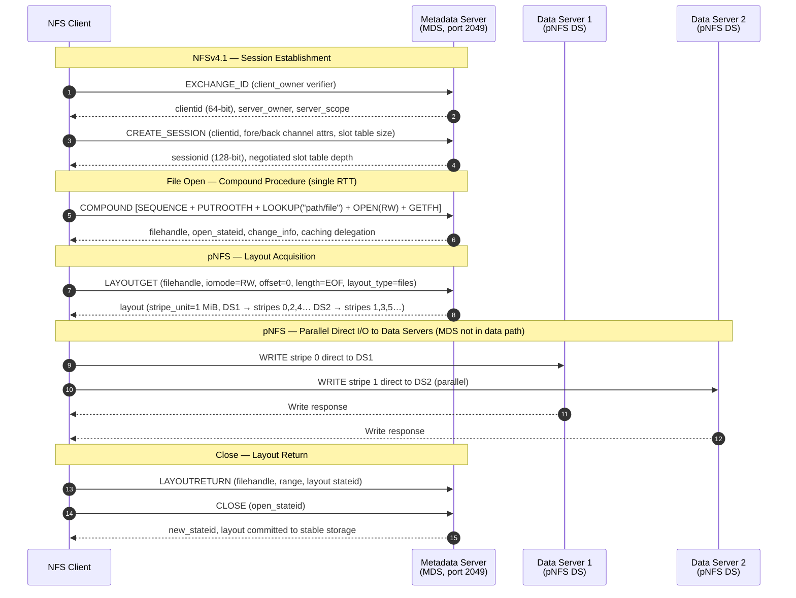

# NFS

<div class="kb-summary">
Network File System (NFS) allows hosts to mount remote directories over TCP. Coverage includes version selection (NFSv3/4/4.1), export configuration, UID/GID permission mapping, mount option tuning (hard/soft, sync/async, rsize/wsize), and troubleshooting stale handles and mount failures.
</div>

## NFSv4.1 Session and pNFS Data Path

NFSv4.1 introduces explicit sessions (slot tables replacing per-RPC XIDs) and pNFS, which allows clients to perform I/O directly to data servers without routing data through the metadata server.



| Version | Ports Required | Session Model | Locking | Parallel I/O |
|---|---|---|---|---|
| NFSv3 | 2049 + rpcbind/111 + mountd + NLM | Stateless per RPC | External (NLM daemon) | No |
| NFSv4 | 2049 only | Stateful (lease-based) | Built-in | No |
| NFSv4.1 | 2049 only | Stateful + explicit sessions (slot table) | Built-in | Yes (pNFS) |

<div class="kb-grid kb-grid-5">

<a class="kb-card" href="exports/">
  <strong>Exports</strong>
  <span>Configuring /etc/exports, export rules, squash options, and reloading exports with exportfs.</span>
</a>

<a class="kb-card" href="mounts/">
  <strong>Mounts</strong>
  <span>Mount options (hard/soft, sync/async, noatime, rsize/wsize), /etc/fstab entries, and autofs.</span>
</a>

<a class="kb-card" href="permissions/">
  <strong>Permissions</strong>
  <span>UID/GID mapping, root squash, no_root_squash, and Kerberos-based identity with NFSv4.</span>
</a>

<a class="kb-card" href="versions/">
  <strong>Versions</strong>
  <span>NFSv3 vs NFSv4 vs NFSv4.1 feature comparison, stateful sessions, pNFS, and protocol negotiation.</span>
</a>

<a class="kb-card" href="troubleshooting/">
  <strong>Troubleshooting</strong>
  <span>Stale file handles, mount timeouts, permission denied errors, rpcbind failures, and nfsstat analysis.</span>
</a>

</div>

## Quick Reference

| Property | NFSv3 | NFSv4 | NFSv4.1 |
|---|---|---|---|
| Transport | TCP / UDP | TCP only | TCP only |
| Port | 2049 + rpcbind (111) | 2049 only | 2049 only |
| Stateful | No | Yes | Yes |
| Locking | NLM (separate daemon) | Built-in | Built-in |
| Kerberos auth | Optional | Supported | Supported |
| pNFS (parallel) | No | No | Yes |
| Recommended use | Legacy / simple | General | High-performance / modern |

**Common mount options:**

| Option | Effect |
|---|---|
| `hard` | Retries indefinitely on server failure — recommended for data integrity |
| `soft` | Returns error after timeout — use only for non-critical mounts |
| `sync` | Writes confirmed before returning — safer, slower |
| `async` | Writes buffered — faster, risk of data loss on crash |
| `noatime` | Disables access time updates — reduces write traffic |
| `rsize=1048576` | Read buffer size (1 MiB) — tune for throughput |
| `wsize=1048576` | Write buffer size (1 MiB) — tune for throughput |
| `nfsvers=4.1` | Force specific NFS version |

## Common Commands / Config

```bash
# Show exports from a remote NFS server
showmount -e <nfs-server>

# Mount an NFS share manually (NFSv4.1, hard mount)
mount -t nfs -o vers=4.1,hard,noatime,rsize=1048576,wsize=1048576 \
  <nfs-server>:/export/path /mnt/nfs

# /etc/fstab entry for persistent NFSv4 mount
# <nfs-server>:/export/path  /mnt/nfs  nfs  vers=4,hard,noatime,_netdev  0 0

# Reload exports after editing /etc/exports (no restart needed)
exportfs -ra

# Show currently active exports
exportfs -v

# Display NFS client and server statistics
nfsstat -c   # client stats
nfsstat -s   # server stats
nfsstat -m   # mounted filesystems and options

# Check RPC services (needed for NFSv3 portmapper)
rpcinfo -p <nfs-server>

# Unmount a stuck NFS mount (lazy unmount)
umount -l /mnt/nfs

# Check NFS mount details including negotiated version
mount | grep nfs
```


```text title="Expected output"
Export list for nfs-server.corp.local:
/export/data     192.168.1.0/24
/export/backup   10.0.0.0/8
/export/home     *

(no output — command completes silently)

/dev/mapper/vg0-lv_root on / type ext4 (rw,relatime)
nfs-server.corp.local:/export/data on /mnt/nfs type nfs4 (rw,relatime,vers=4.1,rsize=1048576,wsize=1048576,hard,noatime)

Server nfs-server.corp.local:
  100003  3   tcp   2049  nfs
  100003  4   tcp   2049  nfs
  100005  1   udp    635  mountd
  100005  3   tcp    635  mountd
  100021  1   udp  45678  nlockmgr
  100021  4   tcp  45678  nlockmgr

(no output — command completes silently)

Client nfs v3:
        calls      retrans    authrefrsh
        1247       12         1247
Server nfs v4:
        reads      writes     commits
        5634       2891       156

Mounts:
  /mnt/nfs from nfs-server.corp.local:/export/data
  Flags: vers=4.1,rsize=1048576,wsize=1048576,hard,noatime,proto=tcp

nfs-server.corp.local:/export/data on /mnt/nfs type nfs4 (rw,relatime,vers=4.1,rsize=1048576,wsize=1048576,hard,noatime,proto=tcp)
```

!!! warning "Common errors"
    **`mount.nfs: No such file or directory`** — Verify the NFS server hostname/IP is resolvable and the export path exists on the server with `showmount -e <nfs-server>`.
    **`exportfs: /etc/exports:2: syntax error - unexpected end of line`** — Check `/etc/exports` for missing whitespace or invalid IP ranges; each export line must have server, path, and options separated by spaces.
    **`umount: /mnt/nfs: target is busy`** — Use `umount -l /mnt/nfs` for lazy unmount, or kill processes accessing the mount with `lsof /mnt/nfs` first.
**Example /etc/exports entry:**
```bash
# /etc/exports
/data/shared  192.168.1.0/24(rw,sync,no_subtree_check,root_squash)
/data/readonly  10.0.0.0/8(ro,sync,no_subtree_check,all_squash)
```


```text title="Expected output"
(no output — command completes silently)
```

!!! warning "Common errors"
    **`exportfs: /etc/exports:1: syntax error - unexpected character after netgroup`** — Ensure there is no space between the export path and the opening parenthesis in `/etc/exports`.
    **`mount.nfs: access denied by server while mounting 192.168.1.50:/data/shared`** — Verify the client IP falls within the specified subnet (192.168.1.0/24) and run `exportfs -ra` on the NFS server after editing `/etc/exports`.
## Troubleshooting

| Symptom | Check | Action |
|---|---|---|
| `mount.nfs: Connection timed out` | Firewall on port 2049; rpcbind (111) for v3 | Open port 2049/tcp; for NFSv3 also open 111/tcp+udp and ensure rpcbind is running |
| `Stale file handle` | Server-side export was removed or path changed | Unmount (`umount -l`) and remount; verify export still exists with `showmount -e` |
| `Permission denied` on client | UID/GID mismatch between client and server | Confirm UIDs match or configure `all_squash` + `anonuid`/`anongid` in exports |
| Mount hangs indefinitely | Hard mount + server unreachable | Use `umount -l` (lazy); consider `soft,timeo=30` for non-critical mounts |
| `rpc.statd: unable to register` | rpcbind not running | Start rpcbind: `systemctl start rpcbind` |
| High NFS latency | rsize/wsize too small; async disabled | Increase rsize/wsize to 1 MiB; consider `async` if data loss risk is acceptable |
